# Análise da evolução e distribuição das pesquisas clínicas sobre câncer de mama

**MVP de Engenharia de Dados — Pós-graduação PUC-Rio**  
**Autor:** Wellington Freitas  
**Plataforma prevista no projeto:** Databricks Free Edition  
**Versão da documentação:** revisão dos 11 notebooks reenviados — 21/09/2026 (UTC)


### Navegação

1. [Contexto de Negócio e Perguntas](#contexto)
2. [Carga dos Dados](#carga)
3. [Modelagem e Catálogo de Dados](#modelagem)
4. [Pipeline de Dados](#pipeline)
5. [Qualidade de Dados](#qualidade)
6. [Análise de Dados](#analise)
7. [Autoavaliação](#autoavaliacao)
8. [Evidências e checklist](#entrega)
9. [Consultas propostas para revisão](#consultas)
10. [Referências e rastreabilidade](#referencias)

### Base documental e temporal

| Material | Uso nesta revisão |
| --- | --- |
| [Código do MVP](https://github.com/wellingtondmf/pos_puc_2026/tree/main/MVP_ENGENHARIA_DE_DADOS) | Implementação, nomes, parâmetros e transformações |
| [Escopo_MVP](https://github.com/wellingtondmf/pos_puc_2026/blob/main/MVP_ENGENHARIA_DE_DADOS/Escopo_MVP) | Objetivo e 12 perguntas originais |
| [README existente na raiz](https://github.com/wellingtondmf/pos_puc_2026/blob/main/README.md) | Contexto, fontes e limitações previamente documentados |
| `01_etl_brz_clinical_trials_table.dbc`| Paginação, persistência Bronze e conciliação da API clínica |
| `01_etl_brz_world_bank_open_data.dbc` | Coleta e persistência Bronze da população |
| `02_etl_silver_*.dbc` | Estudos, condições, intervenções, locais, ISO3 e população etc...|
| `03_etl_gold.dbc` | Contagens, escritas e validações da Gold |
| `04_qualidade_dados.dbc` | Analise e validação, de regras |
| `config.dbc` | Constantes, schemas, funções compartilhadas e parsing |


<a id="contexto"></a>

## 1. Contexto de Negócio e Perguntas

### 1.1 Problema

Os registros de pesquisas sobre câncer de mama estão distribuídos entre países, instituições, fases, intervenções e situações operacionais. É necessário organizar essas informações para estudar a concentração das pesquisas, os tratamentos investigados e sua evolução temporal.

O MVP constrói uma base analítica para responder a essas questões a partir de registros públicos. A contagem de estudos mede atividade de pesquisa presente no cadastro consultado. Ela não mede eficácia terapêutica, cura, qualidade científica ou acesso efetivo de pacientes a tratamentos.

### 1.2 Objetivo geral e objetivos específicos

**Objetivo geral original:** construir uma plataforma analítica no Databricks para coletar, organizar e analisar dados públicos de estudos clínicos relacionados ao câncer de mama.

Os objetivos específicos abaixo consolidam o trabalho técnico já definido:

1. Coletar registros do ClinicalTrials.gov e população anual do Banco Mundial.
2. Preservar o conteúdo dos registros recebidos em tabelas Bronze e registrar sua origem.
3. Limpar, tipar, deduplicar e estruturar os dados na Silver.
4. Construir um modelo dimensional na Gold, incluindo relações de muitos para muitos.
5. Medir qualidade e explicitar limitações antes das análises.
6. Responder às 12 perguntas originais com consultas, resultados e interpretação.
7. Documentar execução, modelagem, linhagem e decisões para permitir revisão e reprodução.

### 1.3 Perguntas originais

1. Quantos estudos sobre câncer de mama foram registrados por ano?
2. Como os estudos estão distribuídos por país?
3. Quais países concentram a maior quantidade de pesquisas?
4. Quais são as fases clínicas mais frequentes?
5. Quais tipos de intervenção são mais estudados?
6. Quais tratamentos ou medicamentos aparecem com maior frequência?
7. Como os estudos estão distribuídos por situação: recrutando, concluído, suspenso ou encerrado?
8. Qual é a duração média dos estudos?
9. Qual é o número médio de participantes por fase clínica?
10. Quais organizações patrocinam mais estudos?
11. Existe relação entre fase clínica, quantidade de participantes e duração do estudo?
12. Como a participação do Brasil se compara à de outros países?

**Regra de entrega:** Manter todas as perguntas. Quando uma resposta não for obtida, será registrado o motivo e a limitação, sem retirar a pergunta do objetivo.

### 1.4 Delimitação

- Fonte clínica: resultado da busca `query.cond=Breast Cancer`, sem filtro de período ou tipo de estudo no código atual.
- População: indicador `SP.POP.TOTL`, com intervalo solicitado de 2000 a 2025.
- Unidade clínica: registro identificado por `nct_id`, não paciente.
- Tipos observados: `INTERVENTIONAL`, `OBSERVATIONAL` e `EXPANDED_ACCESS`. Decidir e documentar se todos permanecerão em cada análise; não excluir silenciosamente registros para fazer uma regra passar.
- O conjunto pode incluir estudos com múltiplas condições; não se deve supor que todos sejam exclusivamente sobre câncer de mama.
- Não são usados microdados de pacientes nem produzidas recomendações médicas.
- O payload integral de um cadastro público pode conter contatos institucionais. Não confundir ausência de microdados de pacientes com ausência de qualquer informação de contato.

### 1.5 Fontes e condições de uso

| Fonte | Conteúdo utilizado | Acesso | Licença |
| --- | --- | --- | --- |
| ClinicalTrials.gov / National Library of Medicine | Cadastros de estudos, fases, situação, patrocinador, intervenções e locais | API REST v2, JSON | Dominio Publico |
| Banco Mundial — World Development Indicators | `SP.POP.TOTL`, população total | Indicators API v2, JSON | A página do indicador informa **CC BY 4.0**, sujeita também aos termos adicionais do Banco Mundial |

Referências verificadas em 21/09/2026:

- [API do ClinicalTrials.gov](https://clinicaltrials.gov/data-api/api).
- [Estrutura dos dados clínicos](https://clinicaltrials.gov/data-api/about-api/study-data-structure).
- [Página de termos do ClinicalTrials.gov](https://clinicaltrials.gov/about-site/terms-conditions)
- [Population, total — SP.POP.TOTL](https://data.worldbank.org/indicator/SP.POP.TOTL)
- [Termos de uso dos datasets do Banco Mundial](https://www.worldbank.org/ext/en/legal/terms-conditions/datasets).

<a id="carga"></a>

## 2. Carga dos Dados (Etapa 4.2)

### 2.1 Ambiente e destino

| Componente | Implementação |
| --- | --- |
| Catálogo | `mvp_eng_dados` |
| Schema | `mvp_cancer` |
| Volume declarado | `mvp_repository` |
| Caminho declarado | `/Volumes/mvp_eng_dados/mvp_cancer/mvp_repository` |
| Formato das tabelas | Delta |
| Linguagens | Python, PySpark e SQL |
| Ingestão | `requests`, sessão HTTP com retentativas |
| Estratégia de escrita | `overwrite`; várias escritas também usam `overwriteSchema=true` |

O volume é criado no código, mas as rotinas de coleta apresentadas persistem os JSONs na coluna `payload` das tabelas Bronze.

**EVIDENCIA:**

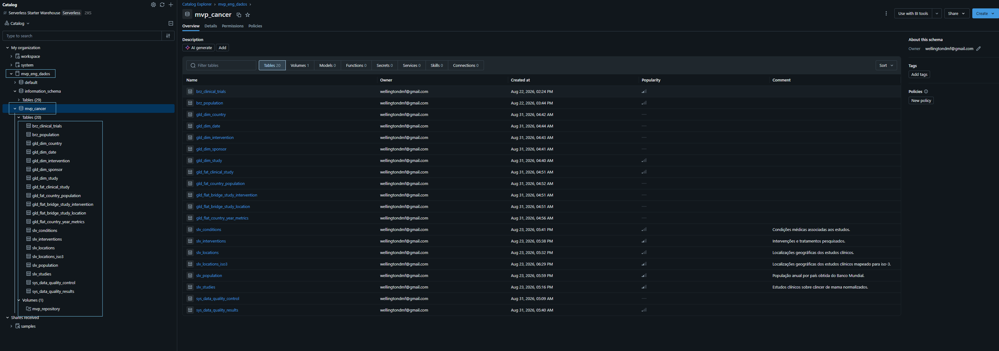

### 2.2 Coleta clínica

Endpoint: `https://clinicaltrials.gov/api/v2/studies`.

| Parâmetro | Valor |
| --- | --- |
| `query.cond` | `Breast Cancer` |
| `format` | `json` |
| `pageSize` | `1000` |
| `countTotal` | `true` |
| `pageToken` | Atualizado com `nextPageToken` até o término |
| Timeout por requisição | 120 segundos |

A coleta acumula os estudos em uma lista Python, adiciona identificador de ingestão, página, URL e instante de coleta, cria um DataFrame com schema explícito e grava `brz_clinical_trials`. Entre páginas há pausa de 0,2 segundo. A sessão HTTP prevê até cinco retentativas, com backoff, para códigos 429, 500, 502, 503 e 504.

O código compara o total persistido com o tamanho da lista e com `totalCount` por meio de `assert`.

Limitações: uso de memória do driver para toda a coleta; ausência de histórico de snapshots por usar `overwrite`; mudanças da fonte durante a paginação podem exigir investigar divergências de contagem. 

**EVIDENCIA:**

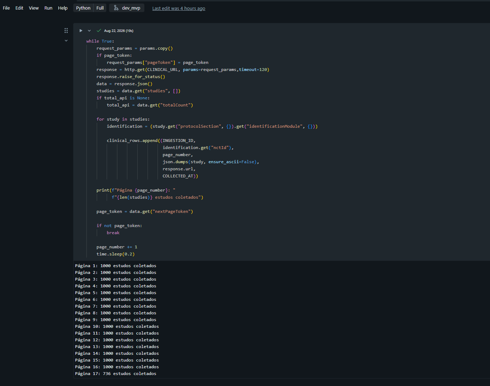

### 2.3 Coleta de população

Endpoint: `https://api.worldbank.org/v2/country/all/indicator/SP.POP.TOTL`.

Parâmetros: `format=json`, `date=2000:2025`, `per_page=20000`. O código lê o primeiro elemento da resposta como metadados e o segundo como registros. Grava `brz_population` com JSON individual e metadados de origem. a execução exibiu `Registros coletados: 6890`; após filtros e deduplicação, o perfil da `slv_population` contém 6.760 linhas. A diferença não foi conciliada por uma auditoria explícita de perdas.


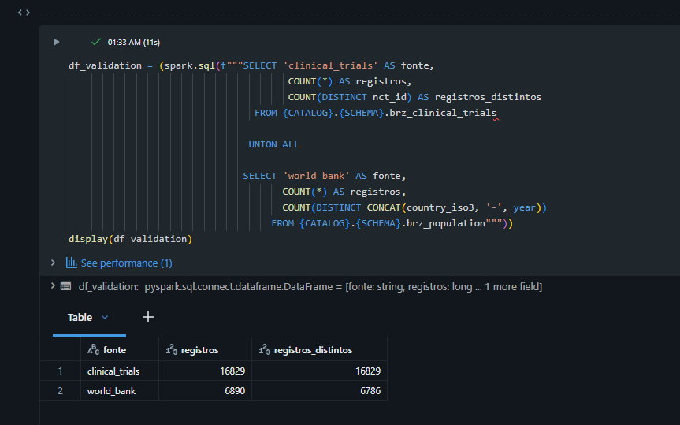

### 2.4 Reprocessamento e rastreabilidade

As tabelas são reconstruídas integralmente. A estratégia evita acumular linhas por append, mas não preserva os snapshots anteriores de forma explícita. O código não configura política de retenção ou versionamento de extrações; Pode ser usado o versionamento da tabela delta para talvez uma criação  historica.

`INGESTION_ID` é gerado em cada execução do `config`; As tabelas de qualidade são sobrescritas e não armazenam, no modelo atual, uma associação explícita com todos os IDs de ingestão avaliados.

<a id="modelagem"></a>

## 3. Modelagem e Catálogo de Dados (Etapa 4.3)

### 3.1 Arquitetura e organização

As três camadas estão no mesmo catálogo e schema. A separação é feita pelos prefixos `brz_`, `slv_` e `gld_`; `sys_` identifica resultados de controle. Não criei catalogos separados para não deixar mais complexo a arquiterura como um todo.

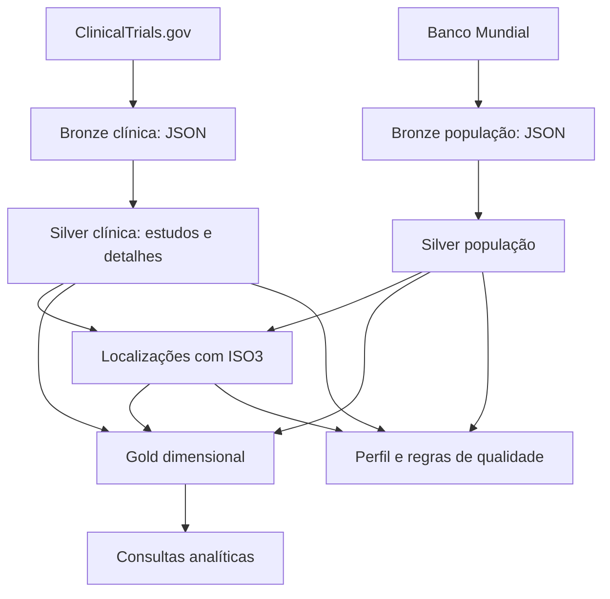

O desenho representa a linhagem lógica inferida do código, não uma captura da linhagem automática do Unity Catalog. O detalhamento Silver inclui estudos, condições, intervenções e localizações. As condições não têm dimensão ou bridge própria na Gold atual.

### 3.2 Modelo dimensional

O centro do modelo é `gld_fat_clinical_study`, com uma linha por estudo. Patrocinador e datas são dimensões relacionadas ao fato. Países e intervenções usam tabelas associativas porque um estudo pode ocorrer em vários países e investigar várias intervenções. A população forma uma segunda fato, por entidade geográfica e ano.

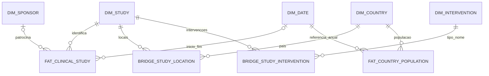

Os nomes abreviados do diagrama correspondem às tabelas `gld_` descritas abaixo. Os relacionamentos são lógicos. Seguem alguns imagens por liagem de dados.


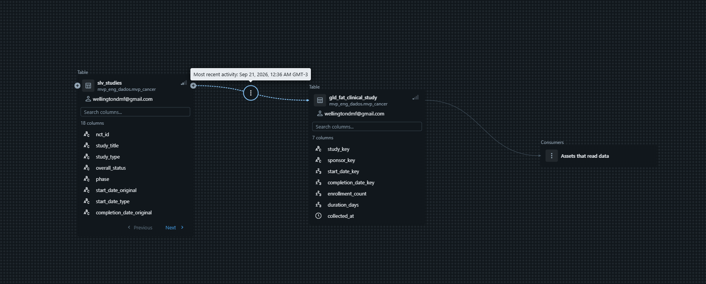
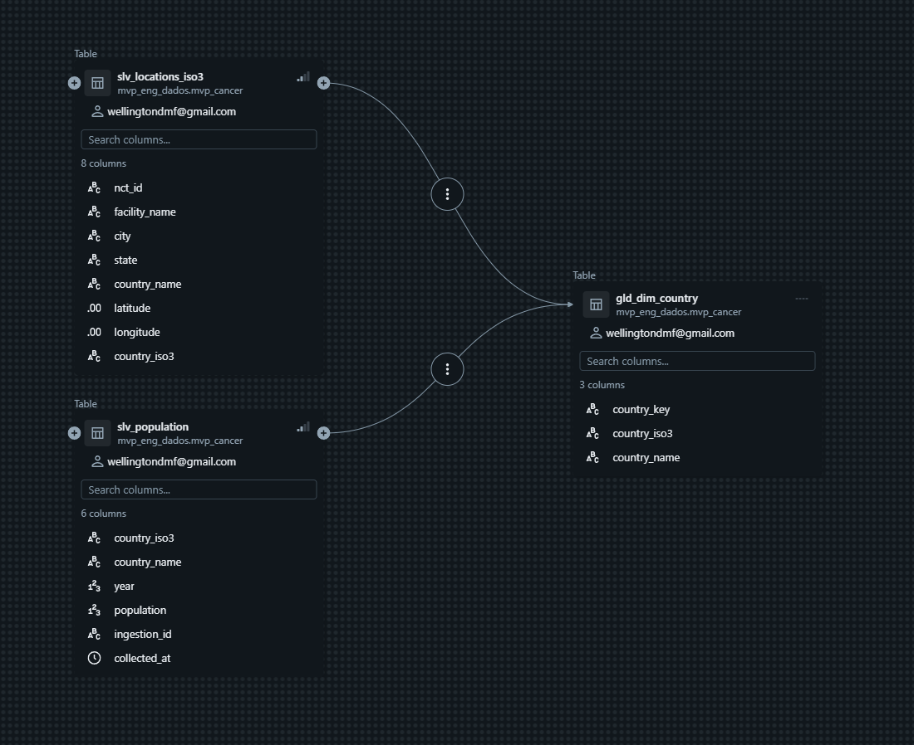
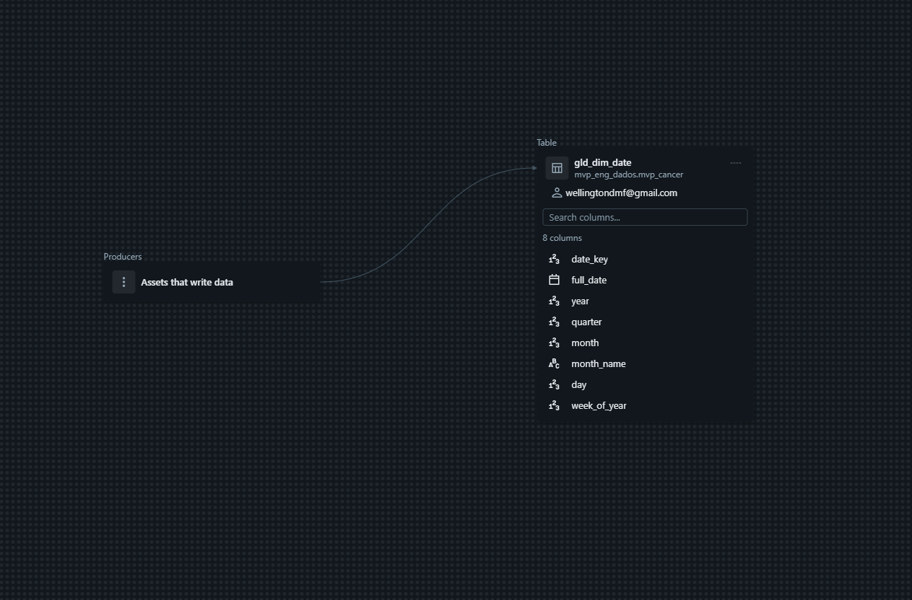

### 3.3 Grãos, chaves e cuidados de agregação

- Estudo: chave natural `nct_id`; chave técnica `SHA-256(nct_id)`.
- Patrocinador: hash do nome e classe após `lower(trim(...))`; classe nula usa `unknown`.
- Intervenção: hash do tipo e nome normalizados; não há resolução de sinônimos comerciais, doses ou combinações.
- País/entidade: hash do código de três caracteres.
- Data: inteiro `yyyyMMdd`; população utiliza 1º de janeiro como referência do ano, sem afirmar que a população foi medida nesse dia.
- Bridge estudo–país: uma linha por estudo e país mapeado.
- Bridge estudo–intervenção: uma linha por par de chaves.
- Indicador país–ano: estudos distintos por país e **ano de início**, divididos pela população do mesmo ano.

**Não somar estudos por país para obter o total mundial:** estudos multinacionais aparecem em mais de um país. O mesmo cuidado vale para tipos de intervenção. `facility_count` é calculado por pares distintos de estabelecimento e cidade dentro de cada estudo–país; sua soma por país–ano não é um total de estabelecimentos físicos únicos.

### 3.4 Convenções do catálogo

Todos os nomes abaixo pertencem a `mvp_eng_dados.mvp_cancer`. Os tipos foram extraídos do código e, quando disponíveis, dos schemas nas saídas. As regras de domínio são contratos documentais esperados; o pipeline ainda não aplica todos eles.

Os campos clínicos indicados por caminhos como `statusModule` pertencem a `payload.protocolSection`. O prefixo `json_data` usado no código é uma estrutura temporária de processamento, não uma tabela.

#### 3.4.1 `brz_clinical_trials`

**Grão:** Um registro retornado pela API em uma página da extração corrente.  
**Origem/linhagem:** API ClinicalTrials.gov.

| Coluna | Tipo | Descrição | Domínio / ressalva | Origem / transformação |
| --- | --- | --- | --- | --- |
| ingestion_id | STRING | Identificador da coleta | UUID textual; preenchido | Configuração da ingestão |
| nct_id | STRING | Identificador extraído do JSON | NCT + 8 dígitos esperado; schema de ingestão não aceita nulo | protocolSection.identificationModule.nctId |
| page_number | INT | Página da coleta | Inteiro >= 1 | Contador local de paginação |
| payload | STRING | JSON serializado do registro integral | JSON válido; não nulo | json.dumps(study, ensure_ascii=False) |
| source_url | STRING | URL da requisição | URL HTTPS, incluindo parâmetros e eventualmente pageToken | response.url |
| collected_at | TIMESTAMP | Instante lógico da coleta | Timestamp; confirmar fuso da exibição | Configuração da ingestão, preservada da Bronze |

#### 3.4.2 `brz_population`

**Grão:** Um registro de entidade geográfica e ano retornado na extração corrente.  
**Origem/linhagem:** API Banco Mundial.

| Coluna | Tipo | Descrição | Domínio / ressalva | Origem / transformação |
| --- | --- | --- | --- | --- |
| ingestion_id | STRING | Identificador da coleta | UUID textual; preenchido | Configuração da ingestão |
| country_id | STRING | Identificador geográfico auxiliar | CORRIGIR: atualmente repete country_iso3 | record.countryiso3code, e não record.country.id |
| country_iso3 | STRING | Código geográfico de três caracteres | ISO3 esperado; códigos agregados ainda precisam de exclusão | Banco Mundial ou mapeamento por nome |
| year | INT | Ano de referência | 2000 a 2025 na carga de população | Banco Mundial, date, convertido para inteiro |
| payload | STRING | JSON serializado da observação populacional | JSON válido; não nulo | json.dumps(record, ensure_ascii=False) |
| source_url | STRING | URL da requisição populacional | URL HTTPS com indicador, período e tamanho da página | response.url |
| collected_at | TIMESTAMP | Instante lógico da coleta | Timestamp; confirmar fuso da exibição | Configuração da ingestão, preservada da Bronze |

#### 3.4.3 `slv_studies`

**Grão:** Um registro por nct_id.  
**Origem/linhagem:** brz_clinical_trials; seleção do registro mais recente e extração do JSON.

| Coluna | Tipo | Descrição | Domínio / ressalva | Origem / transformação |
| --- | --- | --- | --- | --- |
| nct_id | STRING | Identificador do registro clínico | NCT seguido de 8 dígitos; não nulo esperado | identificationModule.nctId; trim e upper na Silver |
| study_title | STRING | Título resumido do estudo | Texto não vazio esperado | identificationModule.briefTitle; normalização de espaços |
| study_type | STRING | Tipo de registro | INTERVENTIONAL, OBSERVATIONAL, EXPANDED_ACCESS | designModule.studyType; upper |
| overall_status | STRING | Situação cadastral | Enumeração oficial Status; regra local incompleta | statusModule.overallStatus; upper |
| phase | STRING | Fase ou combinação de fases | NA, EARLY_PHASE1, PHASE1 a PHASE4 e combinações separadas por \|; nulo na Silver | designModule.phases; ordenação e concatenação |
| start_date_original | STRING | Data de início como recebida | YYYY, YYYY-MM ou YYYY-MM-DD; pode ser nula | statusModule.startDateStruct.date |
| start_date_type | STRING | Natureza da data de início | ACTUAL, ESTIMATED ou nulo | statusModule.startDateStruct.type |
| completion_date_original | STRING | Data de conclusão como recebida | YYYY, YYYY-MM ou YYYY-MM-DD; pode ser nula | statusModule.completionDateStruct.date |
| completion_date_type | STRING | Natureza da data de conclusão | ACTUAL, ESTIMATED ou nulo | statusModule.completionDateStruct.type |
| enrollment_count | BIGINT | Participantes informados no cadastro | Inteiro >= 0 esperado; nulo permitido; sem teto validado | designModule.enrollmentInfo.count |
| enrollment_type | STRING | Natureza da quantidade de participantes | ACTUAL, ESTIMATED ou nulo | designModule.enrollmentInfo.type; upper |
| sponsor_name | STRING | Nome do patrocinador principal | Texto; não identifica necessariamente todos os financiadores | sponsorCollaboratorsModule.leadSponsor.name; espaços normalizados |
| sponsor_class | STRING | Classe do patrocinador principal | NIH, FED, OTHER_GOV, INDIV, INDUSTRY, NETWORK, AMBIG, OTHER, UNKNOWN conforme origem | sponsorCollaboratorsModule.leadSponsor.class; upper |
| ingestion_id | STRING | Identificador da coleta | UUID textual; preenchido | Configuração da ingestão |
| collected_at | TIMESTAMP | Instante lógico da coleta | Timestamp; confirmar fuso da exibição | Configuração da ingestão, preservada da Bronze |
| start_date | DATE | Data de início convertida | Data; precisão incompleta preenchida com mês/dia 01 | parse_partial_date(start_date_original) |
| completion_date | DATE | Data de conclusão convertida | Data; precisão incompleta preenchida com mês/dia 01 | parse_partial_date(completion_date_original) |
| duration_days | INT | Dias entre conclusão e início | >= 0 ou nulo; pode usar datas estimadas/imputadas | datediff(completion_date,start_date) quando fim >= início |

#### 3.4.4 `slv_conditions`

**Grão:** Par distinto nct_id e condition_name.  
**Origem/linhagem:** brz_clinical_trials; conditionsModule.conditions[].

| Coluna | Tipo | Descrição | Domínio / ressalva | Origem / transformação |
| --- | --- | --- | --- | --- |
| nct_id | STRING | Identificador do registro clínico | NCT seguido de 8 dígitos; não nulo esperado | identificationModule.nctId; trim e upper na Silver |
| condition_name | STRING | Condição associada ao estudo | Texto não nulo; string vazia não é filtrada explicitamente | explode_outer e normalização de espaços; dropDuplicates |

#### 3.4.5 `slv_interventions`

**Grão:** Linha distinta de estudo, tipo, nome e descrição.  
**Origem/linhagem:** brz_clinical_trials; armsInterventionsModule.interventions[].

| Coluna | Tipo | Descrição | Domínio / ressalva | Origem / transformação |
| --- | --- | --- | --- | --- |
| nct_id | STRING | Identificador do registro clínico | NCT seguido de 8 dígitos; não nulo esperado | identificationModule.nctId; trim e upper na Silver |
| intervention_type | STRING | Categoria da intervenção | DRUG, DEVICE, BIOLOGICAL, PROCEDURE, RADIATION, BEHAVIORAL, GENETIC, DIETARY_SUPPLEMENT, DIAGNOSTIC_TEST, COMBINATION_PRODUCT, OTHER | armsInterventionsModule.interventions[].type; trim e upper |
| intervention_name | STRING | Nome cadastral da intervenção | Texto; nulos descartados, vazios avaliados depois | armsInterventionsModule.interventions[].name; espaços normalizados |
| description | STRING | Descrição cadastral da intervenção | Texto livre ou nulo | interventions[].description; trim |

#### 3.4.6 `slv_locations`

**Grão:** Linha distinta dos sete campos de localização, incluindo estudo.  
**Origem/linhagem:** brz_clinical_trials; explode das localizações; descarte de país nulo.

| Coluna | Tipo | Descrição | Domínio / ressalva | Origem / transformação |
| --- | --- | --- | --- | --- |
| nct_id | STRING | Identificador do registro clínico | NCT seguido de 8 dígitos; não nulo esperado | identificationModule.nctId; trim e upper na Silver |
| facility_name | STRING | Nome do estabelecimento | Texto ou nulo | contactsLocationsModule.locations[].facility; trim |
| city | STRING | Cidade | Texto ou nulo; sem normalização geográfica além de trim | locations[].city |
| state | STRING | Estado/província | Texto ou nulo; não exigir UF brasileira em dados mundiais | locations[].state |
| country_name | STRING | Nome da entidade geográfica | Texto; sem lista fechada no código | Fonte geográfica; trim na Silver |
| latitude | DOUBLE | Latitude do local | -90 a 90 ou nulo | locations[].geoPoint.lat |
| longitude | DOUBLE | Longitude do local | -180 a 180 ou nulo | locations[].geoPoint.lon |

#### 3.4.7 `slv_locations_iso3`

**Grão:** Linha de localização com código mapeado.  
**Origem/linhagem:** slv_locations LEFT JOIN referência populacional e overrides por nome normalizado.

| Coluna | Tipo | Descrição | Domínio / ressalva | Origem / transformação |
| --- | --- | --- | --- | --- |
| nct_id | STRING | Identificador do registro clínico | NCT seguido de 8 dígitos; não nulo esperado | identificationModule.nctId; trim e upper na Silver |
| facility_name | STRING | Nome do estabelecimento | Texto ou nulo | contactsLocationsModule.locations[].facility; trim |
| city | STRING | Cidade | Texto ou nulo; sem normalização geográfica além de trim | locations[].city |
| state | STRING | Estado/província | Texto ou nulo; não exigir UF brasileira em dados mundiais | locations[].state |
| country_name | STRING | Nome da entidade geográfica | Texto; sem lista fechada no código | Fonte geográfica; trim na Silver |
| latitude | DOUBLE | Latitude do local | -90 a 90 ou nulo | locations[].geoPoint.lat |
| longitude | DOUBLE | Longitude do local | -180 a 180 ou nulo | locations[].geoPoint.lon |
| country_iso3 | STRING | Código geográfico de três caracteres | ISO3 esperado; códigos agregados ainda precisam de exclusão | Banco Mundial ou mapeamento por nome |

#### 3.4.8 `slv_population`

**Grão:** Par country_iso3 e year; ainda pode incluir agregados.  
**Origem/linhagem:** brz_population; parse, filtros e deduplicação.

| Coluna | Tipo | Descrição | Domínio / ressalva | Origem / transformação |
| --- | --- | --- | --- | --- |
| country_iso3 | STRING | Código geográfico de três caracteres | ISO3 esperado; códigos agregados ainda precisam de exclusão | Banco Mundial ou mapeamento por nome |
| country_name | STRING | Nome da entidade geográfica | Texto; sem lista fechada no código | Fonte geográfica; trim na Silver |
| year | INT | Ano de referência | 2000 a 2025 na carga de população | Banco Mundial, date, convertido para inteiro |
| population | BIGINT | População da entidade no ano | >= 0 na regra atual; > 0 necessário para divisão | Banco Mundial, value; valores nulos filtrados na Silver |
| ingestion_id | STRING | Identificador da coleta | UUID textual; preenchido | Configuração da ingestão |
| collected_at | TIMESTAMP | Instante lógico da coleta | Timestamp; confirmar fuso da exibição | Configuração da ingestão, preservada da Bronze |

#### 3.4.9 `gld_dim_study`

**Grão:** Um registro por estudo.  
**Origem/linhagem:** slv_studies.

| Coluna | Tipo | Descrição | Domínio / ressalva | Origem / transformação |
| --- | --- | --- | --- | --- |
| study_key | STRING | Chave técnica do estudo | Hash SHA-256, 64 caracteres hexadecimais | SHA-256 de nct_id |
| phase | STRING | Fase para consumo | Mesmos valores da Silver; nulos convertidos em NA | coalesce(slv_studies.phase, NA) |
| nct_id | STRING | Identificador do registro clínico | NCT seguido de 8 dígitos; não nulo esperado | identificationModule.nctId; trim e upper na Silver |
| study_title | STRING | Título resumido do estudo | Texto não vazio esperado | identificationModule.briefTitle; normalização de espaços |
| study_type | STRING | Tipo de registro | INTERVENTIONAL, OBSERVATIONAL, EXPANDED_ACCESS | designModule.studyType; upper |
| overall_status | STRING | Situação cadastral | Enumeração oficial Status; regra local incompleta | statusModule.overallStatus; upper |
| enrollment_type | STRING | Natureza da quantidade de participantes | ACTUAL, ESTIMATED ou nulo | designModule.enrollmentInfo.type; upper |

#### 3.4.10 `gld_dim_sponsor`

**Grão:** Uma chave por nome/classe normalizados.  
**Origem/linhagem:** slv_studies; patrocinador não nulo; deduplicação pela chave.

| Coluna | Tipo | Descrição | Domínio / ressalva | Origem / transformação |
| --- | --- | --- | --- | --- |
| sponsor_key | STRING | Chave técnica do patrocinador | Hash SHA-256; pode ser nula no fato | SHA-256 de nome e classe normalizados; classe nula vira unknown |
| sponsor_name | STRING | Nome do patrocinador principal | Texto; não identifica necessariamente todos os financiadores | sponsorCollaboratorsModule.leadSponsor.name; espaços normalizados |
| sponsor_class | STRING | Classe do patrocinador principal | NIH, FED, OTHER_GOV, INDIV, INDUSTRY, NETWORK, AMBIG, OTHER, UNKNOWN conforme origem | sponsorCollaboratorsModule.leadSponsor.class; upper |

#### 3.4.11 `gld_dim_country`

**Grão:** Uma chave por código geográfico.  
**Origem/linhagem:** União de slv_locations_iso3 e slv_population; agrupamento por código/hash.

| Coluna | Tipo | Descrição | Domínio / ressalva | Origem / transformação |
| --- | --- | --- | --- | --- |
| country_key | STRING | Chave técnica da entidade geográfica | Hash SHA-256, 64 caracteres hexadecimais | SHA-256 de country_iso3 |
| country_iso3 | STRING | Código geográfico de três caracteres | ISO3 esperado; códigos agregados ainda precisam de exclusão | Banco Mundial ou mapeamento por nome |
| country_name | STRING | Nome escolhido para a entidade | Texto; escolha não determinística se há nomes diferentes para o mesmo código | first(country_name, ignorenulls=True) após união |

#### 3.4.12 `gld_dim_intervention`

**Grão:** Uma chave por tipo/nome normalizados.  
**Origem/linhagem:** slv_interventions; deduplicação pela chave.

| Coluna | Tipo | Descrição | Domínio / ressalva | Origem / transformação |
| --- | --- | --- | --- | --- |
| intervention_key | STRING | Chave técnica da intervenção | Hash SHA-256; tipo e nome normalizados | SHA-256 de lower(trim(tipo)) e lower(trim(nome)), separados por \| |
| intervention_type | STRING | Categoria da intervenção | DRUG, DEVICE, BIOLOGICAL, PROCEDURE, RADIATION, BEHAVIORAL, GENETIC, DIETARY_SUPPLEMENT, DIAGNOSTIC_TEST, COMBINATION_PRODUCT, OTHER | armsInterventionsModule.interventions[].type; trim e upper |
| intervention_name | STRING | Nome cadastral da intervenção | Texto; nulos descartados, vazios avaliados depois | armsInterventionsModule.interventions[].name; espaços normalizados |

#### 3.4.13 `gld_dim_date`

**Grão:** Um dia por linha entre o menor início/fim e o maior início/fim.  
**Origem/linhagem:** Limites de slv_studies; sequence diária.

| Coluna | Tipo | Descrição | Domínio / ressalva | Origem / transformação |
| --- | --- | --- | --- | --- |
| date_key | INT | Chave da data | yyyyMMdd | date_format(full_date, yyyyMMdd) |
| full_date | DATE | Data civil | Entre os limites calculados | sequence(min_date,max_date,interval 1 day) |
| year | INT | Ano da data | Ano civil dentro do intervalo | year(full_date) |
| quarter | INT | Trimestre | 1 a 4 | quarter(full_date) |
| month | INT | Mês | 1 a 12 | month(full_date) |
| month_name | STRING | Nome do mês | Nome gerado por formatação MMMM | date_format(full_date, MMMM) |
| day | INT | Dia do mês | 1 a 31, conforme calendário | dayofmonth(full_date) |
| week_of_year | INT | Semana do ano | 1 a 53 | weekofyear(full_date) |

#### 3.4.14 `gld_fat_clinical_study`

**Grão:** Uma linha por estudo.  
**Origem/linhagem:** slv_studies.

| Coluna | Tipo | Descrição | Domínio / ressalva | Origem / transformação |
| --- | --- | --- | --- | --- |
| study_key | STRING | Chave técnica do estudo | Hash SHA-256, 64 caracteres hexadecimais | SHA-256 de nct_id |
| sponsor_key | STRING | Chave técnica do patrocinador | Hash SHA-256; pode ser nula no fato | SHA-256 de nome e classe normalizados; classe nula vira unknown |
| start_date_key | INT | Referência ao início | yyyyMMdd ou nulo | date_format(start_date) |
| completion_date_key | INT | Referência à conclusão | yyyyMMdd ou nulo | date_format(completion_date) |
| enrollment_count | BIGINT | Participantes informados no cadastro | Inteiro >= 0 esperado; nulo permitido; sem teto validado | designModule.enrollmentInfo.count |
| duration_days | INT | Dias entre conclusão e início | >= 0 ou nulo; pode usar datas estimadas/imputadas | datediff(completion_date,start_date) quando fim >= início |
| collected_at | TIMESTAMP | Instante lógico da coleta | Timestamp; confirmar fuso da exibição | Configuração da ingestão, preservada da Bronze |

#### 3.4.15 `gld_fat_country_population`

**Grão:** Uma linha por entidade e ano.  
**Origem/linhagem:** slv_population.

| Coluna | Tipo | Descrição | Domínio / ressalva | Origem / transformação |
| --- | --- | --- | --- | --- |
| country_key | STRING | Chave técnica da entidade geográfica | Hash SHA-256, 64 caracteres hexadecimais | SHA-256 de country_iso3 |
| date_key | INT | Chave anual representada por 1º de janeiro | yyyy0101; ano 2000 a 2025 | concat(year,0101), convertido para INT |
| population | BIGINT | População da entidade no ano | >= 0 na regra atual; > 0 necessário para divisão | Banco Mundial, value; valores nulos filtrados na Silver |

#### 3.4.16 `gld_flat_bridge_study_location`

**Grão:** Par study_key e country_key.  
**Origem/linhagem:** slv_locations_iso3; exclusão de ISO3 nulo; agrupamento por estudo/país.

| Coluna | Tipo | Descrição | Domínio / ressalva | Origem / transformação |
| --- | --- | --- | --- | --- |
| study_key | STRING | Chave técnica do estudo | Hash SHA-256, 64 caracteres hexadecimais | SHA-256 de nct_id |
| country_key | STRING | Chave técnica da entidade geográfica | Hash SHA-256, 64 caracteres hexadecimais | SHA-256 de country_iso3 |
| facility_count | BIGINT | Pares distintos estabelecimento/cidade no estudo e país | Inteiro >= 0; não equivale a instalações únicas em toda a base | countDistinct(facility_name,city); pares com nulo não entram na contagem |

#### 3.4.17 `gld_flat_bridge_study_intervention`

**Grão:** Par study_key e intervention_key.  
**Origem/linhagem:** slv_interventions; hashes e dropDuplicates.

| Coluna | Tipo | Descrição | Domínio / ressalva | Origem / transformação |
| --- | --- | --- | --- | --- |
| study_key | STRING | Chave técnica do estudo | Hash SHA-256, 64 caracteres hexadecimais | SHA-256 de nct_id |
| intervention_key | STRING | Chave técnica da intervenção | Hash SHA-256; tipo e nome normalizados | SHA-256 de lower(trim(tipo)) e lower(trim(nome)), separados por \| |

#### 3.4.18 `gld_flat_country_year_metrics`

**Grão:** Uma linha por país/entidade e ano de início dos estudos mapeados.  
**Origem/linhagem:** Bridge de locais + fato clínica + dimensão de país; LEFT JOIN população por país/ano.

| Coluna | Tipo | Descrição | Domínio / ressalva | Origem / transformação |
| --- | --- | --- | --- | --- |
| country_key | STRING | Chave técnica da entidade geográfica | Hash SHA-256, 64 caracteres hexadecimais | SHA-256 de country_iso3 |
| country_iso3 | STRING | Código geográfico de três caracteres | ISO3 esperado; códigos agregados ainda precisam de exclusão | Banco Mundial ou mapeamento por nome |
| country_name | STRING | Nome da entidade geográfica | Texto; sem lista fechada no código | Fonte geográfica; trim na Silver |
| year | INT | Ano de início dos estudos | Ano de start_date; nulo possível; não é ano de registro | start_date_key / 10000 convertido para INT |
| study_count | BIGINT | Quantidade distinta de estudos no país/ano | Inteiro > 0 nas linhas presentes; não há grade com países de zero estudos | countDistinct(study_key) |
| facility_count | BIGINT | Soma de pares estabelecimento/cidade por estudo | >= 0; um mesmo estabelecimento pode contar em vários estudos | sum da facility_count da bridge |
| population | BIGINT | População da entidade no ano | >= 0 na regra atual; > 0 necessário para divisão | Banco Mundial, value; valores nulos filtrados na Silver |
| studies_per_million | DOUBLE | Estudos por milhão de habitantes | >= 0 quando denominador > 0; nulo sem população; proteção a zero pendente | round(study_count / population * 1000000,4) |

#### 3.4.19 `sys_data_quality_control`

**Grão:** Uma linha por tabela Silver e coluna perfilada.  
**Origem/linhagem:** profile_table em config; seis tabelas Silver.

| Coluna | Tipo | Descrição | Domínio / ressalva | Origem / transformação |
| --- | --- | --- | --- | --- |
| table_name | STRING | Tabela avaliada | Uma das seis tabelas slv_ | Parâmetro de profile_table |
| column_name | STRING | Coluna avaliada | Nome no schema da tabela | df.schema.fields |
| data_type | STRING | Tipo PySpark como texto | Ex.: StringType(), LongType() | str(field.dataType) |
| total_rows | INT | Total de linhas da tabela | >= 0; tipo observado INT | df.count(), inserido por lit |
| non_null_count | BIGINT | Valores não nulos | 0 a total_rows | count(coluna) |
| null_count | BIGINT | Valores nulos | 0 a total_rows; caso vazio exige tratamento | sum de indicador isNull |
| null_percentage | DOUBLE | Percentual de nulos | 0 a 100 para tabela não vazia | round(null_count/total_rows*100,4) |
| distinct_count | BIGINT | Valores distintos não nulos | 0 a non_null_count | countDistinct |
| minimum_value | STRING | Mínimo convertido para texto | Numérico/data no tipo original; lexical para texto | min(coluna).cast(string) |
| maximum_value | STRING | Máximo convertido para texto | Numérico/data no tipo original; lexical para texto | max(coluna).cast(string) |

#### 3.4.20 `sys_data_quality_results`

**Grão:** Uma linha por regra na execução armazenada.  
**Origem/linhagem:** quality_rules e spark.sql; escrita overwrite.

| Coluna | Tipo | Descrição | Domínio / ressalva | Origem / transformação |
| --- | --- | --- | --- | --- |
| rule_name | STRING | Identificador da regra | Um dos 15 nomes implementados | quality_rules |
| table_name | STRING | Tabela principal da regra | Nome slv_; consultas podem usar mais de uma tabela | quality_rules |
| severity | STRING | Severidade configurada | ERROR ou WARNING | quality_rules |
| failure_count | BIGINT | Contagem de ocorrências da regra | >= 0; duplicidade conta grupos, não linhas excedentes | Resultado failures de cada SQL |
| passed | BOOLEAN | Indicador de aprovação | True quando failure_count=0 | Comparação no Python |
| execution_timestamp | TIMESTAMP | Instante de gravação da avaliação | Timestamp da escrita; fuso da sessão | current_timestamp() |

<a id="pipeline"></a>

## 4. Pipeline de Dados (Etapa 4.4)

> **Evidencia:** schemas, tipos e comentários das tabelas; Apenas mostrando que foi possivel adicionar os comentarios das tabelas, tanto por linha de codigo, quanto pela ia da Databricks.

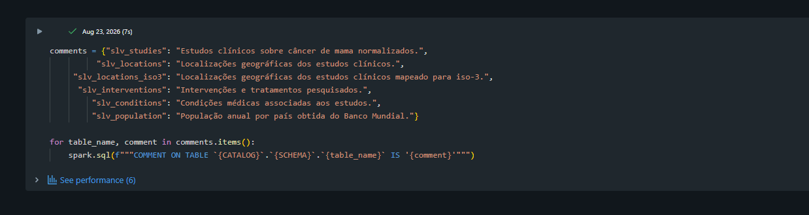
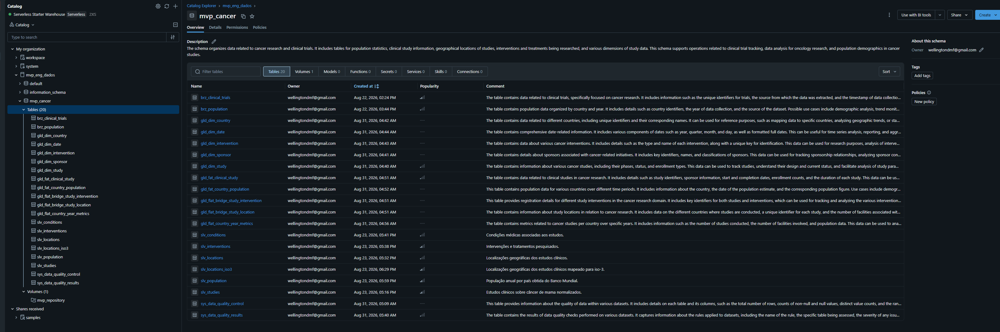


### 4.1 Arquivos e responsabilidades

| Arquivo | Responsabilidade |
| --- | --- |
| [config](https://github.com/wellingtondmf/pos_puc_2026/blob/main/MVP_ENGENHARIA_DE_DADOS/config.ipynb) | Imports, parâmetros, sessão HTTP, schemas, funções e parsing compartilhado; inclui leitura da Bronze, criando dependência inadequada para a primeira carga. |
| [estrutura_dos_dados](https://github.com/wellingtondmf/pos_puc_2026/blob/main/MVP_ENGENHARIA_DE_DADOS/estrutura_dos_dados.ipynb) | Criação de catálogo/schema/volume, consultas de validação e comentários Silver; mistura preparação e pós-carga. |
| [01_etl_brz_clinical_trials_table](https://github.com/wellingtondmf/pos_puc_2026/blob/main/MVP_ENGENHARIA_DE_DADOS/01_etl_brz_clinical_trials_table.ipynb) | Busca e paginação clínica; escrita Bronze e asserts de contagem. |
| [01_etl_brz_world_bank_open_data](https://github.com/wellingtondmf/pos_puc_2026/blob/main/MVP_ENGENHARIA_DE_DADOS/01_etl_brz_world_bank_open_data.ipynb) | Coleta de população; escrita Bronze. |
| [02_etl_silver_studies](https://github.com/wellingtondmf/pos_puc_2026/blob/main/MVP_ENGENHARIA_DE_DADOS/02_etl_silver_studies.ipynb) | Estudos, datas, participantes e patrocinador. |
| [02_etl_silver_conditions](https://github.com/wellingtondmf/pos_puc_2026/blob/main/MVP_ENGENHARIA_DE_DADOS/02_etl_silver_conditions.ipynb) | Explosão e normalização de condições. |
| [02_etl_silver_interventions](https://github.com/wellingtondmf/pos_puc_2026/blob/main/MVP_ENGENHARIA_DE_DADOS/02_etl_silver_interventions.ipynb) | Explosão e normalização de intervenções. |
| [02_etl_silver_locations](https://github.com/wellingtondmf/pos_puc_2026/blob/main/MVP_ENGENHARIA_DE_DADOS/02_etl_silver_locations.ipynb) | Explosão e normalização de localizações. |
| [02_etl_silver_population](https://github.com/wellingtondmf/pos_puc_2026/blob/main/MVP_ENGENHARIA_DE_DADOS/02_etl_silver_population.ipynb) | Parse de população, filtros e deduplicação. |
| [02_etl_silver_locations_iso3](https://github.com/wellingtondmf/pos_puc_2026/blob/main/MVP_ENGENHARIA_DE_DADOS/02_etl_silver_locations_iso3.ipynb) | Correspondência geográfica por nomes e lista manual de ajustes. |
| [03_etl_gold](https://github.com/wellingtondmf/pos_puc_2026/blob/main/MVP_ENGENHARIA_DE_DADOS/03_etl_gold.ipynb) | Dimensões, fatos, bridges, métrica por milhão e duas validações. |
| [04_qualidade_dados](https://github.com/wellingtondmf/pos_puc_2026/blob/main/MVP_ENGENHARIA_DE_DADOS/04_qualidade_dados.ipynb) | Perfil Silver, regras, persistência de controles e análises por situação/fase/intervenção. |

### 4.2 Transformações implementadas: motivo e impacto

| Etapa | O que o código faz | Motivo | Impacto / limite |
| --- | --- | --- | --- |
| Bronze clínica → parsing | Seleciona registro mais recente por `nct_id` e `collected_at` | Evitar versões repetidas do estudo | Empates de timestamp não têm desempate explícito; Bronze atual é overwrite |
| Parsing clínico | Aplica `StructType` ao payload | Estruturar campos usados nas análises | Campos não declarados permanecem apenas no payload; ausência e erro de parsing não são distinguidos por regra própria |
| Textos e identificadores | `trim`, redução de espaços e `upper` em campos específicos | Reduzir diferenças de apresentação | Não resolve sinônimos ou equivalência semântica |
| Fases | Ordena array e concatena com barra vertical | Manter múltiplas fases por estudo | Fases combinadas formam categorias próprias |
| Datas parciais | Preenche mês/dia com 01 | Permitir tipo DATE e cálculos | Introduz precisão artificial; preservar campo original e avaliar impacto |
| Duração | Calcula diferença se conclusão >= início | Evitar duração negativa na coluna derivada | Intervalos inválidos viram nulos; datas estimadas continuam no cálculo |
| Condições | `explode_outer`, filtro de nulo e deduplicação | Separar múltiplas condições por estudo | Estudo sem condição não gera linha final; não prova erro na origem |
| Intervenções | Explode, filtra nome nulo, remove linhas idênticas | Estruturar tratamentos pesquisados | Descrições diferentes podem gerar várias linhas para mesmo estudo/tipo/nome |
| Localizações | Explode, filtra país nulo, remove linhas idênticas | Estruturar geografia | Perdas de registros sem país precisam ser quantificadas na origem |
| População | Filtra código com tamanho 3 e população não nula; deduplica país/ano | Preparar denominador e chave | Tamanho 3 não garante país nem ISO3 oficial; agregados podem permanecer |
| Mapeamento ISO3 | Une referência populacional e oito nomes alternativos; join por `lower(trim(nome))` | Conciliar nomes entre fontes | Persistem 2.493 localizações sem correspondência; overrides não têm prioridade explícita em conflitos |
| Dimensões | Cria hashes e remove chaves repetidas | Estabilizar relacionamentos | Não implementa histórico SCD; possíveis variantes de nomes são colapsadas |
| Bridge geográfica | Filtra ISO3 nulo, agrupa estudo/país | Evitar multiplicar estudo por seus locais | Descarta geografia não mapeada; `countDistinct` não conta pares contendo nulo |
| Bridge intervenção | Deduplica pares de chaves | Representar muitos para muitos | Contagens devem usar estudos distintos por categoria |
| País–ano | Agrega por início e junta população por país/ano | Produzir comparação normalizada | Ano de início ≠ registro; sem população não há taxa; zero no denominador não está protegido |
| Qualidade | Calcula perfil e executa regras sobre Silver | Medir problemas antes da interpretação | Não mede toda a qualidade da Bronze nem aplica correção automaticamente |

Todos os notebooks usam caminhos relativos como `%run ./config`; 

### 4.3.1 Job agendado e dependências entre tasks

**Evidencia:** 
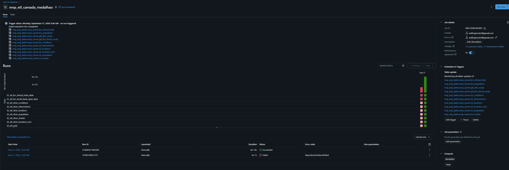
- Criado um Job no Databricks com uma task para cada notebook de execução. O Job está agendado para persistir os dados e organiza as dependências por camada: primeiro Bronze, depois Silver e, por último, Gold.
 As tabelas serão atualizadas em sequencia conforme for registrado a atualização de cada tabela.
| Campo | Configuração / informação a completar |
| --- | --- |
| Nome e ID do Job | **mvp_etl_camada_medalhao:** 406125063302905 |
| Agenda | **Table update:** frequência, horário ou expressão cron e fuso |
| Estado da agenda | **Ativa:** ativa ou pausada |
| Organização | Uma task por notebook de execuçãor.|
| Sequência | Bronze → Silver → Gold |
| Compute e identidade de execução | **Cluster Job:** configuração cluster serverless | **PREENCHER:** limite de execuções simultâneas e tratamento de sobreposição |
| Qualidade | **CONFIRMAR:** task existente e sua posição em relação à Gold |
| Última execução validada | **Run Id:** 274485417465500 - Sucess|

#### Mapeamento dos notebooks de execução

**Evidencia:**
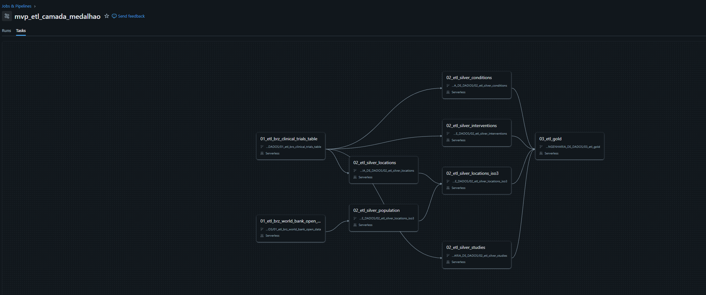

| Notebook | Camada / responsabilidade | Dependência de dados |
| --- | --- | --- |
| `01_etl_brz_clinical_trials_table` | Bronze clínica | Configuração e acesso à API clínica |
| `01_etl_brz_world_bank_open_data` | Bronze população | Configuração e acesso à API populacional |
| `02_etl_silver_studies` | Silver estudos | Bronze clínica |
| `02_etl_silver_conditions` | Silver condições | Bronze clínica |
| `02_etl_silver_interventions` | Silver intervenções | Bronze clínica |
| `02_etl_silver_locations` | Silver localizações | Bronze clínica |
| `02_etl_silver_population` | Silver população | Bronze população |
| `02_etl_silver_locations_iso3` | Silver geográfica enriquecida | Silver localizações **e** Silver população |
| `03_etl_gold` | Gold: dimensões, fatos, bridges e indicadores | Silver estudos, intervenções, localizações ISO3 e população; respeitar a barreira entre camadas configurada |
| `04_qualidade_dados` | Perfil, regras e consultas | Tabelas Silver; confirmar posição e condição de execução no Job |

`config` é chamado por `%run`; 


### 4.4 Evidências de persistência da Gold

As seguintes contagens foram impressas em 31/08/2026 no arquivo `03_etl_gold.dbc`:

| Tabela | Linhas |
| --- | --- |
| `gld_dim_country` | 261 |
| `gld_dim_date` | 47.362 |
| `gld_dim_intervention` | 16.089 |
| `gld_dim_sponsor` | 3.527 |
| `gld_dim_study` | 16.736 |
| `gld_fat_clinical_study` | 16.736 |
| `gld_fat_country_population` | 6.760 |
| `gld_flat_bridge_study_intervention` | 33.008 |
| `gld_flat_bridge_study_location` | 24.800 |
| `gld_flat_country_year_metrics` | 1.866 |

A validação da fato clínica retornou **16.736 linhas e 16.736 chaves distintas**. A verificação de correspondência com `gld_dim_study`.

Obs: Os 261 registros de `gld_dim_country` **não devem ser descritos como 261 países**. A dimensão incorpora os códigos existentes na população, cujo filtro atual não distingue agregados, economias e países.


### 4.5 Correções e investigações técnicas

| ID | Prioridade | Diagnóstico | Ação necessária | Critério de conclusão |
| --- | --- | --- | --- | --- |
| C01 | Alta | O DBC de condições registra `NameError: clinical_json_schema`; o `config.dbc` atual define o schema antes do parsing quando ordenado por `position` | Sincronizar a versão de config usada pelas tasks e reexecutar em sessão limpa | Todas as chamadas de config concluídas na mesma execução |
| C02 | Alta | `config` lê Bronze e é chamado antes da criação/ingestão | Separar configuração de leitura e transformação | Primeira carga em ambiente vazio executada |
| C03 | Alta | Gold exportada contém falha posterior no `%run ./config` | Corrigir dependências e executar todas as células em ordem | Nova exportação com execução completa e consistente |
| C04 | Alta | Primeira célula de qualidade contém apenas nomes de tabelas após `%sql` | Converter em Markdown ou SQL válido | Notebook de qualidade executa do início ao fim |
| C05 | Alta | Pergunta 1 exige registro por ano; modelo estruturado usa início | Definir evento de registro, extrair campo correto e documentar | Consulta usa data aprovada e informa ausências |
| C06 | Alta | `INVALID_STATUS` omite categorias oficiais e sinaliza 32 registros válidos | Completar domínio, incluindo WITHHELD, e testar | Zero falsos positivos para as quatro categorias observadas |
| C07 | Alta | 2.493 localizações sem ISO3 são excluídas da bridge | Listar países, ajustar correspondências e medir perdas | Cobertura recalculada; exceções justificadas |
| C08 | Alta | População admite códigos agregados por filtrar só comprimento | Usar referência de entidades/países com regra de elegibilidade | Dimensão e ranking sem agregados indevidos |
| C09 | Média | População Bronze não valida paginação/completude | Verificar pages/total e paginar quando necessário | Total bruto conciliado com metadados da API |
| C10 | Média | `country_id` duplica ISO3 na Bronze | Corrigir origem ou explicitar redundância | Catálogo e carga com semântica consistente |
| C11 | Média | Perfis não tratam tabela vazia explicitamente | Proteger divisão e agregações vazias | Perfil válido para tabela com zero linhas |
| C12 | Alta | Datas parciais e estimadas entram na duração | Separar precisão e natureza antes da média | Resultado acompanhado do número de estudos elegíveis |
| C13 | Média | Taxa por milhão não protege população zero | Aplicar regra de denominador positivo | Nenhuma divisão inválida; ausências explicadas |
| C14 | Média | Escolha de nomes e overrides pode ser não determinística | Definir prioridade/desempate | Mapeamento repetível com a mesma entrada |
| C15 | Média | Cobertura da dimensão de datas depende só das datas clínicas | Validar chaves das duas fatos contra a dimensão | Zero órfãos indevidos em datas; ausências legítimas separadas |
| C16 | Média | Auditoria de perda e perfil Bronze não foram executados nas evidências | Comparar antes/depois dos filtros e deduplicações | Quantidades e motivos registrados |

**Revisão do diagnóstico:** a ordem das células no array interno do DBC não é a ordem visual do notebook; deve-se usar o campo `position`. No `config.dbc` recebido, o schema vem antes do parsing. Portanto, a afirmação anterior de que a primeira célula usa o schema antes da definição foi corrigida. O DBC de condições registra um `NameError` histórico, a Bronze clínica registra `Notebook not found` no `%run ./config`, e a Gold registra falha genérica. Essas saídas podem refletir versões distintas de config. A leitura da Bronze dentro de config continua sendo uma dependência concreta que dificulta a primeira carga em ambiente vazio.


<a id="qualidade"></a>

## 5. Qualidade de Dados (Etapa 4.5)

### 5.1 Método implementado e guardrails

O processo de qualidade percorre as colunas das seis tabelas Silver e calcula total de linhas, nulos, não nulos, percentual de nulos, distintos e mínimo/máximo. O resultado exportado contém **45 combinações de tabela e coluna**.

As 15 regras complementam o perfil com formato de identificador, duplicidades, domínio de status, população, coordenadas e integridade dos detalhes clínicos. Há também duas verificações específicas na Gold: unicidade de `study_key` e correspondência fato–dimensão de estudo.

| Dimensão | Evidência disponível | Limitação |
| --- | --- | --- |
| Completude | Perfil de todas as colunas Silver | Valores vazios não contam como nulos; dados descartados antes da Silver não aparecem |
| Consistência | NCT, status, datas e coordenadas | Domínio de status incompleto; nem todo atributo possui regra |
| Unicidade | NCT e país/ano; chave de estudo na Gold | Regras de duplicidade contam grupos; nem todas as chaves da Gold são verificadas |
| Plausibilidade | Não negatividade e intervalos geográficos/temporais | Não confirma acurácia factual contra uma fonte independente |
| Outliers | Máximos e mínimos observados | Falta método explícito e inspeção dos registros extremos |
| Integridade | Locais e intervenções sem estudo; fato/dimensão de estudos | Falta validar todas as dimensões, datas e bridges |

**Evidencia:** Segue uma refencia de como algunas regras foram criadas.

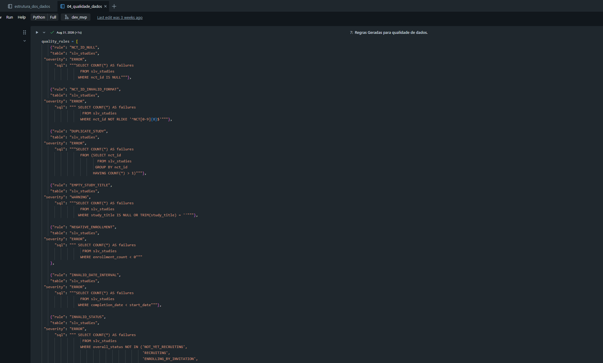

### 5.2 Resultado das 15 regras

| Regra | Tabela | Severidade | Ocorrências | Resultado |
| --- | --- | --- | --- | --- |
| UNMAPPED_COUNTRY | slv_locations_iso3 | WARNING | 2.493 | Sinalizada |
| INVALID_STATUS | slv_studies | ERROR | 32 | Sinalizada |
| NCT_ID_NULL | slv_studies | ERROR | 0 | Aprovada |
| NCT_ID_INVALID_FORMAT | slv_studies | ERROR | 0 | Aprovada |
| DUPLICATE_STUDY | slv_studies | ERROR | 0 | Aprovada |
| EMPTY_STUDY_TITLE | slv_studies | WARNING | 0 | Aprovada |
| NEGATIVE_ENROLLMENT | slv_studies | ERROR | 0 | Aprovada |
| INVALID_DATE_INTERVAL | slv_studies | ERROR | 0 | Aprovada |
| INVALID_LATITUDE | slv_locations_iso3 | ERROR | 0 | Aprovada |
| INVALID_LONGITUDE | slv_locations_iso3 | ERROR | 0 | Aprovada |
| EMPTY_INTERVENTION | slv_interventions | ERROR | 0 | Aprovada |
| INVALID_POPULATION | slv_population | ERROR | 0 | Aprovada |
| DUPLICATE_POPULATION | slv_population | ERROR | 0 | Aprovada |
| ORPHAN_LOCATION | slv_locations_iso3 | ERROR | 0 | Aprovada |
| ORPHAN_INTERVENTION | slv_interventions | ERROR | 0 | Aprovada |

- Foram aprovadas **13 de 15 regras**. Entre as 13 regras de  ERROR, 12 passaram e uma sinalizou 32 ocorrências. Entre as duas WARNING, uma passou e uma sinalizou 2.493 ocorrências.

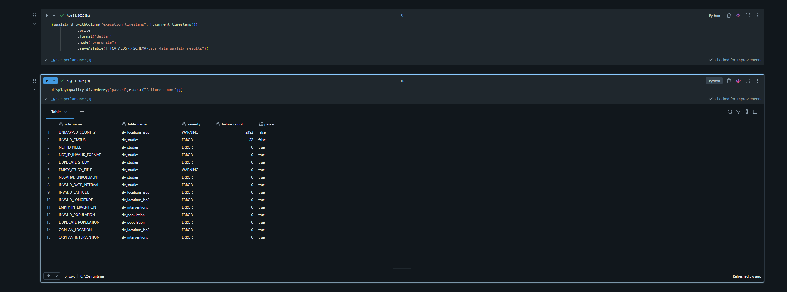

### 5.3 Problemas e limitações efetivamente observados

| Incidentes | Evidência | Interpretação|
| --- | --- | --- |
| País não mapeado | 2.493 de 202.388 localizações, 1,2318% | Preservadas na Silver, excluídas da fato; correção do mapeamento pendente. Não são 2.493 estudos nem países |
| Status fora da lista local | 32 estudos, aproximadamente 0,19% | Falsos positivos da regra; não excluir os estudos |
| Fase nula | 3.684 estudos, 22,0124% | Ausência não equivale automaticamente a erro; distinguir tipo de estudo e não aplicabilidade |
| Natureza da data de início nula | 5.118 estudos, 30,5808% | Não confundir com data de início nula, que ocorre em 85 estudos |
| Estado/província nulo | 59.431 localizações, 29,3649% | Avaliar necessidade do campo por país; não preencher arbitrariamente |
| Descrição de intervenção nula | 4.189 linhas, 12,5359% | Campo textual opcional para algumas análises; preservar ausência |
| Estabelecimento nulo | 5.903 localizações, 2,9167% | Afeta interpretação de facility_count |
| Participantes nulos | 239 estudos, 1,4281% | Informar quantidade elegível nos cálculos de média |
| Duração nula | 607 estudos, 3,6269% | Investigar datas ausentes/inválidas e restrição aplicada no cálculo |
| Participantes extremos | Máximo de 15.000.000 | Investigar registro, tipo de estudo e natureza ACTUAL/ESTIMATED |
| Duração extrema | Máximo de 35.582 dias | Investigar datas originais; cerca de 97 anos não prova sozinho erro cadastral |
| Data de conclusão extrema | Máximo de 2100-12-01 após conversão | Campo original máximo 2100-12; pode ser estimativa, precisa de inspeção |
| População máxima | 8.215.424.893 | Indício de agregado mundial ou regional; identificar código antes de concluir |

Os tipos de status omitidos pela regra são `NO_LONGER_AVAILABLE` (13), `APPROVED_FOR_MARKETING` (10), `AVAILABLE` (8) e `TEMPORARILY_NOT_AVAILABLE` (1). A [enumeração oficial](https://clinicaltrials.gov/data-api/about-api/study-data-structure) reconhece esses quatro valores e também `WITHHELD`. A correção consiste em alinhar a regra ao domínio oficial e à política de escopo aprovada, e não modificar os valores válidos da fonte.

### 5.4 Tratamentos já presentes e validação posterior pendente

O código já normaliza textos, remove duplicidades, filtra nomes/países nulos em tabelas de detalhes, exclui população nula e evita duração negativa na coluna derivada. Esses tratamentos foram identificados no código. **Não há relatório comparativo antes/depois** que permita atribuir um volume de correção a cada transformação.

O mapeamento ISO3 não foi complementado nesta revisão, e a regra de status não foi alterada. Nenhum outlier foi removido. Após a correção, registrar: tabela, regra, quantidade anterior, quantidade posterior, decisão, justificativa e impacto sobre as perguntas.


> **[INSERIR PRINT — E13] Cobertura geográfica e status**  
> **Mostrar:** países sem mapeamento, estudos afetados e domínio de status após revisão  
> **Preencher:** data/hora e fuso da captura, Run ID (quando aplicável), notebook/task e interpretação do resultado.  
> **Estado:** PENDENTE — imagem ainda não anexada.

<!-- Ao adicionar o arquivo em docs/evidencias/e13.png, descomente a linha seguinte. -->
<!--  -->

### 5.5 Análise de outliers proposta — ainda não executada

1. Separar estudos por tipo, fase e natureza efetiva/estimada dos valores.
2. Calcular mediana, quartis, percentis e contagem válida de participantes e duração.
3. Usar IQR ou percentis como sinalizadores, não como critérios automáticos de exclusão.
4. Inspecionar `nct_id`, payload, datas originais e contexto dos registros sinalizados.
5. Comparar médias com medianas e apresentar análise de sensibilidade, quando houver exclusão justificada.
6. Para população, separar agregados de países antes de procurar extremos.


> **[INSERIR PRINT — E14] Investigação de outliers**  
> **Mostrar:** registros extremos, critério utilizado, decisão e efeito nas análises  
> **Preencher:** data/hora e fuso da captura, Run ID (quando aplicável), notebook/task e interpretação do resultado.  
> **Estado:** PENDENTE — imagem ainda não anexada.

<!-- Ao adicionar o arquivo em docs/evidencias/e14.png, descomente a linha seguinte. -->
<!--  -->

### 5.6 Perfil completo por atributo

Os números abaixo foram transcritos das saídas do DBC. A coluna de intervalo contém somente mínimos e máximos numéricos ou temporais; limites lexicais de textos não constituem domínio de negócio e foram omitidos. As origens, descrições e domínios estão no catálogo da seção 3.

| Tabela | Coluna | Linhas | Nulos | Nulos (%) | Distintos não nulos | Mínimo e máximo observados |
| --- | --- | --- | --- | --- | --- | --- |
| slv_studies | start_date_type | 16.736 | 5.118 | 30,5808 | 2 | Ver domínio no catálogo |
| slv_locations | state | 202.388 | 59.431 | 29,3649 | 2.299 | Ver domínio no catálogo |
| slv_locations_iso3 | state | 202.388 | 59.431 | 29,3649 | 2.299 | Ver domínio no catálogo |
| slv_studies | phase | 16.736 | 3.684 | 22,0124 | 8 | Ver domínio no catálogo |
| slv_interventions | description | 33.416 | 4.189 | 12,5359 | 23.949 | Ver domínio no catálogo |
| slv_studies | completion_date_type | 16.736 | 721 | 4,3081 | 2 | Ver domínio no catálogo |
| slv_studies | duration_days | 16.736 | 607 | 3,6269 | 3.897 | 0 a 35582 |
| slv_studies | completion_date_original | 16.736 | 596 | 3,5612 | 3.940 | Ver domínio no catálogo |
| slv_studies | completion_date | 16.736 | 596 | 3,5612 | 3.697 | 1998-05-01 a 2100-12-01 |
| slv_locations | facility_name | 202.388 | 5.903 | 2,9167 | 50.226 | Ver domínio no catálogo |
| slv_locations_iso3 | facility_name | 202.388 | 5.903 | 2,9167 | 50.226 | Ver domínio no catálogo |
| slv_studies | enrollment_type | 16.736 | 412 | 2,4618 | 2 | Ver domínio no catálogo |
| slv_locations | latitude | 202.388 | 3.288 | 1,6246 | 6.195 | -53.78773 a 69.6489 |
| slv_locations | longitude | 202.388 | 3.288 | 1,6246 | 6.215 | -159.3721 a 176.88333 |
| slv_locations_iso3 | latitude | 202.388 | 3.288 | 1,6246 | 6.195 | -53.78773 a 69.6489 |
| slv_locations_iso3 | longitude | 202.388 | 3.288 | 1,6246 | 6.215 | -159.3721 a 176.88333 |
| slv_studies | enrollment_count | 16.736 | 239 | 1,4281 | 1.590 | 0 a 15000000 |
| slv_locations_iso3 | country_iso3 | 202.388 | 2.493 | 1,2318 | 111 | Ver domínio no catálogo |
| slv_studies | start_date_original | 16.736 | 85 | 0,5079 | 4.426 | Ver domínio no catálogo |
| slv_studies | start_date | 16.736 | 85 | 0,5079 | 4.194 | 1971-04-01 a 2028-01-01 |
| slv_conditions | nct_id | 43.295 | 0 | 0,0 | 16.735 | Ver domínio no catálogo |
| slv_conditions | condition_name | 43.295 | 0 | 0,0 | 7.751 | Ver domínio no catálogo |
| slv_interventions | nct_id | 33.416 | 0 | 0,0 | 15.264 | Ver domínio no catálogo |
| slv_interventions | intervention_type | 33.416 | 0 | 0,0 | 11 | Ver domínio no catálogo |
| slv_interventions | intervention_name | 33.416 | 0 | 0,0 | 16.466 | Ver domínio no catálogo |
| slv_locations | nct_id | 202.388 | 0 | 0,0 | 15.351 | Ver domínio no catálogo |
| slv_locations | city | 202.388 | 0 | 0,0 | 7.295 | Ver domínio no catálogo |
| slv_locations | country_name | 202.388 | 0 | 0,0 | 123 | Ver domínio no catálogo |
| slv_locations_iso3 | nct_id | 202.388 | 0 | 0,0 | 15.351 | Ver domínio no catálogo |
| slv_locations_iso3 | city | 202.388 | 0 | 0,0 | 7.295 | Ver domínio no catálogo |
| slv_locations_iso3 | country_name | 202.388 | 0 | 0,0 | 123 | Ver domínio no catálogo |
| slv_population | country_iso3 | 6.760 | 0 | 0,0 | 260 | Ver domínio no catálogo |
| slv_population | country_name | 6.760 | 0 | 0,0 | 260 | Ver domínio no catálogo |
| slv_population | year | 6.760 | 0 | 0,0 | 26 | 2000 a 2025 |
| slv_population | population | 6.760 | 0 | 0,0 | 6.702 | 9492 a 8215424893 |
| slv_population | ingestion_id | 6.760 | 0 | 0,0 | 1 | Ver domínio no catálogo |
| slv_population | collected_at | 6.760 | 0 | 0,0 | 1 | 2026-08-22 18:41:14.577005 a 2026-08-22 18:41:14.577005 |
| slv_studies | nct_id | 16.736 | 0 | 0,0 | 16.736 | Ver domínio no catálogo |
| slv_studies | study_title | 16.736 | 0 | 0,0 | 16.706 | Ver domínio no catálogo |
| slv_studies | study_type | 16.736 | 0 | 0,0 | 3 | Ver domínio no catálogo |
| slv_studies | overall_status | 16.736 | 0 | 0,0 | 13 | Ver domínio no catálogo |
| slv_studies | sponsor_name | 16.736 | 0 | 0,0 | 3.527 | Ver domínio no catálogo |
| slv_studies | sponsor_class | 16.736 | 0 | 0,0 | 8 | Ver domínio no catálogo |
| slv_studies | ingestion_id | 16.736 | 0 | 0,0 | 1 | Ver domínio no catálogo |
| slv_studies | collected_at | 16.736 | 0 | 0,0 | 1 | 2026-08-22 17:12:52.889279 a 2026-08-22 17:12:52.889279 |


> **[INSERIR PRINT — E15] Perfilamento das colunas**  
> **Mostrar:** nulos, distintos, mínimos e máximos; capturas legíveis por tabela, sem resumir tudo em uma imagem ilegível  
> **Preencher:** data/hora e fuso da captura, Run ID (quando aplicável), notebook/task e interpretação do resultado.  
> **Estado:** PENDENTE — imagem ainda não anexada.

<!-- Ao adicionar o arquivo em docs/evidencias/e15.png, descomente a linha seguinte. -->
<!--  -->

<a id="analise"></a>

## 6. Análise de Dados (Etapa 4.5)

### 6.1 Situação das perguntas

Os resultados apresentados nesta seção pertencem à amostra coletada e às saídas exportadas. As interpretações foram redigidas durante esta documentação. Não foram executadas novas consultas no Databricks para este README.

| Pergunta | Situação | Dados / próximo passo |
| --- | --- | --- |
| 1. Registros por ano | CORRIGIR / PENDENTE | Definir data de primeiro envio ou primeira publicação; extrair do payload. O ano de início não responde à pergunta |
| 2. Distribuição por país | PENDENTE | Bridge estudo–país + dim_country; completar mapeamento e contabilizar estudos sem geografia |
| 3. Países com mais pesquisas | PENDENTE | Ranking de estudos distintos por país após tratar elegibilidade das entidades |
| 4. Fases mais frequentes | RESULTADO DISPONÍVEL, COM RESSALVA | Consulta existente mistura nulos com NA; separar antes da conclusão final |
| 5. Tipos de intervenção | RESULTADO DISPONÍVEL | Consulta por tipo com estudos distintos; categorias não exclusivas |
| 6. Tratamentos/medicamentos frequentes | PENDENTE | Bridge de intervenções + dimensão; decidir normalização de nomes e definição de medicamento |
| 7. Situação dos estudos | RESULTADO DISPONÍVEL | Distribuição com 13 status; regra local precisa ser corrigida |
| 8. Duração média | PENDENTE | Separar datas efetivas/estimadas, precisão, concluídos e outliers antes de calcular |
| 9. Participantes por fase | PENDENTE | Média, mediana e número elegível por fase e ACTUAL/ESTIMATED |
| 10. Organizações patrocinadoras | PENDENTE | Ranking do patrocinador principal; não representa todos os colaboradores ou financiadores |
| 11. Relação entre fase, participantes e duração | PENDENTE | Comparações estratificadas e associação entre medidas; não tratar fase como escala numérica simples |
| 12. Brasil versus outros países | PENDENTE | Ranking e taxas comparáveis por período; sem inferir acesso terapêutico a partir de contagens |

### 6.2 Pergunta 4 — Quais são as fases clínicas mais frequentes?

Consulta presente no notebook de qualidade:

```sql
SELECT COALESCE(phase, 'NA') AS phase,
       COUNT(*) AS study_count
FROM mvp_eng_dados.mvp_cancer.slv_studies
GROUP BY COALESCE(phase, 'NA')
ORDER BY study_count DESC;
```

| Categoria exibida | Estudos |
| --- | --- |
| NA | 8.575 |
| PHASE2 | 3.540 |
| PHASE1 | 1.628 |
| PHASE3 | 1.400 |
| PHASE1\|PHASE2 | 872 |
| PHASE4 | 343 |
| EARLY_PHASE1 | 231 |
| PHASE2\|PHASE3 | 147 |

**Interpretação:** entre as categorias de fase explicitamente informadas, `PHASE2` tem o maior número de estudos, com 3.540. Combinações como `PHASE1|PHASE2` são mantidas separadamente; não foram redistribuídas entre fases.

**CORRIGIR NA ANÁLISE:** `COALESCE` reúne 3.684 fases nulas com registros explicitamente classificados como `NA`. O grupo mostrado como NA tem 8.575 estudos. Pela conciliação das duas saídas, 4.891 correspondem a NA explícito, desde que ambas reflitam a mesma versão da Silver. Confirmar com consulta separada antes de publicar esse detalhamento. Não descrever os 8.575 como “fase ausente” nem como “não aplicável” sem distinção.


> **[INSERIR PRINT — E16] Pergunta 4 — fases**  
> **Mostrar:** SQL e resultado, separando fase ausente de NA e mostrando o tipo de estudo  
> **Preencher:** data/hora e fuso da captura, Run ID (quando aplicável), notebook/task e interpretação do resultado.  
> **Estado:** PENDENTE — imagem ainda não anexada.

<!-- Ao adicionar o arquivo em docs/evidencias/e16.png, descomente a linha seguinte. -->
<!--  -->


### 6.3 Pergunta 5 — Quais tipos de intervenção são mais estudados?

```sql
SELECT intervention_type,
       COUNT(DISTINCT nct_id) AS study_count
FROM mvp_eng_dados.mvp_cancer.slv_interventions
GROUP BY intervention_type
ORDER BY study_count DESC;
```

| Tipo de intervenção | Estudos distintos |
| --- | --- |
| DRUG | 7.699 |
| OTHER | 3.236 |
| PROCEDURE | 2.103 |
| BEHAVIORAL | 1.631 |
| DEVICE | 1.193 |
| BIOLOGICAL | 974 |
| RADIATION | 916 |
| DIAGNOSTIC_TEST | 513 |
| DIETARY_SUPPLEMENT | 220 |
| GENETIC | 192 |
| COMBINATION_PRODUCT | 86 |

**Interpretação:** a categoria `DRUG` aparece em 7.699 estudos, mais que qualquer outro tipo isolado nessa consulta. Isso informa a frequência de investigação no cadastro; não demonstra superioridade ou eficácia de medicamentos.

Um estudo pode conter vários tipos. Portanto, a soma das categorias supera a quantidade de estudos únicos com intervenções. O perfil mostra **15.264 `nct_id` distintos** em `slv_interventions`, diante de 16.736 estudos totais. A diferença de 1.472 indica estudos sem linha nessa Silver; a causa pode envolver ausência de intervenção na origem ou filtros, e precisa ser apurada antes de classificar como falha.


> **[INSERIR PRINT — E17] Pergunta 5 — tipos de intervenção**  
> **Mostrar:** SQL, estudos distintos por categoria e interpretação da possibilidade de múltiplos tipos por estudo  
> **Preencher:** data/hora e fuso da captura, Run ID (quando aplicável), notebook/task e interpretação do resultado.  
> **Estado:** PENDENTE — imagem ainda não anexada.

<!-- Ao adicionar o arquivo em docs/evidencias/e17.png, descomente a linha seguinte. -->
<!--  -->


### 6.4 Pergunta 7 — Como os estudos estão distribuídos por situação?

```sql
SELECT overall_status,
       COUNT(*) AS study_count,
       ROUND(COUNT(*) / SUM(COUNT(*)) OVER () * 100, 2) AS percentage
FROM mvp_eng_dados.mvp_cancer.slv_studies
GROUP BY overall_status
ORDER BY study_count DESC;
```

| Situação | Estudos | Percentual (%) |
| --- | --- | --- |
| COMPLETED | 7.657 | 45,75 |
| RECRUITING | 2.473 | 14,78 |
| UNKNOWN | 2.454 | 14,66 |
| TERMINATED | 1.422 | 8,50 |
| ACTIVE_NOT_RECRUITING | 1.194 | 7,13 |
| NOT_YET_RECRUITING | 812 | 4,85 |
| WITHDRAWN | 528 | 3,15 |
| ENROLLING_BY_INVITATION | 102 | 0,61 |
| SUSPENDED | 62 | 0,37 |
| NO_LONGER_AVAILABLE | 13 | 0,08 |
| APPROVED_FOR_MARKETING | 10 | 0,06 |
| AVAILABLE | 8 | 0,05 |
| TEMPORARILY_NOT_AVAILABLE | 1 | 0,01 |

**Interpretação:** `COMPLETED` representa a maior parcela, com 7.657 estudos (45,75%). Há 2.473 em recrutamento (14,78%) e 2.454 com status `UNKNOWN` (14,66%). O volume de status desconhecido limita conclusões sobre a atividade operacional atual do conjunto.

`COMPLETED` indica situação do estudo, não sucesso terapêutico. `TERMINATED`, `WITHDRAWN` e `SUSPENDED` devem ser interpretados conforme as definições da fonte e não agrupados automaticamente como a mesma ocorrência. As quatro categorias de acesso expandido presentes no resultado não são erros de formato.

Os percentuais podem apresentar diferença residual na soma por arredondamento. 

> **[INSERIR PRINT — E18] Pergunta 7 — situação dos estudos**  
> **Mostrar:** SQL, contagens, percentuais e data da base avaliada  
> **Preencher:** data/hora e fuso da captura, Run ID (quando aplicável), notebook/task e interpretação do resultado.  
> **Estado:** PENDENTE — imagem ainda não anexada.

<!-- Ao adicionar o arquivo em docs/evidencias/e18.png, descomente a linha seguinte. -->
<!--  -->


### 6.5 Regras de interpretação para as análises ainda pendentes

- **Geografia:** definir país como local de realização, e não nacionalidade do patrocinador. Usar `COUNT(DISTINCT study_key)` e informar a cobertura do mapeamento.
- **Brasil:** comparar contagens absolutas e, quando disponível, estudos por milhão no mesmo ano; não comparar anos com denominadores populacionais ausentes. A população utilizada é total, não população feminina, incidência de câncer ou população elegível.
- **Temporalidade:** a métrica Gold país–ano existente usa início. A pergunta 1 exige decisão explícita sobre o evento de registro. Não substituir a pergunta pela métrica já disponível.
- **Duração:** distinguir duração planejada de realizada, e datas completas de datas imputadas. Evitar média única sem número de observações e análise de extremos.
- **Participantes:** valores são de cada estudo inteiro, não distribuídos por país. Somá-los após um join com a bridge geográfica duplicaria totais de estudos multinacionais.
- **Intervenção:** nomes cadastrais não correspondem automaticamente a princípios ativos. Mesmo após `lower(trim(...))`, sinônimos, doses e combinações podem permanecer separados.
- **Patrocinador:** `leadSponsor` é o patrocinador principal do cadastro. Não usar essa variável como sinônimo de valor financiado ou lista completa de financiadores.
- **Correlação:** associação entre participantes e duração não prova causalidade; comparar populações de estudo equivalentes e apresentar limites.
- **Cobertura:** estudos retornados pela busca não representam necessariamente todas as pesquisas mundiais sobre câncer de mama.

### 6.6 Discussão geral parcial

O MVP já transforma cadastros públicos em uma base consultável de 16.736 estudos, com detalhamento de condições, intervenções e localizações. As saídas existentes permitem descrever situação operacional e tipos de intervenção e iniciar a avaliação de fases.

A análise ainda não responde integralmente ao problema original: distribuição geográfica, evolução por registro, comparação do Brasil, duração, participantes e patrocinadores não possuem resultados finais documentados. O mapeamento geográfico incompleto, o tratamento de datas e a distinção entre entidades geográficas exigem revisão antes dessas conclusões.


### 6.7 Espaços para evidências das perguntas ainda pendentes

Em cada item, acrescentar a consulta executada, tabela de resultados e interpretação antes do print. A imagem complementa o resultado textual e não substitui a análise.


> **[INSERIR PRINT — Q01] Pergunta 1 — Estudos registrados por ano**  
> **Mostrar:** consulta, filtros, período, resultado e quantidade de observações elegíveis; registrar limitações e conclusão  
> **Preencher:** data/hora e fuso da captura, Run ID (quando aplicável), notebook/task e interpretação do resultado.  
> **Estado:** PENDENTE — imagem ainda não anexada.

<!-- Ao adicionar o arquivo em docs/evidencias/q01.png, descomente a linha seguinte. -->
<!--  -->


> **[INSERIR PRINT — Q02] Pergunta 2 — Distribuição por país**  
> **Mostrar:** consulta, filtros, período, resultado e quantidade de observações elegíveis; registrar limitações e conclusão  
> **Preencher:** data/hora e fuso da captura, Run ID (quando aplicável), notebook/task e interpretação do resultado.  
> **Estado:** PENDENTE — imagem ainda não anexada.

<!-- Ao adicionar o arquivo em docs/evidencias/q02.png, descomente a linha seguinte. -->
<!--  -->


> **[INSERIR PRINT — Q03] Pergunta 3 — Ranking de países**  
> **Mostrar:** consulta, filtros, período, resultado e quantidade de observações elegíveis; registrar limitações e conclusão  
> **Preencher:** data/hora e fuso da captura, Run ID (quando aplicável), notebook/task e interpretação do resultado.  
> **Estado:** PENDENTE — imagem ainda não anexada.

<!-- Ao adicionar o arquivo em docs/evidencias/q03.png, descomente a linha seguinte. -->
<!--  -->


> **[INSERIR PRINT — Q06] Pergunta 6 — Tratamentos ou medicamentos frequentes**  
> **Mostrar:** consulta, filtros, período, resultado e quantidade de observações elegíveis; registrar limitações e conclusão  
> **Preencher:** data/hora e fuso da captura, Run ID (quando aplicável), notebook/task e interpretação do resultado.  
> **Estado:** PENDENTE — imagem ainda não anexada.

<!-- Ao adicionar o arquivo em docs/evidencias/q06.png, descomente a linha seguinte. -->
<!--  -->


> **[INSERIR PRINT — Q08] Pergunta 8 — Duração média**  
> **Mostrar:** consulta, filtros, período, resultado e quantidade de observações elegíveis; registrar limitações e conclusão  
> **Preencher:** data/hora e fuso da captura, Run ID (quando aplicável), notebook/task e interpretação do resultado.  
> **Estado:** PENDENTE — imagem ainda não anexada.

<!-- Ao adicionar o arquivo em docs/evidencias/q08.png, descomente a linha seguinte. -->
<!--  -->


> **[INSERIR PRINT — Q09] Pergunta 9 — Participantes por fase**  
> **Mostrar:** consulta, filtros, período, resultado e quantidade de observações elegíveis; registrar limitações e conclusão  
> **Preencher:** data/hora e fuso da captura, Run ID (quando aplicável), notebook/task e interpretação do resultado.  
> **Estado:** PENDENTE — imagem ainda não anexada.

<!-- Ao adicionar o arquivo em docs/evidencias/q09.png, descomente a linha seguinte. -->
<!--  -->


> **[INSERIR PRINT — Q10] Pergunta 10 — Patrocinadores**  
> **Mostrar:** consulta, filtros, período, resultado e quantidade de observações elegíveis; registrar limitações e conclusão  
> **Preencher:** data/hora e fuso da captura, Run ID (quando aplicável), notebook/task e interpretação do resultado.  
> **Estado:** PENDENTE — imagem ainda não anexada.

<!-- Ao adicionar o arquivo em docs/evidencias/q10.png, descomente a linha seguinte. -->
<!--  -->


> **[INSERIR PRINT — Q11] Pergunta 11 — Fase, participantes e duração**  
> **Mostrar:** consulta, filtros, período, resultado e quantidade de observações elegíveis; registrar limitações e conclusão  
> **Preencher:** data/hora e fuso da captura, Run ID (quando aplicável), notebook/task e interpretação do resultado.  
> **Estado:** PENDENTE — imagem ainda não anexada.

<!-- Ao adicionar o arquivo em docs/evidencias/q11.png, descomente a linha seguinte. -->
<!--  -->


> **[INSERIR PRINT — Q12] Pergunta 12 — Brasil e outros países**  
> **Mostrar:** consulta, filtros, período, resultado e quantidade de observações elegíveis; registrar limitações e conclusão  
> **Preencher:** data/hora e fuso da captura, Run ID (quando aplicável), notebook/task e interpretação do resultado.  
> **Estado:** PENDENTE — imagem ainda não anexada.

<!-- Ao adicionar o arquivo em docs/evidencias/q12.png, descomente a linha seguinte. -->
<!--  -->

<a id="autoavaliacao"></a>

## 7. Autoavaliação

> **Versão preliminar baseada nos artefatos.** O autor deve revisar o texto, acrescentar suas dificuldades e aprendizados pessoais e atualizar o alcance dos objetivos após a execução final. Não são atribuídas experiências pessoais não relatadas.

### 7.1 Alcance dos objetivos

| Objetivo | Avaliação atual |
| --- | --- |
| Construir ingestão de duas fontes | Coleta clínica conciliada em 16.736 registros; população com 6.890 registros coletados; falta conciliar metadados e persistência populacional |
| Organizar Bronze, Silver e Gold | Implementado, com evidências numéricas Silver e Gold |
| Criar modelo dimensional | Implementado, com fatos, dimensões e bridges; integridade parcialmente validada |
| Medir qualidade | Perfil e 15 regras executados; corrigir domínio de status e ampliar cobertura |
| Responder às perguntas | Três consultas com resultados; fase precisa de revisão semântica; demais respostas pendentes |
| Orquestrar execução | Job agendado, uma task por notebook e dependências por camada, informados pelo autor; prints pendentes |
| Garantir reprodução completa | Parcial: dependências de configuração e falha posterior ainda impedem comprovação |
| Documentar o projeto | Este README consolida a documentação; comentários no catálogo, licenças clínicas, screenshots e revisão do autor continuam pendentes |

### 7.2 Texto preliminar de autoavaliação para revisão do autor

O projeto atingiu parte relevante do objetivo técnico ao estruturar a ingestão de duas fontes públicas e a transformação em camadas Bronze, Silver e Gold. As saídas analisadas demonstram a persistência de tabelas analíticas e a execução de verificações de qualidade. A modelagem contempla relacionamentos de muitos para muitos e uma medida de estudos por milhão de habitantes.

Os objetivos analíticos foram atingidos parcialmente. Há resultados para situação, fase e tipo de intervenção, mas a avaliação de fase precisa separar ausência de informação de não aplicabilidade. As demais perguntas permanecem no escopo e demandam consultas, resultados e discussão.

A revisão identificou dependência da Bronze na configuração e falhas históricas de importação, diferenças semânticas entre data de início e registro, regras de status incompletas e lacunas no mapeamento geográfico. Esses pontos devem ser tratados antes de considerar o pipeline integralmente reproduzível. As limitações e perguntas não respondidas ficam explícitas, evitando apresentar implementação como se fosse conclusão analítica.

### 7.3 Campos que dependem do relato pessoal

- **PENDENTE — maior dificuldade encontrada:** preencher com situação real, decisão e resultado.
- **PENDENTE — aprendizado técnico mais relevante:** descrever com exemplo do trabalho.
- **PENDENTE — decisão que seria diferente em uma nova versão:** explicar o motivo.
- **PENDENTE — avaliação final do alcance dos objetivos:** atualizar após as correções e análises.

### 7.4 Trabalhos futuros

1. Preservar snapshots Bronze e registrar a versão de cada fonte por execução.
2. Criar referência geográfica governada com países, territórios, agregados e nomes alternativos.
3. Monitorar perdas de registros, completude e violações antes/depois da Silver.
4. Guardar precisão e natureza das datas ao longo de toda a Gold.
5. Normalizar intervenções para reduzir variações de nomes, com critérios verificáveis.
6. Ampliar validações de integridade para todas as dimensões e tabelas associativas.
7. Evoluir o Job agendado já criado com alertas, histórico operacional e controle de qualidade antes da publicação Gold; adicionar visualizações quando úteis.

<a id="entrega"></a>

## 8. Evidências e checklist de entrega

### 8.0 Como inserir os prints neste Markdown

Salvar este README na raiz da pasta do MVP e criar `docs/evidencias/` abaixo dela. Cada marcação local informa o nome sugerido do arquivo, o que capturar e a legenda a preencher. Os caminhos são relativos ao README.

As linhas de imagem estão comentadas para evitar imagens quebradas enquanto os arquivos não existem. Ao inserir o print, retirar `<!--` e `-->` da linha correspondente, atualizar o estado para **ANEXADO** e preencher a legenda. Exemplo:

```markdown


Legenda: Job [nome], Run ID [id], captura em [data/hora/fuso].
Resultado observado: [descrever a evidência e suas limitações].
```

Usar PNG ou JPG com texto legível. Se necessário, dividir uma evidência em `e06-01.png`, `e06-02.png` etc. Preservar contexto de consulta, tabela, execução e data. Não inserir tokens ou credenciais. Adicionar os arquivos de imagem ao repositório junto com o README para que os links funcionem.

| Marcação | Evidência | Arquivo sugerido |
| --- | --- | --- |
| E01 | Catálogo, schema e armazenamento | `docs/evidencias/e01.png` |
| E02 | Paginação e conciliação clínica | `docs/evidencias/e02.png` |
| E03 | Coleta populacional e completude | `docs/evidencias/e03.png` |
| E04 | Modelo e linhagem | `docs/evidencias/e04.png` |
| E05 | Catálogo de dados aplicado | `docs/evidencias/e05.png` |
| E06 | Configuração e grafo do Job | `docs/evidencias/e06.png` |
| E07 | Agendamento do Job | `docs/evidencias/e07.png` |
| E08 | Execução completa do Job | `docs/evidencias/e08.png` |
| E09 | Persistência Silver | `docs/evidencias/e09.png` |
| E10 | Persistência e integridade Gold | `docs/evidencias/e10.png` |
| E11 | Correções e nova execução | `docs/evidencias/e11.png` |
| E12 | Resultados das regras de qualidade | `docs/evidencias/e12.png` |
| E13 | Cobertura geográfica e status | `docs/evidencias/e13.png` |
| E14 | Investigação de outliers | `docs/evidencias/e14.png` |
| E15 | Perfilamento das colunas | `docs/evidencias/e15.png` |
| E16 | Pergunta 4 — fases | `docs/evidencias/e16.png` |
| E17 | Pergunta 5 — tipos de intervenção | `docs/evidencias/e17.png` |
| E18 | Pergunta 7 — situação dos estudos | `docs/evidencias/e18.png` |
| Q01 | Pergunta 1 — Estudos registrados por ano | `docs/evidencias/q01.png` |
| Q02 | Pergunta 2 — Distribuição por país | `docs/evidencias/q02.png` |
| Q03 | Pergunta 3 — Ranking de países | `docs/evidencias/q03.png` |
| Q06 | Pergunta 6 — Tratamentos ou medicamentos frequentes | `docs/evidencias/q06.png` |
| Q08 | Pergunta 8 — Duração média | `docs/evidencias/q08.png` |
| Q09 | Pergunta 9 — Participantes por fase | `docs/evidencias/q09.png` |
| Q10 | Pergunta 10 — Patrocinadores | `docs/evidencias/q10.png` |
| Q11 | Pergunta 11 — Fase, participantes e duração | `docs/evidencias/q11.png` |
| Q12 | Pergunta 12 — Brasil e outros países | `docs/evidencias/q12.png` |

### 8.1 Evidências a incorporar ao repositório

Os arquivos DBC recebidos sustentam esta documentação, mas não aparecem na árvore GitHub revisada. A criação deste README não os publica automaticamente. Guardar as evidências aprovadas em uma pasta como `docs/evidencias/` e atualizar os links quando os arquivos existirem.

| Evidência | Estado atual | Complemento necessário |
| --- | --- | --- |
| Coleta clínica e paginação | Log de 17 páginas e conciliação de 16.736 registros no DBC | Inserir print identificado por execução |
| Coleta populacional | Código e metadados posteriores | Total bruto, páginas e conciliação com metadados |
| Tabelas Silver e Gold | Contagens nas saídas exportadas | Screenshots de persistência no workspace |
| Catálogo de dados | Catálogo textual neste README | Screenshots do Catalog Explorer e comentários de colunas |
| Linhagem | Diagrama lógico neste README | Captura automática se disponível, ou manter linhagem manual documentada |
| Qualidade | Perfil e regras no DBC | Capturas legíveis e comparação depois das correções |
| Perguntas 4, 5 e 7 | Resultados numéricos disponíveis | Capturas finais e ajuste da análise de fases |
| Outras nove perguntas | Planejamento documentado | Consultas, resultados, interpretação e screenshots |
| Job e agendamento | Criados conforme relato do autor | E06: grafo; E07: agenda e fuso |
| Execução completa | Ainda não comprovada por evidência do Job | E08: rodada completa e exportação consistente |

Screenshots devem mostrar contexto suficiente para identificar a consulta ou tabela, o resultado e a etapa. Vídeo e áudio não substituem as evidências exigidas. A inclusão dos DBC é complementar; não elimina a exigência de screenshots no documento final.

### 8.2 Checklist consolidado

- [x] Problema, objetivo e 12 perguntas originais documentados.
- [x] Fontes, endpoints, parâmetros e estrutura bruta descritos.
- [x] Código de ingestão, Silver, Gold e qualidade disponível no GitHub consultado.
- [x] Arquitetura e modelo dimensional documentados.
- [x] Catálogo textual das 20 tabelas e respectivas colunas incluído para revisão.
- [x] Contagens Gold e duas validações transcritas das saídas.
- [x] Perfil Silver, 15 regras e problemas observados documentados.
- [x] Três consultas e seus resultados incluídos, com ressalvas.
- [x] Licença do indicador de população e atribuição documentadas.
- [ ] Confirmar condições de reutilização do ClinicalTrials.gov.
- [ ] Corrigir dependências, célula SQL inválida e reexecutar em sessão limpa.
- [x] Conciliação clínica de 16.736 registros identificada no DBC.
- [ ] Conciliar coleta populacional com metadados, persistência e perdas na Silver.
- [x] Job agendado e tasks por notebook documentados conforme relato do autor.
- [ ] Preencher agenda, fuso, Run ID e dependências reais; anexar evidências do Job.
- [ ] Ajustar domínio de status e reavaliar regras.
- [ ] Complementar mapeamento de países e excluir agregados indevidos das comparações.
- [ ] Investigar datas, participantes extremos e demais outliers.
- [ ] Avaliar atributos na entrada e medir impacto de cada filtro.
- [ ] Definir e incluir a data de registro correta para a pergunta 1.
- [ ] Separar fase nula de NA na análise final.
- [ ] Responder às outras nove perguntas e atualizar a discussão geral.
- [ ] Aplicar comentários aprovados no Unity Catalog e conferir schema real.
- [ ] Capturar screenshots e anexar evidências ao documento/repositório.
- [ ] Completar autoavaliação pessoal e revisar conclusões.
- [ ] Confirmar acesso público ao repositório em sessão sem autenticação.
- [ ] Revisar e publicar esta versão do README no local escolhido pelo autor.

<a id="consultas"></a>

## 9. Consultas de apoio à revisão — propostas, não executadas

Estas consultas foram preparadas para a próxima etapa. Não têm resultados neste documento e não alteram os dados. Executar no Databricks após resolver as dependências do pipeline. Não substituem o notebook de análise final.

### 9.1 Países não mapeados e estudos afetados

```sql
SELECT country_name,
       COUNT(*) AS location_rows,
       COUNT(DISTINCT nct_id) AS studies
FROM mvp_eng_dados.mvp_cancer.slv_locations_iso3
WHERE country_iso3 IS NULL
GROUP BY country_name
ORDER BY location_rows DESC;
```

### 9.2 Separação de fase ausente e não aplicável

```sql
SELECT CASE WHEN phase IS NULL THEN 'SEM_INFORMACAO'
            WHEN TRIM(phase) = '' THEN 'VAZIO'
            ELSE phase END AS phase_category,
       study_type,
       COUNT(*) AS studies
FROM mvp_eng_dados.mvp_cancer.slv_studies
GROUP BY CASE WHEN phase IS NULL THEN 'SEM_INFORMACAO'
              WHEN TRIM(phase) = '' THEN 'VAZIO'
              ELSE phase END,
         study_type
ORDER BY studies DESC;
```

### 9.3 Inspeção inicial dos maiores números de participantes

```sql
SELECT nct_id, study_title, study_type, phase,
       enrollment_count, enrollment_type,
       start_date_original, completion_date_original,
       start_date_type, completion_date_type, duration_days
FROM mvp_eng_dados.mvp_cancer.slv_studies
WHERE enrollment_count IS NOT NULL
ORDER BY enrollment_count DESC
LIMIT 20;
```

Essa inspeção não define, sozinha, um limiar de outlier nem autoriza exclusão.

### 9.4 Identificação das entidades com maior população

```sql
SELECT country_iso3, country_name, year, population
FROM mvp_eng_dados.mvp_cancer.slv_population
ORDER BY population DESC
LIMIT 30;
```

Validar as entidades contra referência oficial de países/economias e agregados. Não eliminar um registro apenas por sua população ser alta.

### 9.5 Cobertura populacional da métrica por milhão

```sql
SELECT year,
       COUNT(*) AS country_year_rows,
       SUM(CASE WHEN population IS NULL THEN 1 ELSE 0 END) AS missing_population,
       SUM(CASE WHEN population <= 0 THEN 1 ELSE 0 END) AS non_positive_population
FROM mvp_eng_dados.mvp_cancer.gld_flat_country_year_metrics
GROUP BY year
ORDER BY year;
```

### 9.6 Integridade das datas na fato de população

```sql
SELECT COUNT(*) AS orphan_population_dates
FROM mvp_eng_dados.mvp_cancer.gld_fat_country_population AS f
LEFT JOIN mvp_eng_dados.mvp_cancer.gld_dim_date AS d
  ON f.date_key = d.date_key
WHERE d.date_key IS NULL;
```

<a id="referencias"></a>

## 10. Referências e rastreabilidade da revisão

- [Repositório do projeto](https://github.com/wellingtondmf/pos_puc_2026/tree/main/MVP_ENGENHARIA_DE_DADOS).
- [Escopo original](https://github.com/wellingtondmf/pos_puc_2026/blob/main/MVP_ENGENHARIA_DE_DADOS/Escopo_MVP).
- [Enunciado informado pelo autor — plataforma PUC-Rio](https://pucrio.grupoa.education/plataforma/course/3803857/content/82254586). Requisitos obtidos do texto fornecido na conversa; não foi efetuado acesso à área autenticada.
- [ClinicalTrials.gov — API](https://clinicaltrials.gov/data-api/api).
- [ClinicalTrials.gov — estrutura e enumerações](https://clinicaltrials.gov/data-api/about-api/study-data-structure).
- [Banco Mundial — população total](https://data.worldbank.org/indicator/SP.POP.TOTL).
- [Banco Mundial — termos dos datasets](https://www.worldbank.org/ext/en/legal/terms-conditions/datasets).
- [Databricks — exportação de notebooks e saídas](https://docs.databricks.com/aws/en/notebooks/notebook-export-import).

### 10.1 Identificação dos arquivos de evidência

Os hashes abaixo permitem identificar os arquivos exatos usados nesta revisão. Não representam verificação de assinatura, execução ou equivalência com o estado atual do workspace. Cada arquivo desta remessa tem o mesmo hash do respectivo notebook recebido anteriormente.

| Arquivo desta remessa | SHA-256 | Comparação com o anterior |
| --- | --- | --- |
| `01_etl_brz_clinical_trials_table(1).dbc` | `0b3c1c51cc6019192c9bf239d588ede6c31a2e52cf11b4d358b5f31bd70ee75f` | Idêntico |
| `01_etl_brz_world_bank_open_data(1).dbc` | `563bf70437656a608fadf269d5cb3d8c87c53d60742d57e857c0a3e6cca0b7eb` | Idêntico |
| `02_etl_silver_conditions(1).dbc` | `abd3a76b726c803fca65778a3cab00671b2290d000cf0931946b1d35e675eace` | Idêntico |
| `02_etl_silver_interventions(1).dbc` | `5aaa52efd61bcae54aacdaf1db6fa613fdf885956639030b0c7990a419623edf` | Idêntico |
| `02_etl_silver_locations(1).dbc` | `73914aa5310b6e90012ac621b46cd46542ed4484cde058eac611a59fa213a54e` | Idêntico |
| `02_etl_silver_locations_iso3(1).dbc` | `33bfc3f2f385bfa6a4610e610540853772bacf90df0db3cda4c83d10e54e22ed` | Idêntico |
| `02_etl_silver_population(1).dbc` | `583ae889e236c8999ddb70947f7d8aecf18575d38fc3ee9e91ea388b6a3896ac` | Idêntico |
| `02_etl_silver_studies(1).dbc` | `ecbb560b31a3c13086e88ae3dee20a75a4dd09ca3f53746fd070d9a42d8aa958` | Idêntico |
| `03_etl_gold(2).dbc` | `ece58fe4cdbcff7ed3582c28b9341b379d18304d9e54e926d870dac6a6c7ed25` | Idêntico |
| `04_qualidade_dados(2).dbc` | `40357cbc321a52d37998cb97b184e7b4cbc33e0e21f01c181d3b187660eb0eb6` | Idêntico |
| `config(1).dbc` | `66b40f1002b8b3352fe27041d1476044752f21644c3d6213e15bff3d08595020` | Idêntico |

### 10.2 Escopo desta versão documental

Esta revisão inclui o Job agendado informado pelo autor e espaços Markdown para 27 evidências. Nenhuma configuração JSON/YAML do Job ou nova captura de execução foi recebida nesta solicitação. Os resultados históricos não comprovam uma execução do novo Job. Os 11 notebooks reenviados foram conferidos nesta revisão e são idênticos aos anteriores. A tabela da seção 10.1 identifica os nomes exatos desta remessa. O notebook de preparação `estrutura_dos_dados` e a definição do Job não integram os anexos recebidos.


Este documento foi produzido pela inspeção do código e das saídas recebidas, com referências oficiais para a licença populacional e os domínios de status. As novas consultas da seção 9 são propostas. Os números das seções 4, 5 e 6 foram obtidos das saídas exportadas, e as interpretações e recomendações foram elaboradas para revisão do autor.

Nenhum notebook foi corrigido, nenhuma tabela foi alterada e nenhuma nova execução foi realizada no Databricks durante a elaboração deste README. A publicação no GitHub e a substituição da documentação anterior dependem da revisão do autor.
