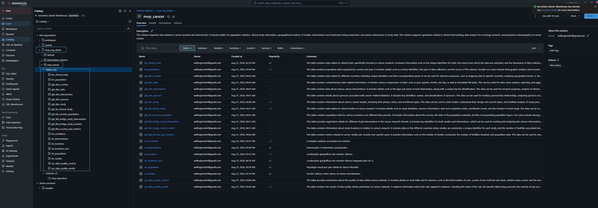
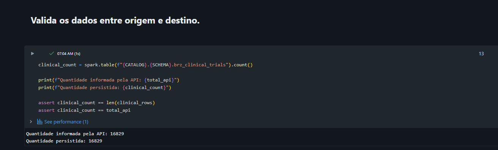
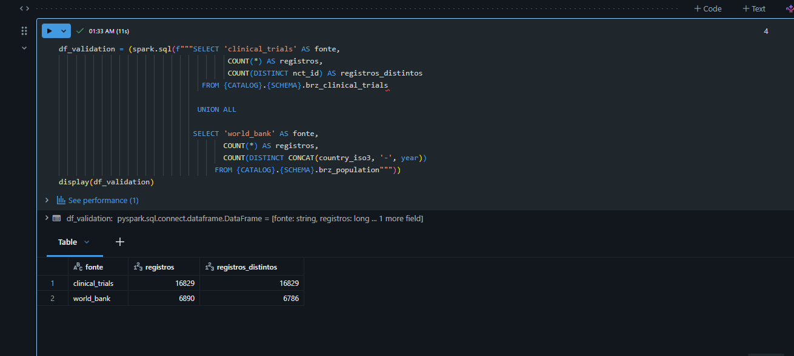
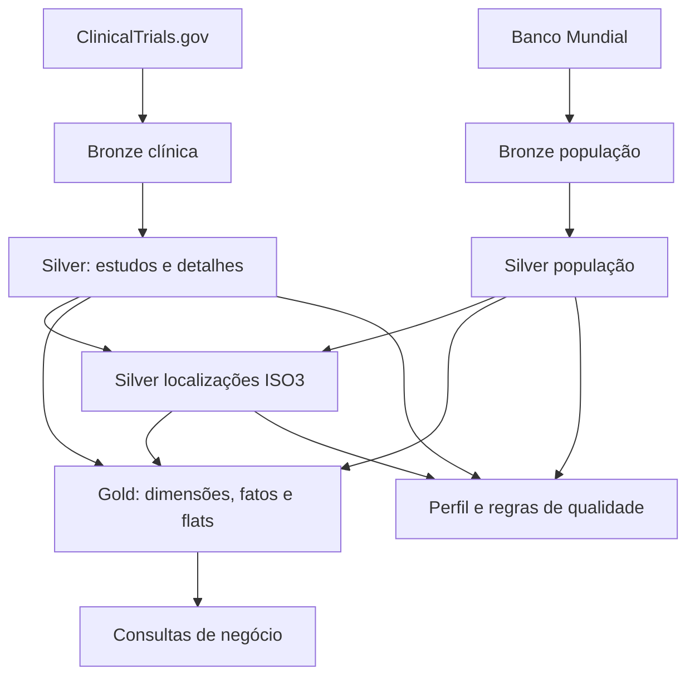
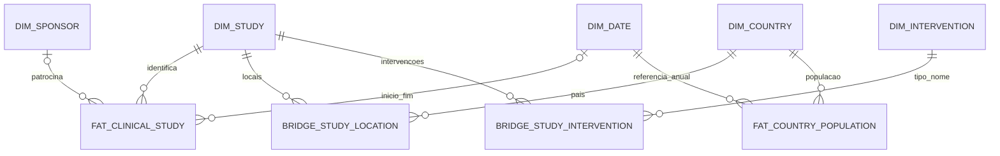

# MVP de Engenharia de Dados — Pesquisas clínicas sobre câncer de mama

**Autor:** Wellington Freitas  
**Curso:** Pós-graduação PUC-Rio — Engenharia de Dados  
**Plataforma do projeto:** Databricks Free Edition, conforme contexto informado  
**Matricula:** 4052026000913  


## Apresentação e escopo da evidência

Este MVP coleta registros públicos do ClinicalTrials.gov e dados populacionais do Banco Mundial, persiste os dados em Delta Tables e os transforma em camadas Bronze, Silver e Gold. O resultado é uma base analítica com 20 tabelas: duas Bronze, seis Silver, dez Gold e duas de controle de qualidade.

Um job foi criado e agendado com uma task por notebook de execução e dependências por camada, na sequência Bronze → Silver → Gold. Esta documentação incorpora essa informação e apresenta os resultados disponíveis.

**Resumo técnico:**

 O MVP foi desenvolvido no Databricks em conjuto com o Gitlab, versionando todo o processo e separando as camadas para melhor abordagem e futura manutenção, utilizando Python, PySpark, SQL, com objetivo de analisar pesquisas clínicas sobre câncer de mama, que  foi o objeto de estudo no Sprint de Machine Learning e Analytics. Combinando dados do ClinicalTrials.gov com a população dos países disponibilizada pelo Banco Mundial.

- **Configuração compartilhada:** os notebooks importam o config usando %run ./config. Ele centraliza bibliotecas, catálogo/schema, sessão HTTP com retentativas, schemas JSON e funções reutilizáveis para datas, gravação e perfilamento.
- **Camada Bronze** — ingestão: os ETLs consultam as APIs e preservam os registros em JSON, acompanhados de identificador da carga, URL e horário de coleta. A API clínica utiliza paginação e validação entre total recebido e persistido.
- **Camada Silver** — tratamento: os JSONs são estruturados em tabelas de estudos, condições, intervenções, localizações e população. Aplicam-se normalização de textos, conversão de tipos e datas, deduplicação e mapeamento geográfico para ISO3.
- **Camada Gold** — modelagem analítica: são criadas dimensões de estudos, patrocinadores, intervenções, países e datas; fatos de estudos e população; bridges para relacionamentos entre estudos, países e intervenções; e uma flat com indicadores por país e ano.
- **Qualidade e análise**: o pipeline calcula nulos, valores distintos e extremos, além de executar 15 regras de qualidade. As consultas analisam fases, situação dos estudos e distribuição geográfica.
- **Automação:** um Job agendado executa uma task por notebook, respeitando as dependências Bronze → Silver → Gold. As tabelas são reconstruídas com overwrite e seguem agendados pela atualizacão da tabela anterior.

O resultado atual reúne 16.829 estudos em uma estrutura de 20 tabelas, com documentação técnica, resultados e limitações identificadas.


### Sumário

1. [Contexto de negócio e perguntas](#contexto)
2. [Carga dos dados](#carga)
3. [Modelagem e catálogo de dados](#modelagem)
4. [Pipeline e notebooks](#pipeline)
5. [Qualidade de dados](#qualidade)
6. [Análise dos resultados](#analise)
7. [Autoavaliação](#autoavaliacao)
8. [Evidências e limites da entrega](#evidencias)
9. [Consultas complementares](#consultas)
10. [Referências e rastreabilidade](#referencias)

### Síntese dos resultados

| Indicador | Resultado e origem |
| --- | --- |
| Coleta clínica | 16.829 estudos; total informado pela API igual ao persistido |
| Paginação clínica | 17 páginas: 16 × 1.000 e 1 × 829 |
| Coleta populacional | 6.890 registros coletados; 6.760 linhas na Silver |
| Fato clínica | 16.829 linhas e 16.829 chaves distintas |
| Integridade estudo | Zero cartesiano entre fato clínica e dimensão de estudos |
| Qualidade | 13 de 15 regras aprovadas; 2.511 localizações sem ISO3 e 32 status fora da lista local |
| Perfilamento | 45 combinações de tabela e coluna nas seis tabelas Silver |
| Orquestração | Execução via Agendamento em job|

<a id="contexto"></a>
## 1. Contexto de negócio e perguntas

### Problema e objetivo

Os cadastros de pesquisas clínicas sobre câncer de mama contêm múltiplas condições, intervenções, locais, fases, patrocinadores e datas. A estrutura JSON da origem precisa ser organizada para permitir consultas consistentes e comparações entre países e períodos.

O objetivo é construir uma plataforma analítica no Databricks para coletar, organizar e analisar esses dados públicos. Os objetivos específicos são preservar o conteúdo recebido, estruturar os atributos relevantes, construir um modelo dimensional, medir qualidade, automatizar a execução e responder às perguntas de negócio.

Contagem de estudos representa atividade de pesquisa no cadastro consultado. Não demonstra eficácia, cura, superioridade terapêutica, qualidade científica ou acesso efetivo ao tratamento. A unidade analisada é o estudo identificado por `nct_id`, não o paciente.

### Perguntas originais

1. Quantos estudos sobre câncer de mama foram registrados por ano?
2. Como os estudos estão distribuídos por país?
3. Quais países concentram a maior quantidade de pesquisas?
4. Quais são as fases clínicas mais frequentes?
5. Quais tipos de intervenção são mais estudados?
6. Quais tratamentos ou medicamentos aparecem com maior frequência?
7. Como os estudos estão distribuídos por situação: recrutando, concluído, suspenso ou encerrado?
8. Qual é a duração média dos estudos?
9. Qual é o número médio de participantes por fase clínica?
10. Quais organizações patrocinam mais estudos?
11. Existe relação entre fase clínica, quantidade de participantes e duração do estudo?
12. Como a participação do Brasil se compara à de outros países?

### Delimitação

A busca utiliza `query.cond=Breast Cancer`, sem filtro explícito de período ou tipo de estudo. Os dados incluem estudos intervencionais, observacionais e de acesso expandido. Um registro pode ter múltiplas condições; a presença na busca não significa exclusividade de câncer de mama. A população é total, com anos de 2000 a 2025, e não corresponde à população feminina ou à população elegível para cada estudo.

<a id="carga"></a>
## 2. Carga dos dados

### 2.1 Fontes e ambiente

| Elemento | Configuração |
| --- | --- |
| ClinicalTrials.gov | `https://clinicaltrials.gov/api/v2/studies` |
| Banco Mundial | `https://api.worldbank.org/v2/country/all/indicator/SP.POP.TOTL` |
| Catálogo | `mvp_eng_dados` |
| Schema | `mvp_cancer` |
| Volume declarado | `mvp_repository` |
| Linguagens | Python, PySpark e SQL |
| Bibliotecas | requests, urllib3, json, uuid, datetime, functools e APIs PySpark |
| Persistência | Delta com `saveAsTable`, escrita `overwrite` |

As camadas compartilham catálogo e schema; os prefixos identificam sua função. `VOLUME` é uma constante no config, mas os notebooks enviados gravam as tabelas pelo nome no Unity Catalog. Não há gravação explícita de arquivos em `/Volumes/` nessa implementação. Tabelas registradas e volumes são objetos distintos; a documentação Databricks informa que arquivos de volumes não podem ser registrados como tabelas no Unity Catalog. Um volume pode armazenar arquivos de entrada, enquanto as tabelas Delta permanecem no armazenamento da AWS da propria conta do databricks Academy.

### 2.2 Bronze clínica

O coletor envia `format=json`, `pageSize=1000`, `countTotal=true` e a condição de interesse. Percorre `nextPageToken` até o fim, com timeout de 120 segundos e pausa de 0,2 segundo entre páginas. A sessão HTTP implementa até cinco retentativas com backoff para 429, 500, 502, 503 e 504.

Cada estudo é serializado em JSON e associado a `ingestion_id`, `nct_id`, página, URL e timestamp lógico da coleta. O DataFrame usa schema explícito e é persistido em `brz_clinical_trials`. Dois asserts comparam tabela, lista coletada e total informado pela API. A saída atual mostra 16.829 registros conciliados. Como a gravação ocorre antes dos asserts, uma eventual divergência não desfaz automaticamente o overwrite.

### 2.3 Bronze populacional

O coletor solicita `format=json`, `date=2000:2025` e `per_page=20000`. Separa os metadados dos registros, serializa cada observação e grava `brz_population`. Foram coletados 6.890 registros. O código não implementa loop de páginas nem conciliação explícita com `metadata.pages` e `metadata.total`.

`country_id` recebe `countryiso3code`, repetindo `country_iso3` porque preferi isolar o tratamento da contry_iso3 em outra tabela silver, que faz agragação com location da Clinical não recebe `country.id`. Na Silver, filtros e deduplicação resultam em 6.760 linhas; a diferença de 130 registros ainda não está decomposta por causa.

### 2.4 Reprocessamento e rastreabilidade

A carga reconstrói as tabelas com `overwrite`; não é uma ingestão incremental ou um MERGE. O código conserva o payload individual recebido, mas não preserva automaticamente todos os snapshots de API nem a resposta HTTP integral byte a byte. A coleta em lista Python usa memória do driver e não tem checkpoint por página. Para futura melhoria, será criada tabelas históricas especificas.

`INGESTION_ID` e `COLLECTED_AT` são gerados quando config é executado. As tabelas de controle são sobrescritas e não têm um identificador comum do pipeline. Registrar Run ID e versões das tabelas ajuda a relacionar as evidências de uma mesma rodada. Não foi fornecida política de retenção Delta nem versão do Runtime e bibliotecas; esses dados devem constar do print de ambiente.

> **Evidência — E01: Ambiente e armazenamento**  
> Obs: catálogo, schema, objetos Bronze e volume, além da configuração do compute Serveless.  

< -->

> **Evidência — E02: Conciliação clínica**  
> Obs: páginas da coleta, total da API e quantidade persistida de 16.829.  

< -->

> **Evidência — E03: Coleta populacional**  
> Obs: metadados da API, 6.890 registros coletados e conciliação com Bronze e Silver.  

< -->


<a id="modelagem"></a>
## 3. Modelagem e catálogo de dados

### 3.1 Arquitetura



O diagrama é uma representação lógica das leituras e transformações identificadas, não uma captura automática do Unity Catalog. `slv_conditions` mantém informação relevante na Silver, mas não possui uma dimensão ou bridge correspondente na Gold atual.

### 3.2 O que representam fatos, dimensões e flats

**Dimensões** descrevem as entidades usadas para filtrar, agrupar e interpretar as medidas: estudo, patrocinador, intervenção, país e data. **Fatos** armazenam medidas no grão definido: participantes e duração por estudo; população por entidade geográfica e ano.

As **bridges** representam relações de muitos para muitos. Um estudo pode ocorrer em vários países e avaliar várias intervenções. No projeto, duas bridges usam o prefixo `gld_flat_`; elas continuam sendo tabelas associativas, e não tabelas completas de todas as medidas do estudo. A terceira flat, `gld_flat_country_year_metrics`, é uma tabela agregada e desnormalizada para consumo por país e ano de início.

O modelo possui cinco dimensões, duas fatos e três flats. As chaves SHA-256 são derivadas deterministicamente dos atributos normalizados; não são sequências numéricas. Não há implementação de histórico SCD nem constraints PK/FK declaradas nos notebooks.



### 3.3 Função de cada tabela

#### brz_clinical_trials

**Classe:** Bronze. **Grão:** Um registro clínico por linha da coleta.

Preserva o JSON do estudo e os metadados de ingestão. Permite reprocessar atributos sem repetir a chamada da API enquanto esse snapshot estiver disponível. Alimenta estudos, condições, intervenções e locais. A chave esperada é nct_id no snapshot; duplicatas de origem não são removidas no coletor.

#### brz_population

**Classe:** Bronze. **Grão:** Uma observação geográfica por ano na coleta.

Preserva a observação populacional em JSON com código, ano e origem. Alimenta slv_population. Pode incluir países, territórios e agregados regionais; não é exclusivamente uma lista de países.

#### slv_studies

**Classe:** Silver. **Grão:** Um estudo por nct_id.

Estrutura título, tipo, situação, fases, datas, participantes e patrocinador. Conserva datas originais e natureza ACTUAL/ESTIMATED; converte datas parciais e calcula duração. É a base central da fato e da dimensão de estudos.

#### slv_conditions

**Classe:** Silver. **Grão:** Par distinto nct_id e condição.

Explode o array de condições, normaliza espaços e remove nomes nulos e duplicatas. Permite investigar o escopo clínico e a presença de múltiplas doenças no mesmo estudo. Não possui tabela derivada Gold no código.

#### slv_interventions

**Classe:** Silver. **Grão:** Linha distinta de estudo, tipo, nome e descrição.

Explode intervenções, normaliza tipo/nome e mantém descrição. Como a deduplicação considera a linha inteira, descrições diferentes podem manter mais de uma linha para um mesmo estudo/tipo/nome. Alimenta dimensão e bridge de intervenções.

#### slv_locations

**Classe:** Silver. **Grão:** Linha distinta de localização dentro do estudo.

Mantém estabelecimento, cidade, estado, país, latitude e longitude. Descarta países nulos. Um estudo pode ter muitos locais; contagens de linhas não equivalem a contagens de estudos ou hospitais físicos únicos.

#### slv_locations_iso3

**Classe:** Silver. **Grão:** Localização enriquecida com código geográfico.

Faz left join por nome normalizado com referência da população e oito aliases manuais. Preserva locais não mapeados com country_iso3 nulo. Alimenta a dimensão geográfica e a bridge estudo–país.

#### slv_population

**Classe:** Silver. **Grão:** Uma entidade geográfica e ano.

Extrai código, nome, ano e população do payload; tipa valores, exige código de tamanho três e população não nula, e deduplica código/ano. Serve como denominador das taxas. O filtro por tamanho não exclui agregados.

#### gld_dim_study

**Classe:** Dimensão. **Grão:** Um estudo por nct_id / study_key.

Descreve estudo, título, tipo, situação, fase e natureza do enrollment. study_key = SHA-256(nct_id). Usa coalesce para transformar fase nula em NA, perdendo a distinção entre ausência e não aplicabilidade disponível na Silver.

#### gld_dim_sponsor

**Classe:** Dimensão. **Grão:** Uma chave derivada do nome e classe normalizados.

Descreve o patrocinador principal. A chave usa lower(trim(nome)), classe normalizada e unknown para classe nula. Suporta rankings por patrocinador. Não representa todos os colaboradores nem montantes de financiamento.

#### gld_dim_country

**Classe:** Dimensão. **Grão:** Um código geográfico / country_key.

Une códigos de locais mapeados e população. country_key = SHA-256(country_iso3). Mantém um nome via first não ordenado, portanto a escolha entre variantes não é determinística. Os 261 registros são entidades geográficas, não necessariamente 261 países.

#### gld_dim_intervention

**Classe:** Dimensão. **Grão:** Um par normalizado tipo e nome de intervenção.

Descreve intervenções com chave SHA-256 de tipo e nome concatenados. Deduplica variantes de caixa/espaços externos, mas não resolve sinônimos, doses ou nomes comerciais. Permite agrupar tratamentos via bridge.

#### gld_dim_date

**Classe:** Dimensão. **Grão:** Uma data civil por date_key.

Gera calendário diário entre menor e maior data clínica, com ano, trimestre, mês, dia e semana. date_key tem formato yyyyMMdd. Relaciona-se à fato clínica em dois papéis: início e conclusão. A fato populacional usa 1º de janeiro; sua cobertura deve ser validada separadamente.

#### gld_fat_clinical_study

**Classe:** Fato. **Grão:** Uma linha por estudo.

Armazena enrollment_count, duration_days e collected_at, ligados às dimensões por study_key, sponsor_key, start_date_key e completion_date_key. Participantes são do estudo inteiro e podem ser estimados. Não correspondem a pessoas únicas entre estudos. Médias devem informar elegibilidade e nulos.

#### gld_fat_country_population

**Classe:** Fato. **Grão:** Uma entidade geográfica por ano.

Armazena population, country_key e date_key no formato ano0101. O dia 1º de janeiro é uma convenção da chave anual, não uma afirmação sobre a data da medição. População não deve ser somada entre anos para produzir um estoque populacional; agregados sobrepostos também não podem ser somados como países independentes.

#### gld_flat_bridge_study_location

**Classe:** Flat / bridge. **Grão:** Um par study_key e country_key.

Relaciona estudos a países mapeados e calcula facility_count por pares distintos de estabelecimento e cidade. Remove ISO3 nulo. O countDistinct de múltiplas colunas não conta pares com nulo; somar facility_count representa participações de locais nos estudos, não estabelecimentos únicos.

#### gld_flat_bridge_study_intervention

**Classe:** Flat / bridge. **Grão:** Um par study_key e intervention_key.

Relaciona cada estudo às intervenções da dimensão. Deduplica o par de hashes. Viabiliza consultas por tipo/nome sem carregar descrições textuais na fato. Uma intervenção pode aparecer em muitos estudos e um estudo pode ter várias intervenções.

#### gld_flat_country_year_metrics

**Classe:** Flat agregada. **Grão:** Uma entidade geográfica e ano de início, inclusive ano nulo.

Combina bridge geográfica, fato clínica, dimensão de países e fato populacional. Calcula study_count, soma facility_count, associa população do mesmo ano e calcula round(study_count / population × 1.000.000, 4). Inclui somente grupos com estudos; não produz uma grade completa de países/anos com zero. Sem população, a taxa é nula.

#### sys_data_quality_control

**Classe:** Controle. **Grão:** Uma tabela e coluna na avaliação armazenada.

Persiste total, não nulos, nulos, percentual de nulos, distintos e extremos. Ajuda a entender cobertura e plausibilidade. A escrita overwrite conserva apenas o resultado corrente; não é um histórico de monitoramento.

#### sys_data_quality_results

**Classe:** Controle. **Grão:** Uma regra na avaliação armazenada.

Persiste nome, tabela, severidade, quantidade de falhas, passed e timestamp. passed significa contagem igual a zero. A rotina registra resultados e não lança uma falha automática quando uma regra ERROR reprova.

### Cuidados com joins e agregações

Depois de um join da fato com uma bridge, um estudo pode ocupar várias linhas. Para contar estudos por categoria, usar `COUNT(DISTINCT study_key)`. Não somar participantes após joins geográficos ou de intervenção sem definir uma regra de alocação. Somar estudos por país não produz o total mundial, pois estudos multinacionais participam de vários grupos. Não tirar média simples das taxas por milhão de diferentes países/anos para obter uma taxa global.

### 3.4 Dicionário de dados completo

Todos os nomes pertencem a `mvp_eng_dados.mvp_cancer`. Os tipos e transformações abaixo descrevem o código enviado. Domínios documentados não equivalem a constraints aplicadas. Os caminhos clínicos estão dentro de `payload.protocolSection`. `json_data` é uma estrutura temporária do parsing.

#### 3.4.1 `brz_clinical_trials`

**Grão:** Um registro retornado pela API em uma página da extração corrente.  
**Origem/linhagem:** API ClinicalTrials.gov.

| Coluna | Tipo | Descrição | Domínio / ressalva | Origem / transformação |
| --- | --- | --- | --- | --- |
| ingestion_id | STRING | Identificador da coleta | UUID textual; preenchido | Configuração da ingestão |
| nct_id | STRING | Identificador extraído do JSON | NCT + 8 dígitos esperado; schema de ingestão não aceita nulo | protocolSection.identificationModule.nctId |
| page_number | INT | Página da coleta | Inteiro >= 1 | Contador local de paginação |
| payload | STRING | JSON serializado do registro integral | JSON válido; não nulo | json.dumps(study, ensure_ascii=False) |
| source_url | STRING | URL da requisição | URL HTTPS, incluindo parâmetros e eventualmente pageToken | response.url |
| collected_at | TIMESTAMP | Instante lógico da coleta | Timestamp; confirmar fuso da exibição | Configuração da ingestão, preservada da Bronze |

#### 3.4.2 `brz_population`

**Grão:** Um registro de entidade geográfica e ano retornado na extração corrente.  
**Origem/linhagem:** API Banco Mundial.

| Coluna | Tipo | Descrição | Domínio / ressalva | Origem / transformação |
| --- | --- | --- | --- | --- |
| ingestion_id | STRING | Identificador da coleta | UUID textual; preenchido | Configuração da ingestão |
| country_id | STRING | Identificador geográfico auxiliar | CORRIGIR: atualmente repete country_iso3 | record.countryiso3code, e não record.country.id |
| country_iso3 | STRING | Código geográfico de três caracteres | ISO3 esperado; códigos agregados ainda precisam de exclusão | Banco Mundial ou mapeamento por nome |
| year | INT | Ano de referência | 2000 a 2025 na carga de população | Banco Mundial, date, convertido para inteiro |
| payload | STRING | JSON serializado da observação populacional | JSON válido; não nulo | json.dumps(record, ensure_ascii=False) |
| source_url | STRING | URL da requisição populacional | URL HTTPS com indicador, período e tamanho da página | response.url |
| collected_at | TIMESTAMP | Instante lógico da coleta | Timestamp; confirmar fuso da exibição | Configuração da ingestão, preservada da Bronze |

#### 3.4.3 `slv_studies`

**Grão:** Um registro por nct_id.  
**Origem/linhagem:** brz_clinical_trials; seleção do registro mais recente e extração do JSON.

| Coluna | Tipo | Descrição | Domínio / ressalva | Origem / transformação |
| --- | --- | --- | --- | --- |
| nct_id | STRING | Identificador do registro clínico | NCT seguido de 8 dígitos; não nulo esperado | identificationModule.nctId; trim e upper na Silver |
| study_title | STRING | Título resumido do estudo | Texto não vazio esperado | identificationModule.briefTitle; normalização de espaços |
| study_type | STRING | Tipo de registro | INTERVENTIONAL, OBSERVATIONAL, EXPANDED_ACCESS | designModule.studyType; upper |
| overall_status | STRING | Situação cadastral | Enumeração oficial Status; regra local incompleta | statusModule.overallStatus; upper |
| phase | STRING | Fase ou combinação de fases | NA, EARLY_PHASE1, PHASE1 a PHASE4 e combinações separadas por \|; nulo na Silver | designModule.phases; ordenação e concatenação |
| start_date_original | STRING | Data de início como recebida | YYYY, YYYY-MM ou YYYY-MM-DD; pode ser nula | statusModule.startDateStruct.date |
| start_date_type | STRING | Natureza da data de início | ACTUAL, ESTIMATED ou nulo | statusModule.startDateStruct.type |
| completion_date_original | STRING | Data de conclusão como recebida | YYYY, YYYY-MM ou YYYY-MM-DD; pode ser nula | statusModule.completionDateStruct.date |
| completion_date_type | STRING | Natureza da data de conclusão | ACTUAL, ESTIMATED ou nulo | statusModule.completionDateStruct.type |
| enrollment_count | BIGINT | Participantes informados no cadastro | Inteiro >= 0 esperado; nulo permitido; sem teto validado | designModule.enrollmentInfo.count |
| enrollment_type | STRING | Natureza da quantidade de participantes | ACTUAL, ESTIMATED ou nulo | designModule.enrollmentInfo.type; upper |
| sponsor_name | STRING | Nome do patrocinador principal | Texto; não identifica necessariamente todos os financiadores | sponsorCollaboratorsModule.leadSponsor.name; espaços normalizados |
| sponsor_class | STRING | Classe do patrocinador principal | NIH, FED, OTHER_GOV, INDIV, INDUSTRY, NETWORK, AMBIG, OTHER, UNKNOWN conforme origem | sponsorCollaboratorsModule.leadSponsor.class; upper |
| ingestion_id | STRING | Identificador da coleta | UUID textual; preenchido | Configuração da ingestão |
| collected_at | TIMESTAMP | Instante lógico da coleta | Timestamp; confirmar fuso da exibição | Configuração da ingestão, preservada da Bronze |
| start_date | DATE | Data de início convertida | Data; precisão incompleta preenchida com mês/dia 01 | parse_partial_date(start_date_original) |
| completion_date | DATE | Data de conclusão convertida | Data; precisão incompleta preenchida com mês/dia 01 | parse_partial_date(completion_date_original) |
| duration_days | INT | Dias entre conclusão e início | >= 0 ou nulo; pode usar datas estimadas/imputadas | datediff(completion_date,start_date) quando fim >= início |

#### 3.4.4 `slv_conditions`

**Grão:** Par distinto nct_id e condition_name.  
**Origem/linhagem:** brz_clinical_trials; conditionsModule.conditions[].

| Coluna | Tipo | Descrição | Domínio / ressalva | Origem / transformação |
| --- | --- | --- | --- | --- |
| nct_id | STRING | Identificador do registro clínico | NCT seguido de 8 dígitos; não nulo esperado | identificationModule.nctId; trim e upper na Silver |
| condition_name | STRING | Condição associada ao estudo | Texto não nulo; string vazia não é filtrada explicitamente | explode_outer e normalização de espaços; dropDuplicates |

#### 3.4.5 `slv_interventions`

**Grão:** Linha distinta de estudo, tipo, nome e descrição.  
**Origem/linhagem:** brz_clinical_trials; armsInterventionsModule.interventions[].

| Coluna | Tipo | Descrição | Domínio / ressalva | Origem / transformação |
| --- | --- | --- | --- | --- |
| nct_id | STRING | Identificador do registro clínico | NCT seguido de 8 dígitos; não nulo esperado | identificationModule.nctId; trim e upper na Silver |
| intervention_type | STRING | Categoria da intervenção | DRUG, DEVICE, BIOLOGICAL, PROCEDURE, RADIATION, BEHAVIORAL, GENETIC, DIETARY_SUPPLEMENT, DIAGNOSTIC_TEST, COMBINATION_PRODUCT, OTHER | armsInterventionsModule.interventions[].type; trim e upper |
| intervention_name | STRING | Nome cadastral da intervenção | Texto; nulos descartados, vazios avaliados depois | armsInterventionsModule.interventions[].name; espaços normalizados |
| description | STRING | Descrição cadastral da intervenção | Texto livre ou nulo | interventions[].description; trim |

#### 3.4.6 `slv_locations`

**Grão:** Linha distinta dos sete campos de localização, incluindo estudo.  
**Origem/linhagem:** brz_clinical_trials; explode das localizações; descarte de país nulo.

| Coluna | Tipo | Descrição | Domínio / ressalva | Origem / transformação |
| --- | --- | --- | --- | --- |
| nct_id | STRING | Identificador do registro clínico | NCT seguido de 8 dígitos; não nulo esperado | identificationModule.nctId; trim e upper na Silver |
| facility_name | STRING | Nome do estabelecimento | Texto ou nulo | contactsLocationsModule.locations[].facility; trim |
| city | STRING | Cidade | Texto ou nulo; sem normalização geográfica além de trim | locations[].city |
| state | STRING | Estado/província | Texto ou nulo; não exigir UF brasileira em dados mundiais | locations[].state |
| country_name | STRING | Nome da entidade geográfica | Texto; sem lista fechada no código | Fonte geográfica; trim na Silver |
| latitude | DOUBLE | Latitude do local | -90 a 90 ou nulo | locations[].geoPoint.lat |
| longitude | DOUBLE | Longitude do local | -180 a 180 ou nulo | locations[].geoPoint.lon |

#### 3.4.7 `slv_locations_iso3`

**Grão:** Linha de localização com código mapeado.  
**Origem/linhagem:** slv_locations LEFT JOIN referência populacional e overrides por nome normalizado.

| Coluna | Tipo | Descrição | Domínio / ressalva | Origem / transformação |
| --- | --- | --- | --- | --- |
| nct_id | STRING | Identificador do registro clínico | NCT seguido de 8 dígitos; não nulo esperado | identificationModule.nctId; trim e upper na Silver |
| facility_name | STRING | Nome do estabelecimento | Texto ou nulo | contactsLocationsModule.locations[].facility; trim |
| city | STRING | Cidade | Texto ou nulo; sem normalização geográfica além de trim | locations[].city |
| state | STRING | Estado/província | Texto ou nulo; não exigir UF brasileira em dados mundiais | locations[].state |
| country_name | STRING | Nome da entidade geográfica | Texto; sem lista fechada no código | Fonte geográfica; trim na Silver |
| latitude | DOUBLE | Latitude do local | -90 a 90 ou nulo | locations[].geoPoint.lat |
| longitude | DOUBLE | Longitude do local | -180 a 180 ou nulo | locations[].geoPoint.lon |
| country_iso3 | STRING | Código geográfico de três caracteres | ISO3 esperado; códigos agregados ainda precisam de exclusão | Banco Mundial ou mapeamento por nome |

#### 3.4.8 `slv_population`

**Grão:** Par country_iso3 e year; ainda pode incluir agregados.  
**Origem/linhagem:** brz_population; parse, filtros e deduplicação.

| Coluna | Tipo | Descrição | Domínio / ressalva | Origem / transformação |
| --- | --- | --- | --- | --- |
| country_iso3 | STRING | Código geográfico de três caracteres | ISO3 esperado; códigos agregados ainda precisam de exclusão | Banco Mundial ou mapeamento por nome |
| country_name | STRING | Nome da entidade geográfica | Texto; sem lista fechada no código | Fonte geográfica; trim na Silver |
| year | INT | Ano de referência | 2000 a 2025 na carga de população | Banco Mundial, date, convertido para inteiro |
| population | BIGINT | População da entidade no ano | >= 0 na regra atual; > 0 necessário para divisão | Banco Mundial, value; valores nulos filtrados na Silver |
| ingestion_id | STRING | Identificador da coleta | UUID textual; preenchido | Configuração da ingestão |
| collected_at | TIMESTAMP | Instante lógico da coleta | Timestamp; confirmar fuso da exibição | Configuração da ingestão, preservada da Bronze |

#### 3.4.9 `gld_dim_study`

**Grão:** Um registro por estudo.  
**Origem/linhagem:** slv_studies.

| Coluna | Tipo | Descrição | Domínio / ressalva | Origem / transformação |
| --- | --- | --- | --- | --- |
| study_key | STRING | Chave técnica do estudo | Hash SHA-256, 64 caracteres hexadecimais | SHA-256 de nct_id |
| phase | STRING | Fase para consumo | Mesmos valores da Silver; nulos convertidos em NA | coalesce(slv_studies.phase, NA) |
| nct_id | STRING | Identificador do registro clínico | NCT seguido de 8 dígitos; não nulo esperado | identificationModule.nctId; trim e upper na Silver |
| study_title | STRING | Título resumido do estudo | Texto não vazio esperado | identificationModule.briefTitle; normalização de espaços |
| study_type | STRING | Tipo de registro | INTERVENTIONAL, OBSERVATIONAL, EXPANDED_ACCESS | designModule.studyType; upper |
| overall_status | STRING | Situação cadastral | Enumeração oficial Status; regra local incompleta | statusModule.overallStatus; upper |
| enrollment_type | STRING | Natureza da quantidade de participantes | ACTUAL, ESTIMATED ou nulo | designModule.enrollmentInfo.type; upper |

#### 3.4.10 `gld_dim_sponsor`

**Grão:** Uma chave por nome/classe normalizados.  
**Origem/linhagem:** slv_studies; patrocinador não nulo; deduplicação pela chave.

| Coluna | Tipo | Descrição | Domínio / ressalva | Origem / transformação |
| --- | --- | --- | --- | --- |
| sponsor_key | STRING | Chave técnica do patrocinador | Hash SHA-256; pode ser nula no fato | SHA-256 de nome e classe normalizados; classe nula vira unknown |
| sponsor_name | STRING | Nome do patrocinador principal | Texto; não identifica necessariamente todos os financiadores | sponsorCollaboratorsModule.leadSponsor.name; espaços normalizados |
| sponsor_class | STRING | Classe do patrocinador principal | NIH, FED, OTHER_GOV, INDIV, INDUSTRY, NETWORK, AMBIG, OTHER, UNKNOWN conforme origem | sponsorCollaboratorsModule.leadSponsor.class; upper |

#### 3.4.11 `gld_dim_country`

**Grão:** Uma chave por código geográfico.  
**Origem/linhagem:** União de slv_locations_iso3 e slv_population; agrupamento por código/hash.

| Coluna | Tipo | Descrição | Domínio / ressalva | Origem / transformação |
| --- | --- | --- | --- | --- |
| country_key | STRING | Chave técnica da entidade geográfica | Hash SHA-256, 64 caracteres hexadecimais | SHA-256 de country_iso3 |
| country_iso3 | STRING | Código geográfico de três caracteres | ISO3 esperado; códigos agregados ainda precisam de exclusão | Banco Mundial ou mapeamento por nome |
| country_name | STRING | Nome escolhido para a entidade | Texto; escolha não determinística se há nomes diferentes para o mesmo código | first(country_name, ignorenulls=True) após união |

#### 3.4.12 `gld_dim_intervention`

**Grão:** Uma chave por tipo/nome normalizados.  
**Origem/linhagem:** slv_interventions; deduplicação pela chave.

| Coluna | Tipo | Descrição | Domínio / ressalva | Origem / transformação |
| --- | --- | --- | --- | --- |
| intervention_key | STRING | Chave técnica da intervenção | Hash SHA-256; tipo e nome normalizados | SHA-256 de lower(trim(tipo)) e lower(trim(nome)), separados por \| |
| intervention_type | STRING | Categoria da intervenção | DRUG, DEVICE, BIOLOGICAL, PROCEDURE, RADIATION, BEHAVIORAL, GENETIC, DIETARY_SUPPLEMENT, DIAGNOSTIC_TEST, COMBINATION_PRODUCT, OTHER | armsInterventionsModule.interventions[].type; trim e upper |
| intervention_name | STRING | Nome cadastral da intervenção | Texto; nulos descartados, vazios avaliados depois | armsInterventionsModule.interventions[].name; espaços normalizados |

#### 3.4.13 `gld_dim_date`

**Grão:** Um dia por linha entre o menor início/fim e o maior início/fim.  
**Origem/linhagem:** Limites de slv_studies; sequence diária.

| Coluna | Tipo | Descrição | Domínio / ressalva | Origem / transformação |
| --- | --- | --- | --- | --- |
| date_key | INT | Chave da data | yyyyMMdd | date_format(full_date, yyyyMMdd) |
| full_date | DATE | Data civil | Entre os limites calculados | sequence(min_date,max_date,interval 1 day) |
| year | INT | Ano da data | Ano civil dentro do intervalo | year(full_date) |
| quarter | INT | Trimestre | 1 a 4 | quarter(full_date) |
| month | INT | Mês | 1 a 12 | month(full_date) |
| month_name | STRING | Nome do mês | Nome gerado por formatação MMMM | date_format(full_date, MMMM) |
| day | INT | Dia do mês | 1 a 31, conforme calendário | dayofmonth(full_date) |
| week_of_year | INT | Semana do ano | 1 a 53 | weekofyear(full_date) |

#### 3.4.14 `gld_fat_clinical_study`

**Grão:** Uma linha por estudo.  
**Origem/linhagem:** slv_studies.

| Coluna | Tipo | Descrição | Domínio / ressalva | Origem / transformação |
| --- | --- | --- | --- | --- |
| study_key | STRING | Chave técnica do estudo | Hash SHA-256, 64 caracteres hexadecimais | SHA-256 de nct_id |
| sponsor_key | STRING | Chave técnica do patrocinador | Hash SHA-256; pode ser nula no fato | SHA-256 de nome e classe normalizados; classe nula vira unknown |
| start_date_key | INT | Referência ao início | yyyyMMdd ou nulo | date_format(start_date) |
| completion_date_key | INT | Referência à conclusão | yyyyMMdd ou nulo | date_format(completion_date) |
| enrollment_count | BIGINT | Participantes informados no cadastro | Inteiro >= 0 esperado; nulo permitido; sem teto validado | designModule.enrollmentInfo.count |
| duration_days | INT | Dias entre conclusão e início | >= 0 ou nulo; pode usar datas estimadas/imputadas | datediff(completion_date,start_date) quando fim >= início |
| collected_at | TIMESTAMP | Instante lógico da coleta | Timestamp; confirmar fuso da exibição | Configuração da ingestão, preservada da Bronze |

#### 3.4.15 `gld_fat_country_population`

**Grão:** Uma linha por entidade e ano.  
**Origem/linhagem:** slv_population.

| Coluna | Tipo | Descrição | Domínio / ressalva | Origem / transformação |
| --- | --- | --- | --- | --- |
| country_key | STRING | Chave técnica da entidade geográfica | Hash SHA-256, 64 caracteres hexadecimais | SHA-256 de country_iso3 |
| date_key | INT | Chave anual representada por 1º de janeiro | yyyy0101; ano 2000 a 2025 | concat(year,0101), convertido para INT |
| population | BIGINT | População da entidade no ano | >= 0 na regra atual; > 0 necessário para divisão | Banco Mundial, value; valores nulos filtrados na Silver |

#### 3.4.16 `gld_flat_bridge_study_location`

**Grão:** Par study_key e country_key.  
**Origem/linhagem:** slv_locations_iso3; exclusão de ISO3 nulo; agrupamento por estudo/país.

| Coluna | Tipo | Descrição | Domínio / ressalva | Origem / transformação |
| --- | --- | --- | --- | --- |
| study_key | STRING | Chave técnica do estudo | Hash SHA-256, 64 caracteres hexadecimais | SHA-256 de nct_id |
| country_key | STRING | Chave técnica da entidade geográfica | Hash SHA-256, 64 caracteres hexadecimais | SHA-256 de country_iso3 |
| facility_count | BIGINT | Pares distintos estabelecimento/cidade no estudo e país | Inteiro >= 0; não equivale a instalações únicas em toda a base | countDistinct(facility_name,city); pares com nulo não entram na contagem |

#### 3.4.17 `gld_flat_bridge_study_intervention`

**Grão:** Par study_key e intervention_key.  
**Origem/linhagem:** slv_interventions; hashes e dropDuplicates.

| Coluna | Tipo | Descrição | Domínio / ressalva | Origem / transformação |
| --- | --- | --- | --- | --- |
| study_key | STRING | Chave técnica do estudo | Hash SHA-256, 64 caracteres hexadecimais | SHA-256 de nct_id |
| intervention_key | STRING | Chave técnica da intervenção | Hash SHA-256; tipo e nome normalizados | SHA-256 de lower(trim(tipo)) e lower(trim(nome)), separados por \| |

#### 3.4.18 `gld_flat_country_year_metrics`

**Grão:** Uma linha por país/entidade e ano de início dos estudos mapeados.  
**Origem/linhagem:** Bridge de locais + fato clínica + dimensão de país; LEFT JOIN população por país/ano.

| Coluna | Tipo | Descrição | Domínio / ressalva | Origem / transformação |
| --- | --- | --- | --- | --- |
| country_key | STRING | Chave técnica da entidade geográfica | Hash SHA-256, 64 caracteres hexadecimais | SHA-256 de country_iso3 |
| country_iso3 | STRING | Código geográfico de três caracteres | ISO3 esperado; códigos agregados ainda precisam de exclusão | Banco Mundial ou mapeamento por nome |
| country_name | STRING | Nome da entidade geográfica | Texto; sem lista fechada no código | Fonte geográfica; trim na Silver |
| year | INT | Ano de início dos estudos | Ano de start_date; nulo possível; não é ano de registro | start_date_key / 10000 convertido para INT |
| study_count | BIGINT | Quantidade distinta de estudos no país/ano | Inteiro > 0 nas linhas presentes; não há grade com países de zero estudos | countDistinct(study_key) |
| facility_count | BIGINT | Soma de pares estabelecimento/cidade por estudo | >= 0; um mesmo estabelecimento pode contar em vários estudos | sum da facility_count da bridge |
| population | BIGINT | População da entidade no ano | >= 0 na regra atual; > 0 necessário para divisão | Banco Mundial, value; valores nulos filtrados na Silver |
| studies_per_million | DOUBLE | Estudos por milhão de habitantes | >= 0 quando denominador > 0; nulo sem população; proteção a zero pendente | round(study_count / population * 1000000,4) |

#### 3.4.19 `sys_data_quality_control`

**Grão:** Uma linha por tabela Silver e coluna perfilada.  
**Origem/linhagem:** profile_table em config; seis tabelas Silver.

| Coluna | Tipo | Descrição | Domínio / ressalva | Origem / transformação |
| --- | --- | --- | --- | --- |
| table_name | STRING | Tabela avaliada | Uma das seis tabelas slv_ | Parâmetro de profile_table |
| column_name | STRING | Coluna avaliada | Nome no schema da tabela | df.schema.fields |
| data_type | STRING | Tipo PySpark como texto | Ex.: StringType(), LongType() | str(field.dataType) |
| total_rows | INT | Total de linhas da tabela | >= 0; tipo observado INT | df.count(), inserido por lit |
| non_null_count | BIGINT | Valores não nulos | 0 a total_rows | count(coluna) |
| null_count | BIGINT | Valores nulos | 0 a total_rows; caso vazio exige tratamento | sum de indicador isNull |
| null_percentage | DOUBLE | Percentual de nulos | 0 a 100 para tabela não vazia | round(null_count/total_rows*100,4) |
| distinct_count | BIGINT | Valores distintos não nulos | 0 a non_null_count | countDistinct |
| minimum_value | STRING | Mínimo convertido para texto | Numérico/data no tipo original; lexical para texto | min(coluna).cast(string) |
| maximum_value | STRING | Máximo convertido para texto | Numérico/data no tipo original; lexical para texto | max(coluna).cast(string) |

#### 3.4.20 `sys_data_quality_results`

**Grão:** Uma linha por regra na execução armazenada.  
**Origem/linhagem:** quality_rules e spark.sql; escrita overwrite.

| Coluna | Tipo | Descrição | Domínio / ressalva | Origem / transformação |
| --- | --- | --- | --- | --- |
| rule_name | STRING | Identificador da regra | Um dos 15 nomes implementados | quality_rules |
| table_name | STRING | Tabela principal da regra | Nome slv_; consultas podem usar mais de uma tabela | quality_rules |
| severity | STRING | Severidade configurada | ERROR ou WARNING | quality_rules |
| failure_count | BIGINT | Contagem de ocorrências da regra | >= 0; duplicidade conta grupos, não linhas excedentes | Resultado failures de cada SQL |
| passed | BOOLEAN | Indicador de aprovação | True quando failure_count=0 | Comparação no Python |
| execution_timestamp | TIMESTAMP | Instante de gravação da avaliação | Timestamp da escrita; fuso da sessão | current_timestamp() |

### 3.5 Governança

O catálogo textual documenta as 20 tabelas. Não foram anexados comandos que apliquem comentários a todas as colunas nem constraints de integridade. Confirmar os schemas finais no Catalog Explorer. O notebook `estrutura_dos_dados`, citado em versões anteriores, não integra os 11 arquivos desta entrega; a criação inicial de catálogo/schema/volume não pode ser descrita como reexecutada a partir desta remessa.

> **INSERIR PRINT — E04: Modelagem e catálogo**  
> Mostrar: linhagem e schemas, com comentários de tabelas e colunas; dividir em imagens legíveis quando necessário.  
> Legenda a preencher: data/hora/fuso, notebook ou task, Run ID e resultado observado.

<!-- Remover os marcadores de comentário quando o arquivo existir. -->
<!--  -->

<a id="pipeline"></a>
## 4. Pipeline de dados e análise dos notebooks

### 4.1 Descrição individual

#### 4.1.1 `config.dbc`

Centraliza imports, constantes, sessão HTTP, schema clínico e funções auxiliares. `profile_table` calcula métricas por coluna; `create_http_session` configura retry; `parse_partial_date` preenche mês/dia ausentes com 01; `save_gold` padroniza Delta overwrite. Lê a Bronze, escolhe a linha mais recente por nct_id/collected_at e aplica from_json. A definição do schema precede o parsing na ordem real `position`. Como esse notebook lê Bronze, uma primeira carga em ambiente vazio exige separar inicialização de transformação. Um empate de collected_at não tem desempate explícito.

#### 4.1.2 `01_etl_brz_clinical_trials_table.dbc`

Chama config, parametriza a busca clínica, pagina a API, serializa estudos, constrói schema e DataFrame, sobrescreve a Bronze e executa asserts de contagem. A coleta atual registra 17 páginas e 16.829 estudos. O SELECT final é uma prévia truncada e não deve ser contado para inferir o tamanho da tabela.

#### 4.1.3 `01_etl_brz_world_bank_open_data.dbc`

Chama config, consulta o indicador populacional e armazena metadata e records. Monta 6.890 linhas e grava a Bronze. O SELECT final é truncado. Falta validar o total de páginas; country_id repete ISO3. A consulta DESCRIBE da tabela clínica, presente na versão anterior, foi removida desta versão.

#### 4.1.4 `02_etl_silver_studies.dbc`

Usa clinical_parsed para selecionar atributos do estudo, normalizar textos, concatenar fases ordenadas, tipar participantes e preservar origem. Converte datas parciais e calcula datediff somente quando conclusão não é anterior ao início. Persiste slv_studies. A coluna duration_days pode refletir datas estimadas e imputadas.

#### 4.1.5 `02_etl_silver_conditions.dbc`

Explode conditionsModule.conditions, normaliza espaços, filtra nulos e remove linhas duplicadas. Persiste slv_conditions. A saída contém 43.512 linhas no perfil e 16.828 estudos distintos: um estudo da base não possui linha final de condição. A causa específica não foi inspecionada.

#### 4.1.6 `02_etl_silver_interventions.dbc`

Explode armsInterventionsModule.interventions, normaliza tipo e nome e mantém descrição. Filtra nome nulo, deduplica e persiste slv_interventions. O perfil registra 33.605 linhas e 15.348 estudos distintos. A ausência de linha para outros estudos pode decorrer da origem ou dos filtros.

#### 4.1.7 `02_etl_silver_locations.dbc`

Explode contactsLocationsModule.locations, seleciona estabelecimento e atributos geográficos, filtra país nulo e deduplica. Persiste slv_locations. O perfil mostra 203.002 linhas e 15.435 estudos distintos. Não cria um cadastro mestre de estabelecimentos.

#### 4.1.8 `02_etl_silver_population.dbc`

Lê brz_population, aplica schema específico ao payload, normaliza código e nome, converte ano e população e preserva metadados de ingestão. Filtra código de tamanho três e população não nula; deduplica código/ano. Persiste 6.760 registros com 260 entidades e 26 anos.

#### 4.1.9 `02_etl_silver_locations_iso3.dbc`

Lê slv_locations e slv_population; cria referência nome/código e acrescenta United States, South Korea, Korea, Republic of, Russia, Iran, Vietnam, Czechia e Taiwan. Normaliza nomes e faz left join. Persiste 203.002 linhas, das quais 2.511 sem ISO3. A união seguida de dropDuplicates não define prioridade explícita entre referência e override em conflitos.

#### 4.1.10 `03_etl_gold.dbc`

Lê estudos, intervenções, locais mapeados e população. Constrói e persiste cinco dimensões, fato clínica, fato populacional, duas bridges e flat país–ano. Exibe as dez contagens, unicidade da fato e relação fato–dimensão de estudo. O resultado atualizado mostra 16.829 estudos distintos e zero órfãos nessa relação. Essas verificações não abrangem todas as chaves da Gold.

#### 4.1.11 `04_qualidade_dados.dbc`

Lista as tabelas do projeto, chama config, perfila as seis Silver e grava sys_data_quality_control. Define 15 regras SQL, executa consultas, grava sys_data_quality_results e mostra status, fases e tipos de intervenção. Esta versão adiciona SELECTs das dez tabelas Gold. A célula inicial com apenas nomes qualificados está marcada como %sql e não contém uma instrução SQL válida; está sem execução nos metadados. Converter essa lista em Markdown antes de um Run all. O notebook não bloqueia automaticamente a publicação quando uma regra reprova.

### 4.2 Job e ordem de execução

**INFORMADO PELO AUTOR:** foi criado e agendado um Job com uma task por notebook de execução. A execução manual e a execução via cluster Job foram concluídas com sucesso. As dependências são organizadas por camada, Bronze → Silver → Gold.

O encadeamento lógico deve garantir também que `slv_locations` e `slv_population` estejam atualizadas antes de `slv_locations_iso3`. O sucesso de config em uma task não deve ser interpretado como inicialização de variáveis Python nas demais: cada notebook chama sua configuração via `%run`.

| Estágio | Notebooks | Pré-requisito de dados |
| --- | --- | --- |
| Preparação | config e provisionamento dos objetos | Compute, bibliotecas, catálogo/schema e acesso às fontes |
| Bronze | As duas rotinas 01_etl_brz | Configuração; na implementação atual config também lê Bronze preexistente |
| Silver clínica | studies, conditions, interventions, locations | Bronze clínica concluída |
| Silver população | population | Bronze população concluída |
| Silver enriquecida | locations_iso3 | locations e population concluídas |
| Gold | 03_etl_gold | Silver concluída, incluindo ISO3 |
| Controle | 04_qualidade_dados | Silver para regras e Gold para os SELECTs finais; confirmar posição no grafo real |

Não foram recebidos JSON/YAML do Job nem seu histórico. Preencher os valores reais abaixo; não inferir agenda ou nomes de tasks pelos nomes dos notebooks.

| Parâmetro operacional | Registro da entrega |
| --- | --- |
| Nome, ID e link do Job | **INSERIR** |
| Frequência / cron e fuso | **INSERIR** |
| Estado da agenda | **INSERIR** |
| Compute / Runtime e Run as | **INSERIR** |
| Task keys e caminhos | **INSERIR** ou anexar configuração |
| Condições de dependência, retries e timeout | **INSERIR** |
| Run ID da rodada final e horários | **INSERIR** |
| Concorrência máxima / execução sobreposta | **INSERIR** |

### 4.3 Reprodutibilidade

Importar os notebooks preservando a relação de caminhos de `%run ./config`; confirmar bibliotecas e objetos de destino; executar as coletas, as Silver na ordem lógica, Gold e qualidade. Para reprodução em ambiente vazio, separar do config a leitura da Bronze. Registrar contagens, Run ID, horários e versões das tabelas. Como as fontes mudam, uma nova coleta pode produzir números diferentes dos apresentados.

A análise das células também mostra que a consulta manual de ISO3 ocorreu antes da atualização manual de população nessa exportação. Isso pode ter utilizado uma versão já existente da população; não comprova a ordem do Job. O grafo deve garantir a dependência correta para evitar misturar rodadas.

> **INSERIR PRINT — E05: Grafo do Job**  
> Mostrar: tasks e dependências entre camadas e dentro da Silver.  
> Legenda a preencher: data/hora/fuso, notebook ou task, Run ID e resultado observado.

<!-- Remover os marcadores de comentário quando o arquivo existir. -->
<!--  -->

> **INSERIR PRINT — E06: Agendamento e compute**  
> Mostrar: frequência, fuso, agenda ativa e configuração de cluster ou compute.  
> Legenda a preencher: data/hora/fuso, notebook ou task, Run ID e resultado observado.

<!-- Remover os marcadores de comentário quando o arquivo existir. -->
<!--  -->

> **INSERIR PRINT — E07: Execução manual e via Job**  
> Mostrar: Run ID, horários e status de todas as tasks da rodada final, além das validações manuais.  
> Legenda a preencher: data/hora/fuso, notebook ou task, Run ID e resultado observado.

<!-- Remover os marcadores de comentário quando o arquivo existir. -->
<!--  -->

### 4.4 Contagens Gold da nova remessa

| Tabela | Linhas |
| --- | --- |
| gld_dim_country | 261 |
| gld_dim_date | 47.362 |
| gld_dim_intervention | 16.196 |
| gld_dim_sponsor | 3.544 |
| gld_dim_study | 16.829 |
| gld_fat_clinical_study | 16.829 |
| gld_fat_country_population | 6.760 |
| gld_flat_bridge_study_intervention | 33.194 |
| gld_flat_bridge_study_location | 24.918 |
| gld_flat_country_year_metrics | 1.871 |

As saídas de contagem e as duas validações da Gold possuem metadados de 21/09/2026. A fato contém 16.829 linhas e 16.829 chaves distintas; o join com gld_dim_study apresenta zero órfãos. Esses números substituem os 16.736 estudos da documentação anterior.

> **INSERIR PRINT — E08: Persistência e validação Gold**  
> Mostrar: as dez contagens, unicidade da fato e ausência de órfãos na relação estudo.  
> Legenda a preencher: data/hora/fuso, notebook ou task, Run ID e resultado observado.

<!-- Remover os marcadores de comentário quando o arquivo existir. -->
<!--  -->

<a id="qualidade"></a>
## 5. Qualidade de dados

### 5.1 Método e resultados

O perfilamento calcula total, não nulos, nulos, percentual de nulos, distintos e extremos para cada coluna Silver. Regras SQL avaliam formato, duplicidade, domínio, intervalo, coordenadas, população e integridade. Os controles são diagnósticos: gravar passed=false não faz o notebook lançar uma exceção.

| Regra | Tabela | Severidade | Ocorrências | Resultado |
| --- | --- | --- | --- | --- |
| UNMAPPED_COUNTRY | slv_locations_iso3 | WARNING | 2.511 | Sinalizada |
| INVALID_STATUS | slv_studies | ERROR | 32 | Sinalizada |
| NCT_ID_NULL | slv_studies | ERROR | 0 | Aprovada |
| NCT_ID_INVALID_FORMAT | slv_studies | ERROR | 0 | Aprovada |
| DUPLICATE_STUDY | slv_studies | ERROR | 0 | Aprovada |
| EMPTY_STUDY_TITLE | slv_studies | WARNING | 0 | Aprovada |
| NEGATIVE_ENROLLMENT | slv_studies | ERROR | 0 | Aprovada |
| INVALID_DATE_INTERVAL | slv_studies | ERROR | 0 | Aprovada |
| INVALID_LATITUDE | slv_locations_iso3 | ERROR | 0 | Aprovada |
| INVALID_LONGITUDE | slv_locations_iso3 | ERROR | 0 | Aprovada |
| EMPTY_INTERVENTION | slv_interventions | ERROR | 0 | Aprovada |
| INVALID_POPULATION | slv_population | ERROR | 0 | Aprovada |
| DUPLICATE_POPULATION | slv_population | ERROR | 0 | Aprovada |
| ORPHAN_LOCATION | slv_locations_iso3 | ERROR | 0 | Aprovada |
| ORPHAN_INTERVENTION | slv_interventions | ERROR | 0 | Aprovada |

**13 de 15 regras aprovadas.** O resultado detalhado de 21/09 registra 2.511 localizações sem ISO3 e 32 status fora da lista local. A consulta-resumo por severidade ainda contém uma saída de 31/08 com 2.493 localizações; ela não é a referência atual e deve ser reexecutada para a captura final.

Os 32 casos correspondem a NO_LONGER_AVAILABLE (13), APPROVED_FOR_MARKETING (10), AVAILABLE (8) e TEMPORARILY_NOT_AVAILABLE (1). A enumeração oficial da fonte reconhece essas situações; a regra local não as contempla. Corrigir a lista da regra, sem alterar valores válidos da origem. Referência: [ClinicalTrials.gov — estrutura dos dados](https://clinicaltrials.gov/data-api/about-api/study-data-structure).

As 2.511 localizações sem ISO3 representam 1,2369% de 203.002 linhas; não são 2.511 países nem estudos. São mantidas na Silver e descartadas da bridge geográfica. Deve-se medir quantos estudos perdem representação por causa disso.

### 5.2 Perfil completo das colunas Silver

O quadro foi reconstruído diretamente das 45 linhas da saída atual. Extremos de strings livres foram omitidos: ordem lexical não constitui domínio de negócio. As descrições e origens estão no catálogo.

| Tabela | Coluna | Linhas | Nulos | Nulos (%) | Distintos | Intervalo numérico/temporal |
| --- | --- | --- | --- | --- | --- | --- |
| slv_studies | start_date_type | 16.829 | 5.115 | 30,394 | 2 | Ver catálogo |
| slv_locations | state | 203.002 | 59.658 | 29,3879 | 2.313 | Ver catálogo |
| slv_locations_iso3 | state | 203.002 | 59.658 | 29,3879 | 2.313 | Ver catálogo |
| slv_studies | phase | 16.829 | 3.705 | 22,0156 | 8 | Ver catálogo |
| slv_interventions | description | 33.605 | 4.189 | 12,4654 | 24.120 | Ver catálogo |
| slv_studies | completion_date_type | 16.829 | 721 | 4,2843 | 2 | Ver catálogo |
| slv_studies | duration_days | 16.829 | 607 | 3,6069 | 3.907 | 0 a 35582 |
| slv_studies | completion_date_original | 16.829 | 596 | 3,5415 | 3.962 | Ver catálogo |
| slv_studies | completion_date | 16.829 | 596 | 3,5415 | 3.720 | 1998-05-01 a 2100-12-01 |
| slv_locations | facility_name | 203.002 | 5.903 | 2,9079 | 50.476 | Ver catálogo |
| slv_locations_iso3 | facility_name | 203.002 | 5.903 | 2,9079 | 50.476 | Ver catálogo |
| slv_studies | enrollment_type | 16.829 | 412 | 2,4482 | 2 | Ver catálogo |
| slv_locations | latitude | 203.002 | 3.301 | 1,6261 | 6.204 | -53.78773 a 69.6489 |
| slv_locations | longitude | 203.002 | 3.301 | 1,6261 | 6.226 | -159.3721 a 176.88333 |
| slv_locations_iso3 | latitude | 203.002 | 3.301 | 1,6261 | 6.204 | -53.78773 a 69.6489 |
| slv_locations_iso3 | longitude | 203.002 | 3.301 | 1,6261 | 6.226 | -159.3721 a 176.88333 |
| slv_studies | enrollment_count | 16.829 | 239 | 1,4202 | 1.591 | 0 a 15000000 |
| slv_locations_iso3 | country_iso3 | 203.002 | 2.511 | 1,2369 | 111 | Ver catálogo |
| slv_studies | start_date_original | 16.829 | 85 | 0,5051 | 4.445 | Ver catálogo |
| slv_studies | start_date | 16.829 | 85 | 0,5051 | 4.213 | 1971-04-01 a 2028-01-01 |
| slv_conditions | nct_id | 43.512 | 0 | 0,0 | 16.828 | Ver catálogo |
| slv_conditions | condition_name | 43.512 | 0 | 0,0 | 7.781 | Ver catálogo |
| slv_interventions | nct_id | 33.605 | 0 | 0,0 | 15.348 | Ver catálogo |
| slv_interventions | intervention_type | 33.605 | 0 | 0,0 | 11 | Ver catálogo |
| slv_interventions | intervention_name | 33.605 | 0 | 0,0 | 16.574 | Ver catálogo |
| slv_locations | nct_id | 203.002 | 0 | 0,0 | 15.435 | Ver catálogo |
| slv_locations | city | 203.002 | 0 | 0,0 | 7.311 | Ver catálogo |
| slv_locations | country_name | 203.002 | 0 | 0,0 | 123 | Ver catálogo |
| slv_locations_iso3 | nct_id | 203.002 | 0 | 0,0 | 15.435 | Ver catálogo |
| slv_locations_iso3 | city | 203.002 | 0 | 0,0 | 7.311 | Ver catálogo |
| slv_locations_iso3 | country_name | 203.002 | 0 | 0,0 | 123 | Ver catálogo |
| slv_population | country_iso3 | 6.760 | 0 | 0,0 | 260 | Ver catálogo |
| slv_population | country_name | 6.760 | 0 | 0,0 | 260 | Ver catálogo |
| slv_population | year | 6.760 | 0 | 0,0 | 26 | 2000 a 2025 |
| slv_population | population | 6.760 | 0 | 0,0 | 6.702 | 9492 a 8215424893 |
| slv_population | ingestion_id | 6.760 | 0 | 0,0 | 1 | Ver catálogo |
| slv_population | collected_at | 6.760 | 0 | 0,0 | 1 | 2026-09-21 10:04:32.845896 a 2026-09-21 10:04:32.845896 |
| slv_studies | nct_id | 16.829 | 0 | 0,0 | 16.829 | Ver catálogo |
| slv_studies | study_title | 16.829 | 0 | 0,0 | 16.799 | Ver catálogo |
| slv_studies | study_type | 16.829 | 0 | 0,0 | 3 | Ver catálogo |
| slv_studies | overall_status | 16.829 | 0 | 0,0 | 13 | Ver catálogo |
| slv_studies | sponsor_name | 16.829 | 0 | 0,0 | 3.544 | Ver catálogo |
| slv_studies | sponsor_class | 16.829 | 0 | 0,0 | 8 | Ver catálogo |
| slv_studies | ingestion_id | 16.829 | 0 | 0,0 | 1 | Ver catálogo |
| slv_studies | collected_at | 16.829 | 0 | 0,0 | 1 | 2026-09-21 10:11:41.069693 a 2026-09-21 10:11:41.069693 |

### 5.3 Interpretação e limitações

Há 3.705 estudos com fase nula, 239 com participantes nulos e 607 com duração nula. A maior quantidade de participantes é 15.000.000; a duração máxima é 35.582 dias, e a conclusão máxima convertida é 2100-12-01. Esses extremos exigem inspeção do cadastro antes de qualquer exclusão. Datas com precisão apenas anual ou mensal recebem dia/mês 01 para conversão; isso introduz precisão artificial na duração.

O perfil é posterior aos filtros. Ele não quantifica individualmente as linhas eliminadas na Bronze → Silver. Zero falhas em população nula não prova completude na origem, pois a Silver já exclui nulos. Valores zero de população passam na regra atual e exigem proteção antes de uma divisão. Strings vazias não são nulos.

Os resultados completos da flat país–ano têm 291 linhas sem população e 28 linhas com ano nulo, calculados nesta revisão. Anos fora de 2000–2025, ausência de código na população e ano de início nulo podem impedir o denominador; as causas precisam ser discriminadas. Não preencher taxas ausentes com zero.

### 5.4 Rastreabilidade temporal das exportações

O perfil populacional registra collected_at = `2026-09-21 10:04:32.845896`. O perfil clínico registra `2026-09-21 10:11:41.069693`, embora algumas células de leitura manual tenham timestamps anteriores. Esse desencontro pode decorrer de execuções sobrepostas ou saídas de rodadas diferentes; a causa não foi determinada. Não usar esses timestamps como prova de uma única sequência de carga sem Run ID e versões das tabelas.

Os anexos ainda apresentam mensagens no `%run` da Bronze clínica, condições e Gold. O autor relata sucesso final das execuções. Registrar uma exportação consistente e os prints de sucesso resolve essa divergência documental. Não se afirma que essas mensagens descrevem o estado atual do Job.

> **INSERIR PRINT — E09: Perfil Silver**  
> Mostrar: nulos, distintos e extremos com contexto de execução.  
> Legenda a preencher: data/hora/fuso, notebook ou task, Run ID e resultado observado.

<!-- Remover os marcadores de comentário quando o arquivo existir. -->
<!--  -->

> **INSERIR PRINT — E10: Regras de qualidade**  
> Mostrar: 15 regras e resumo atualizado com 2.511 localizações sem ISO3.  
> Legenda a preencher: data/hora/fuso, notebook ou task, Run ID e resultado observado.

<!-- Remover os marcadores de comentário quando o arquivo existir. -->
<!--  -->

> **INSERIR PRINT — E11: Tratamento das exceções**  
> Mostrar: países sem ISO3, domínio corrigido de status e inspeção de outliers.  
> Legenda a preencher: data/hora/fuso, notebook ou task, Run ID e resultado observado.

<!-- Remover os marcadores de comentário quando o arquivo existir. -->
<!--  -->

<a id="analise"></a>
## 6. Análise dos resultados

### 6.1 Alcance das respostas

As consultas exportadas completas permitem analisar fases e status da nova extração. O resultado por tipo de intervenção permanece histórico. A flat país–ano foi exportada integralmente (1.871 linhas, sem overflow), permitindo agregações geográficas nesta revisão. Os SELECTs de estudos, fato clínica e bridges estão truncados; não é correto calcular sobre essas prévias médias ou rankings como se representassem toda a base.

| Pergunta | Situação | Motivo / alcance |
| --- | --- | --- |
| 1 — Registro por ano | Sem resposta final | Datas de registro não foram extraídas na Silver; ano de início não é registro |
| 2 — Distribuição por país | Respondida para geografia mapeada | Agregação da flat completa; locais sem ISO3 ficam fora |
| 3 — Ranking de países | Respondida para geografia mapeada | Mesma cobertura e limitação da pergunta 2 |
| 4 — Fases | Resultado disponível com ressalva | COALESCE combina nulo e NA |
| 5 — Tipos de intervenção | Resultado histórico | Célula de agosto não foi atualizada na exportação |
| 6 — Tratamentos / medicamentos | Sem resposta final | Bridge e dimensão de intervenções truncadas no export; falta consulta agregada completa |
| 7 — Situação | Respondida | Resultado agregado atualizado |
| 8 — Duração média | Sem resposta final | Falta agregado completo e definição de elegibilidade das datas |
| 9 — Participantes por fase | Sem resposta final | Falta agregado completo; separar ACTUAL/ESTIMATED |
| 10 — Patrocinadores | Sem resposta final | Dimensão completa não informa frequência; fato/estudos estão truncados |
| 11 — Fase, participantes e duração | Sem resposta final | Falta análise estratificada e tratamento dos extremos |
| 12 — Brasil | Comparação descritiva parcial | Ranking e indicador de 2025 da flat; sem conclusão causal ou de acesso |

### 6.2 Distribuição geográfica e países com mais estudos — perguntas 2 e 3

**CALCULADO NESTA REVISÃO:** soma de study_count por país em todos os grupos da flat exportada, incluindo o grupo de ano nulo. Pelo grão do modelo, cada estudo tem um único ano de início e um par estudo–país na bridge; portanto a soma entre anos representa a contagem por país, condicionada à unicidade prevista no código. Não é soma mundial de estudos exclusivos.

| Posição | Código | Nome na dimensão | Estudos |
| --- | --- | --- | --- |
| 1 | USA | United States | 7.047 |
| 2 | CHN | China | 2.203 |
| 3 | FRA | France | 1.384 |
| 4 | ESP | Spain | 1.071 |
| 5 | CAN | Canada | 1.033 |
| 6 | ITA | Italy | 1.024 |
| 7 | GBR | United Kingdom | 874 |
| 8 | DEU | Germany | 774 |
| 9 | KOR | South Korea | 717 |
| 10 | BEL | Belgium | 638 |
| 11 | AUS | Australia | 492 |
| 12 | NLD | Netherlands | 453 |
| 13 | TWN | Taiwan | 449 |
| 14 | BRA | Brazil | 385 |
| 15 | JPN | Japan | 326 |

Os Estados Unidos concentram 7.047 estudos com geografia mapeada, seguidos de China (2.203) e França (1.384). O ranking descreve presença de locais dos estudos nesses países, não nacionalidade do patrocinador nem pacientes únicos. A cobertura incompleta do ISO3 limita a comparação.

Consulta equivalente para reprodução no Databricks, não executada nesta revisão:

```sql
SELECT country_iso3, country_name, SUM(study_count) AS studies
FROM mvp_eng_dados.mvp_cancer.gld_flat_country_year_metrics
GROUP BY country_iso3, country_name
ORDER BY studies DESC, country_iso3;
```

> **INSERIR PRINT — Q02: Distribuição geográfica**  
> Mostrar: consulta de países com contagem distinta e cobertura do mapeamento.  
> Legenda a preencher: data/hora/fuso, notebook ou task, Run ID e resultado observado.

<!-- Remover os marcadores de comentário quando o arquivo existir. -->
<!--  -->

> **INSERIR PRINT — Q03: Ranking geográfico**  
> Mostrar: ranking e filtros utilizados; separar contagem por país de total mundial.  
> Legenda a preencher: data/hora/fuso, notebook ou task, Run ID e resultado observado.

<!-- Remover os marcadores de comentário quando o arquivo existir. -->
<!--  -->

### 6.3 Fases clínicas — pergunta 4

Saída atual da consulta `GROUP BY COALESCE(phase, 'NA')`:

| Fase agrupada | Estudos |
| --- | --- |
| NA | 8.635 |
| PHASE2 | 3.555 |
| PHASE1 | 1.631 |
| PHASE3 | 1.409 |
| PHASE1\|PHASE2 | 876 |
| PHASE4 | 344 |
| EARLY_PHASE1 | 232 |
| PHASE2\|PHASE3 | 147 |

O grupo NA reúne 8.635 estudos e mistura valores NA explícitos com 3.705 fases nulas. A diferença de 4.930 é uma conciliação entre saídas, condicionada à mesma versão da base. Entre fases nomeadas isoladas, PHASE2 é a mais frequente, com 3.555. As categorias combinadas foram preservadas; não devem ser distribuídas entre fases sem definir uma regra.

> **INSERIR PRINT — Q04: Fases**  
> Mostrar: consulta separando fase nula de NA e identificando o tipo de estudo.  
> Legenda a preencher: data/hora/fuso, notebook ou task, Run ID e resultado observado.

<!-- Remover os marcadores de comentário quando o arquivo existir. -->
<!--  -->

### 6.4 Tipos de intervenção — pergunta 5

**RESULTADO HISTÓRICO DE 31/08/2026:** a saída abaixo está no novo anexo, mas sua célula não foi atualizada. Não descrevê-la como resultado dos 16.829 estudos atuais.

| Tipo | Estudos distintos na saída histórica |
| --- | --- |
| DRUG | 7.699 |
| OTHER | 3.236 |
| PROCEDURE | 2.103 |
| BEHAVIORAL | 1.631 |
| DEVICE | 1.193 |
| BIOLOGICAL | 974 |
| RADIATION | 916 |
| DIAGNOSTIC_TEST | 513 |
| DIETARY_SUPPLEMENT | 220 |
| GENETIC | 192 |
| COMBINATION_PRODUCT | 86 |

DRUG lidera essa saída histórica, com 7.699 estudos. Um estudo pode aparecer em vários tipos, e a soma das categorias não equivale ao total de estudos. Para a base atual, reexecutar a consulta agregada; o perfil atual registra 15.348 estudos distintos em slv_interventions, mas não fornece sua distribuição completa por tipo.

> **INSERIR PRINT — Q05: Tipos de intervenção**  
> Mostrar: consulta agregada reexecutada para a mesma rodada da entrega.  
> Legenda a preencher: data/hora/fuso, notebook ou task, Run ID e resultado observado.

<!-- Remover os marcadores de comentário quando o arquivo existir. -->
<!--  -->

### 6.5 Situação dos estudos — pergunta 7

Resultado agregado com metadados de 21/09/2026:

| Situação | Estudos | Percentual (%) |
| --- | --- | --- |
| COMPLETED | 7.701 | 45,76 |
| UNKNOWN | 2.491 | 14,8 |
| RECRUITING | 2.448 | 14,55 |
| TERMINATED | 1.430 | 8,5 |
| ACTIVE_NOT_RECRUITING | 1.210 | 7,19 |
| NOT_YET_RECRUITING | 820 | 4,87 |
| WITHDRAWN | 532 | 3,16 |
| ENROLLING_BY_INVITATION | 103 | 0,61 |
| SUSPENDED | 62 | 0,37 |
| NO_LONGER_AVAILABLE | 13 | 0,08 |
| APPROVED_FOR_MARKETING | 10 | 0,06 |
| AVAILABLE | 8 | 0,05 |
| TEMPORARILY_NOT_AVAILABLE | 1 | 0,01 |

COMPLETED representa 45,76% (7.701 estudos); RECRUITING reúne 2.448 (14,55%). UNKNOWN representa 14,80% (2.491), limitando a interpretação da atividade operacional. COMPLETED significa conclusão do estudo, não eficácia ou sucesso terapêutico. A soma dos percentuais pode diferir de 100% por arredondamento.

> **INSERIR PRINT — Q07: Situação dos estudos**  
> Mostrar: SQL e resultado completo com percentuais e data da base.  
> Legenda a preencher: data/hora/fuso, notebook ou task, Run ID e resultado observado.

<!-- Remover os marcadores de comentário quando o arquivo existir. -->
<!--  -->

### 6.6 Brasil — pergunta 12

**CALCULADO NESTA REVISÃO:** o Brasil aparece com 385 estudos na soma dos grupos da flat, em 14º lugar por contagem entre os códigos representados na tabela. Essa é uma comparação descritiva da cobertura mapeada.

Para o ano de início de 2025, a flat contém 26 estudos associados ao Brasil e população de 212.812.405, produzindo 0,1222 estudo por milhão. O valor de facility_count é 164 e representa a soma das participações de pares estabelecimento/cidade nos estudos desse grupo. Não representa 164 hospitais únicos nem número de participantes.

A taxa usa população total e ano de início. Não mede incidência de câncer, oferta de tratamento nem probabilidade individual de acesso. Países sem denominador no mesmo ano não devem ser comparados usando taxa zero.

> **INSERIR PRINT — Q12: Brasil e comparação internacional**  
> Mostrar: ranking absoluto e taxas para um ano comum com denominadores válidos.  
> Legenda a preencher: data/hora/fuso, notebook ou task, Run ID e resultado observado.

<!-- Remover os marcadores de comentário quando o arquivo existir. -->
<!--  -->

### 6.7 Perguntas sem resposta numérica conclusiva

As perguntas 1, 6, 8, 9, 10 e 11 permanecem explicitamente no escopo. As saídas truncadas não permitem produzir resultados integrais confiáveis. A pergunta 1 exige extrair a data de registro/publicação e decidir seu significado; as perguntas de duração e participantes exigem distinguir valores efetivos de estimados e datas imputadas. As consultas da seção 9 viabilizam a continuidade sem inventar resultados.

> **INSERIR PRINT — Q01: Registros por ano**  
> Mostrar: consulta, resultado completo, critérios de elegibilidade e interpretação; se não realizada, explicar a limitação.  
> Legenda a preencher: data/hora/fuso, notebook ou task, Run ID e resultado observado.

<!-- Remover os marcadores de comentário quando o arquivo existir. -->
<!--  -->

> **INSERIR PRINT — Q06: Tratamentos e medicamentos**  
> Mostrar: consulta, resultado completo, critérios de elegibilidade e interpretação; se não realizada, explicar a limitação.  
> Legenda a preencher: data/hora/fuso, notebook ou task, Run ID e resultado observado.

<!-- Remover os marcadores de comentário quando o arquivo existir. -->
<!--  -->

> **INSERIR PRINT — Q08: Duração dos estudos**  
> Mostrar: consulta, resultado completo, critérios de elegibilidade e interpretação; se não realizada, explicar a limitação.  
> Legenda a preencher: data/hora/fuso, notebook ou task, Run ID e resultado observado.

<!-- Remover os marcadores de comentário quando o arquivo existir. -->
<!--  -->

> **INSERIR PRINT — Q09: Participantes por fase**  
> Mostrar: consulta, resultado completo, critérios de elegibilidade e interpretação; se não realizada, explicar a limitação.  
> Legenda a preencher: data/hora/fuso, notebook ou task, Run ID e resultado observado.

<!-- Remover os marcadores de comentário quando o arquivo existir. -->
<!--  -->

> **INSERIR PRINT — Q10: Patrocinadores**  
> Mostrar: consulta, resultado completo, critérios de elegibilidade e interpretação; se não realizada, explicar a limitação.  
> Legenda a preencher: data/hora/fuso, notebook ou task, Run ID e resultado observado.

<!-- Remover os marcadores de comentário quando o arquivo existir. -->
<!--  -->

> **INSERIR PRINT — Q11: Fase, participantes e duração**  
> Mostrar: consulta, resultado completo, critérios de elegibilidade e interpretação; se não realizada, explicar a limitação.  
> Legenda a preencher: data/hora/fuso, notebook ou task, Run ID e resultado observado.

<!-- Remover os marcadores de comentário quando o arquivo existir. -->
<!--  -->

<a id="autoavaliacao"></a>
## 7. Autoavaliação

### 7.1 Alcance dos objetivos

A implementação integra duas fontes públicas e organiza os dados em camadas com funções definidas. A Bronze preserva o payload, a Silver estrutura os atributos, e a Gold disponibiliza um modelo dimensional com relacionamentos de muitos para muitos e indicadores populacionais. Foram documentadas as 20 tabelas e suas colunas, os 11 notebooks e os controles de qualidade.

O autor relata execução manual e via Job agendado concluídas. Os anexos demonstram contagens e persistência compatíveis com uma base atualizada de 16.829 estudos. A rastreabilidade de uma rodada única ainda depende dos prints e metadados operacionais, devido à mistura de resultados e mensagens preservadas nas exportações.

O objetivo analítico foi atendido parcialmente: há respostas de situação e fase, resultado histórico de intervenções e comparações geográficas calculadas da flat completa. As demais perguntas têm os motivos de não conclusão e consultas de apoio documentados. A existência do pipeline não implica que todas as perguntas de negócio tenham sido respondidas.

### 7.2 Aprendizados técnicos observáveis

O trabalho exercita ingestão REST paginada, serialização JSON, schemas explícitos, normalização de arrays, deduplicação, enriquecimento geográfico, modelagem dimensional, tabelas associativas e perfilamento. A revisão evidencia a importância de definir o grão antes de agregar, distinguir datas de início e registro e separar sucesso operacional de qualidade dos dados.

### 7.3 Relato pessoal do autor

**COMPLETAR PELO AUTOR:** principal dificuldade, decisão tomada para resolvê-la e aprendizado pessoal. Esses itens não foram relatados de forma suficiente para redigir uma experiência em primeira pessoa sem inferência.

### 7.4 Evoluções propostas

Separar config de leitura de dados; preservar snapshots e histórico de qualidade; parametrizar período e ambiente; manter uma referência geográfica com prioridade explícita; ampliar integridade de dimensões e bridges; registrar perdas por transformação; criar alertas e, se desejado, bloqueio de publicação por severidade. Essas melhorias não são apresentadas como implementadas.

<a id="evidencias"></a>
## 8. Evidências, pontos de revisão e limites da entrega

### 8.1 Como anexar os prints

Colocar este arquivo como README na pasta do MVP e salvar as imagens em `docs/evidencias/`, relativo a ele. Cada espaço contém uma linha de imagem comentada. Quando o print existir, retirar `<!--` e `-->`, inserir a legenda e manter data/fuso, consulta ou task e Run ID. Dividir imagens extensas em sufixos como e04-01.png e e04-02.png.

```markdown


Legenda: Job [nome], Run ID [id], execução em [data/hora/fuso].
Resultado: [estado das tasks e validações correspondentes].
```

As imagens complementam as tabelas e interpretações. Não expor credenciais ou tokens. Versionar as imagens junto ao Markdown para manter os caminhos funcionais.

### 8.2 O que não foi confirmado e por quê

| Item | Motivo | Ação para completar |
| --- | --- | --- |
| Nome e agenda do Job, fuso e Run ID | Não constam dos DBC | Anexar configuração e prints E05–E07 |
| Rodada única sem mensagens de erro | Exportações misturam estados e datas | Exportar após execução final e vincular ao Run ID |
| Completude populacional | metadata não foi conciliado pelo código | Comparar páginas/total, Bronze e perdas na Silver |
| Persistência de arquivos no volume | Código usa saveAsTable, sem escrita em /Volumes | Documentar destino real em E01 |
| Criação inicial dos objetos | Notebook de preparação não foi anexado | Acrescentar notebook ou DDL usado |
| Registro por ano | Schema clínico não extrai data de registro | Definir evento e estender transformação |
| Demais agregados analíticos faltantes | SELECTs de detalhe truncados | Executar consultas completas da seção 9 |
| Comentários e constraints no catálogo | Não demonstrados pelos anexos | Conferir Catalog Explorer e DDL |
| Relato pessoal de autoavaliação | Não pode ser inferido do código | Completar a seção 7.3 |
| Termos clínicos e licença do código | Não foram formalizados nos anexos | Confirmar termos de reutilização e licença escolhida |

### 8.3 Ajustes técnicos identificados

| Prioridade | Achado | Tratamento recomendado |
| --- | --- | --- |
| Alta | Célula inicial de qualidade contém nomes sob %sql | Transformar a lista em Markdown ou SQL válido |
| Alta | config lê Bronze em todas as chamadas | Separar configuração e parsing para primeira carga |
| Alta | Domínio de status incompleto | Incluir as categorias válidas da fonte e reavaliar |
| Alta | ISO3 ausente em 2.511 locais | Revisar correspondências e medir estudos afetados |
| Alta | População contém agregados | Definir países/territórios elegíveis por referência oficial |
| Média | country_id repete country_iso3 | Corrigir origem ou explicitar contrato redundante |
| Média | dropDuplicates/first sem prioridade em nomes | Definir desempate e prioridade de aliases |
| Média | Fase nula convertida em NA na Gold | Preservar ausência separada de não aplicabilidade |
| Média | Duração usa datas estimadas e imputadas | Definir população analítica e precisão |
| Média | Taxa permite denominador zero no código | Aplicar regra explícita de denominador positivo |
| Média | Perfil de tabela vazia sem proteção explícita | Tratar agregações vazias e divisão por zero |
| Média | Controles e cargas sobrescritos | Registrar execução e histórico quando necessário |

### 8.4 Checklist documental

- [x] Objetivos e 12 perguntas preservados.
- [x] Fontes, parâmetros, arquitetura e transformação descritos.
- [x] 11 notebooks analisados na ordem lógica das células.
- [x] 20 tabelas explicadas, incluindo grão, fatos, dimensões e flats.
- [x] Dicionário das colunas incluído.
- [x] Contagens e perfil atualizados com esta remessa.
- [x] Job e sucesso manual/automatizado registrados conforme relato do autor.
- [x] Resultados históricos e agregações locais identificados.
- [ ] Inserir prints e metadados reais nos espaços marcados.
- [ ] Reexecutar consultas históricas e completar análises faltantes.
- [ ] Registrar correções ou justificativas dos pontos técnicos.
- [ ] Completar autoavaliação pessoal e conferir requisitos formais da disciplina.
- [ ] Publicar Markdown e imagens no repositório de entrega.

### 8.5 Índice dos espaços de evidência
| Código | Conteúdo | Caminho sugerido |
| --- | --- | --- |
| E01 | Ambiente e armazenamento | `docs/evidencias/e01.png` |
| E02 | Conciliação clínica | `docs/evidencias/e02.png` |
| E03 | Coleta populacional | `docs/evidencias/e03.png` |
| E04 | Modelagem e catálogo | `docs/evidencias/e04.png` |
| E05 | Grafo do Job | `docs/evidencias/e05.png` |
| E06 | Agendamento e compute | `docs/evidencias/e06.png` |
| E07 | Execução manual e via Job | `docs/evidencias/e07.png` |
| E08 | Persistência e validação Gold | `docs/evidencias/e08.png` |
| E09 | Perfil Silver | `docs/evidencias/e09.png` |
| E10 | Regras de qualidade | `docs/evidencias/e10.png` |
| E11 | Tratamento das exceções | `docs/evidencias/e11.png` |
| Q02 | Distribuição geográfica | `docs/evidencias/q02.png` |
| Q03 | Ranking geográfico | `docs/evidencias/q03.png` |
| Q04 | Fases | `docs/evidencias/q04.png` |
| Q05 | Tipos de intervenção | `docs/evidencias/q05.png` |
| Q07 | Situação dos estudos | `docs/evidencias/q07.png` |
| Q12 | Brasil e comparação internacional | `docs/evidencias/q12.png` |
| Q01 | Registros por ano | `docs/evidencias/q01.png` |
| Q06 | Tratamentos e medicamentos | `docs/evidencias/q06.png` |
| Q08 | Duração dos estudos | `docs/evidencias/q08.png` |
| Q09 | Participantes por fase | `docs/evidencias/q09.png` |
| Q10 | Patrocinadores | `docs/evidencias/q10.png` |
| Q11 | Fase, participantes e duração | `docs/evidencias/q11.png` |

<a id="consultas"></a>
## 9. Consultas complementares — propostas, não executadas

As consultas abaixo usam as tabelas descritas e devem ser executadas na rodada escolhida para a entrega. Não possuem resultados presumidos neste documento.

### 9.1 Registro por ano — definição proposta: primeira publicação

`studyFirstPostDateStruct.date` representa primeira publicação. Se o objetivo for primeiro envio, usar `studyFirstSubmitDate` e nomear a métrica de acordo. A consulta abaixo é um caminho de análise do payload; a implementação final deve persistir o campo escolhido na Silver e avaliar ausências.

```sql
WITH latest AS (
  SELECT payload,
         ROW_NUMBER() OVER (PARTITION BY nct_id ORDER BY collected_at DESC) AS rn
  FROM mvp_eng_dados.mvp_cancer.brz_clinical_trials
), extracted AS (
  SELECT get_json_object(payload,
    '$.protocolSection.statusModule.studyFirstPostDateStruct.date') AS first_post
  FROM latest WHERE rn = 1
)
SELECT TRY_CAST(SUBSTRING(first_post, 1, 4) AS INT) AS first_post_year,
       COUNT(*) AS studies
FROM extracted
GROUP BY TRY_CAST(SUBSTRING(first_post, 1, 4) AS INT)
ORDER BY first_post_year;
```

### 9.2 Tipos e tratamentos mais frequentes

```sql
SELECT intervention_type, COUNT(DISTINCT nct_id) AS studies
FROM mvp_eng_dados.mvp_cancer.slv_interventions
GROUP BY intervention_type ORDER BY studies DESC;

SELECT d.intervention_type, d.intervention_name,
       COUNT(DISTINCT b.study_key) AS studies
FROM mvp_eng_dados.mvp_cancer.gld_flat_bridge_study_intervention b
JOIN mvp_eng_dados.mvp_cancer.gld_dim_intervention d
  ON b.intervention_key = d.intervention_key
GROUP BY d.intervention_type, d.intervention_name
ORDER BY studies DESC LIMIT 20;
```

O segundo resultado lista nomes cadastrais. Para restringir a medicamentos, explicitar a seleção de tipos e a política de sinônimos; não equiparar automaticamente qualquer intervenção a medicamento.

### 9.3 Duração — coorte restrita para análise inicial

```sql
SELECT COUNT(*) AS eligible_studies,
       AVG(duration_days) AS mean_days,
       percentile_approx(duration_days, 0.5) AS median_days,
       MIN(duration_days) AS min_days, MAX(duration_days) AS max_days
FROM mvp_eng_dados.mvp_cancer.slv_studies
WHERE overall_status = 'COMPLETED'
  AND start_date_type = 'ACTUAL' AND completion_date_type = 'ACTUAL'
  AND LENGTH(start_date_original) = 10
  AND LENGTH(completion_date_original) = 10
  AND duration_days IS NOT NULL;
```

Essa coorte exclui datas imputadas e estimadas. Não é a média de todos os estudos; registrar quantos ficaram de fora e inspecionar extremos antes de concluir.

### 9.4 Participantes por fase

```sql
SELECT COALESCE(phase, 'SEM_INFORMACAO') AS phase,
       study_type, enrollment_type, COUNT(*) AS studies,
       COUNT(enrollment_count) AS with_enrollment,
       AVG(enrollment_count) AS mean_enrollment,
       percentile_approx(enrollment_count, 0.5) AS median_enrollment
FROM mvp_eng_dados.mvp_cancer.slv_studies
GROUP BY COALESCE(phase, 'SEM_INFORMACAO'), study_type, enrollment_type;
```

### 9.5 Patrocinadores principais

```sql
SELECT d.sponsor_name, d.sponsor_class,
       COUNT(DISTINCT f.study_key) AS studies
FROM mvp_eng_dados.mvp_cancer.gld_fat_clinical_study f
JOIN mvp_eng_dados.mvp_cancer.gld_dim_sponsor d
  ON f.sponsor_key = d.sponsor_key
GROUP BY d.sponsor_name, d.sponsor_class
ORDER BY studies DESC LIMIT 20;
```

### 9.6 Participantes e duração, estratificados por fase

```sql
SELECT COALESCE(phase, 'SEM_INFORMACAO') AS phase,
       study_type, COUNT(*) AS paired_studies,
       AVG(enrollment_count) AS mean_enrollment,
       AVG(duration_days) AS mean_duration,
       CORR(enrollment_count, duration_days) AS correlation
FROM mvp_eng_dados.mvp_cancer.slv_studies
WHERE overall_status = 'COMPLETED'
  AND enrollment_type = 'ACTUAL'
  AND start_date_type = 'ACTUAL' AND completion_date_type = 'ACTUAL'
  AND LENGTH(start_date_original) = 10
  AND LENGTH(completion_date_original) = 10
  AND enrollment_count IS NOT NULL AND duration_days IS NOT NULL
GROUP BY COALESCE(phase, 'SEM_INFORMACAO'), study_type;
```

Correlação não prova causalidade; pode ser nula ou indefinida em grupos pequenos ou constantes. Fases são categorias, não uma escala numérica simples. Inspecionar outliers e comparar distribuições.

### 9.7 Países sem mapeamento

```sql
SELECT country_name, COUNT(*) AS location_rows,
       COUNT(DISTINCT nct_id) AS affected_studies
FROM mvp_eng_dados.mvp_cancer.slv_locations_iso3
WHERE country_iso3 IS NULL
GROUP BY country_name ORDER BY location_rows DESC;
```

### 9.8 Datas da fato de população

```sql
SELECT COUNT(*) AS orphan_dates
FROM mvp_eng_dados.mvp_cancer.gld_fat_country_population f
LEFT JOIN mvp_eng_dados.mvp_cancer.gld_dim_date d
  ON f.date_key = d.date_key
WHERE d.date_key IS NULL;
```

### 9.9 Conferência de persistência por camada

```sql
SELECT 'brz_clinical_trials' AS table_name, COUNT(*) AS rows
FROM mvp_eng_dados.mvp_cancer.brz_clinical_trials
UNION ALL
SELECT 'brz_population', COUNT(*)
FROM mvp_eng_dados.mvp_cancer.brz_population
UNION ALL
SELECT 'slv_studies', COUNT(*)
FROM mvp_eng_dados.mvp_cancer.slv_studies
UNION ALL
SELECT 'gld_fat_clinical_study', COUNT(*)
FROM mvp_eng_dados.mvp_cancer.gld_fat_clinical_study;
```

<a id="referencias"></a>
## 10. Referências e rastreabilidade

### 10.1 Fontes

- [Repositório do MVP](https://github.com/wellingtondmf/pos_puc_2026/tree/main/MVP_ENGENHARIA_DE_DADOS): referência do projeto fornecida pelo autor; esta revisão técnica usa os DBC anexados, sem afirmar equivalência com a versão atual do GitHub.
- [Escopo original](https://github.com/wellingtondmf/pos_puc_2026/blob/main/MVP_ENGENHARIA_DE_DADOS/Escopo_MVP): perguntas preservadas da documentação anterior.
- [ClinicalTrials.gov — API](https://clinicaltrials.gov/data-api/api).
- [ClinicalTrials.gov — estrutura dos estudos e enumerações](https://clinicaltrials.gov/data-api/about-api/study-data-structure).
- [Banco Mundial — Population, total](https://data.worldbank.org/indicator/SP.POP.TOTL).
- [Banco Mundial — termos de uso dos datasets](https://www.worldbank.org/ext/en/legal/terms-conditions/datasets).
- [Databricks — Unity Catalog volumes](https://docs.databricks.com/aws/en/volumes).

**Atribuição:** The World Bank, World Development Indicators, Population, total (SP.POP.TOTL). O indicador foi tipado, filtrado e integrado a dados clínicos. A documentação anterior identificou CC BY 4.0 na página do indicador; conferir termos adicionais e atribuição dos provedores para publicação. As condições de reutilização do ClinicalTrials.gov e a licença escolhida para o código devem ser confirmadas pelo autor. Não se presume endosso das instituições ao projeto.

### 10.2 Identificação dos anexos analisados

Esta remessa contém novos resultados e não é idêntica à anterior. Os hashes abaixo identificam os arquivos exatos analisados, sem constituir prova de execução ou assinatura. Foram lidos os comandos, posições, saídas, timestamps, flags de truncamento e erros de todos os 11 notebooks.

| Arquivo | SHA-256 |
| --- | --- |
| config.dbc | 9b5292fa55e0f56f8a4a9da5312b5fd67adbc53c15e88d1499f80189411e7e6d |
| 01_etl_brz_clinical_trials_table.dbc | aaa5c8522f1975967a4e295d14b8ff3ce58eb33d4b6f18f63fe4243f5eff5191 |
| 01_etl_brz_world_bank_open_data.dbc | 1f7765125d61c4a6f0c1eb8daae838c79eddf9c7f76103e6bf02477d58ed31d9 |
| 02_etl_silver_studies.dbc | 4c90d916656765edb00ad3754ebf7347955481302afb4b113300a8b52d71fcf5 |
| 02_etl_silver_conditions.dbc | 13deb98a1902fc80fd39ac32b0f61ea564cd576fdf193f444b2ad604dbb12c31 |
| 02_etl_silver_interventions.dbc | 6863fe0964b8456bba8e0e2e5ac9bad34eb82cc5f9bc195a7ce013550ef8b562 |
| 02_etl_silver_locations.dbc | 0ca004c26d16cc979e5c9f525c4350ccc68f3b3cae6b1d5823dde3ff33c54408 |
| 02_etl_silver_population.dbc | e131ddb6b42d077b592d22d4a1e4c69d18b90e41790076e1676c6c81ed045471 |
| 02_etl_silver_locations_iso3.dbc | 710993c309245718a6d7c94403e2ec1c71220271a1d4c8a9ca00b5f104ab397c |
| 03_etl_gold.dbc | e8d30a81eee9b5eed83538781825fad6f1192fffde6b4648d227120546780485 |
| 04_qualidade_dados.dbc | 0470741705c049492da7a4764efdbd27e2319b963992a9b059baab195990dc09 |

### 10.3 Critérios de elaboração

Os números de perfil, regras, status, fases e contagens Gold foram extraídos das saídas dos notebooks. Os rankings geográficos e a cobertura populacional foram calculados localmente usando somente a flat exportada completa. A análise por tipo de intervenção foi mantida como histórica por sua data de execução. Nenhuma prévia truncada foi tratada como base integral.

O documento mantém a organização acadêmica adotada no MVP — contexto, carga, modelagem, pipeline, qualidade, análise e autoavaliação. O enunciado original completo não foi reenviado nesta remessa; eventuais requisitos formais adicionais devem ser conferidos pelo autor. As limitações explicitadas permitem apresentar o alcance real do trabalho sem transformar ausência de evidência em resultado presumido.
