# MVP de Engenharia de Dados — Pesquisas clínicas sobre câncer

**Autor:** Wellington Freitas  
**Curso:** Pós-graduação PUC-Rio — Engenharia de Dados  
**Plataforma do projeto:** Databricks Free Edition, conforme contexto informado  
**Matricula:** 4052026000913  


## Apresentação e escopo da evidência

Este MVP coleta registros públicos do ClinicalTrials.gov e dados populacionais do Banco Mundial, persiste os dados em Delta Tables e os transforma em camadas Bronze, Silver e Gold. O resultado é uma base analítica com 20 tabelas: duas Bronze, seis Silver, dez Gold e duas de controle de qualidade.

Um job foi criado e agendado com uma task por notebook de execução e dependências por camada, na sequência Bronze → Silver → Gold. Esta documentação incorpora essa informação e apresenta os resultados disponíveis.

**Resumo técnico:**

 O MVP foi desenvolvido no Databricks em conjuto com o Gitlab, versionando todo o processo e separando as camadas para melhor abordagem e futura manutenção, utilizando Python, PySpark, SQL, com objetivo de analisar pesquisas clínicas sobre câncer, que  foi o objeto de estudo no Sprint anterior de Machine Learning e Analytics. Combinando dados do ClinicalTrials.gov com a população dos países disponibilizada pelo Banco Mundial.

- **Configuração compartilhada:** os notebooks importam o config usando %run ./config. Ele centraliza bibliotecas, catálogo/schema, sessão HTTP com retentativas, schemas JSON e funções reutilizáveis para datas, gravação e perfilamento.
- **Camada Bronze** — ingestão: os ETLs consultam as APIs e preservam os registros em JSON, acompanhados de identificador da carga, URL e horário de coleta. A API clínica utiliza paginação e validação entre total recebido e persistido.
- **Camada Silver** — tratamento: os JSONs são estruturados em tabelas de estudos, condições, intervenções, localizações e população. Aplicam-se normalização de textos, conversão de tipos e datas, deduplicação e mapeamento geográfico para ISO3.
- **Camada Gold** — modelagem analítica: são criadas dimensões de estudos, patrocinadores, intervenções, países e datas; fatos de estudos e população; bridges para relacionamentos entre estudos, países e intervenções; e uma flat com indicadores por país e ano.
- **Modelagem:** Na camada Gold,o modelo se encaixa melhor em modelagem dimensional com constelação de fatos. Essa classificação trás duas tabelas fato que compartilham dimensões, como gld_dim_date. É uma organização de múltiplos esquemas estrela conectados por dimensões compartilhadas.
- **Qualidade e análise**: o pipeline calcula nulos, valores distintos e extremos, além de executar 15 regras de qualidade. As consultas analisam fases, situação dos estudos e distribuição geográfica.
- **Automação:** um Job agendado executa uma task por notebook, respeitando as dependências Bronze → Silver → Gold. As tabelas são reconstruídas com overwrite e seguem agendados pela atualizacão da tabela anterior.

O resultado atual reúne 16.829 estudos em uma estrutura de 20 tabelas, com documentação técnica, resultados e limitações identificadas.

### Sumário

1. [Contexto de negócio e perguntas](#contexto)
2. [Carga dos dados](#carga)
3. [Modelagem e catálogo de dados](#modelagem)
4. [Pipeline e notebooks](#pipeline)
5. [Qualidade de dados](#qualidade)
6. [Análise dos resultados](#analise)
7. [Autoavaliação](#autoavaliacao)
8. [Evidências e limites da entrega](#evidencias)
9. [Consultas complementares](#consultas)
10. [Referências e rastreabilidade](#referencias)

### Síntese dos resultados

| Indicador | Resultado e origem |
| --- | --- |
| Coleta clínica | 16.829 estudos; total informado pela API igual ao persistido |
| Paginação clínica | 17 páginas: 16 × 1.000 e 1 × 829 |
| Coleta populacional | 6.890 registros coletados; 6.760 linhas na Silver |
| Fato clínica | 16.829 linhas e 16.829 chaves distintas |
| Integridade estudo | Zero cartesiano entre fato clínica e dimensão de estudos |
| Qualidade | 13 de 15 regras aprovadas; 2.511 localizações sem ISO3 e 32 status fora da lista local |
| Perfilamento | 45 combinações de tabela e coluna nas seis tabelas Silver |
| Orquestração | Execução via Agendamento em job databricks|

<a id="contexto"></a>
## 1. Contexto de negócio e perguntas

### Problema e objetivo

Os cadastros de pesquisas clínicas sobre câncer contêm múltiplas condições, intervenções, locais, fases, patrocinadores e datas. A estrutura JSON da origem precisa ser organizada para permitir consultas consistentes e comparações entre países e períodos.

O objetivo é construir uma plataforma analítica no Databricks para coletar, organizar e analisar esses dados públicos. Os objetivos específicos são preservar o conteúdo recebido, estruturar os atributos relevantes, construir um modelo dimensional, medir qualidade, automatizar a execução e responder às perguntas de negócio.

Contagem de estudos representa atividade de pesquisa no cadastro consultado. Não demonstra eficácia, cura, superioridade terapêutica, qualidade científica ou acesso efetivo ao tratamento. A unidade analisada é o estudo identificado por `nct_id`, não o paciente.

### Perguntas originais

1. Quantos estudos sobre câncer de mama foram registrados por ano?
2. Quais países concentram a maior quantidade de pesquisas?
3. Quais são as fases clínicas mais frequentes?
4. Quais tipos de intervenção são mais estudados?
5. Quais tratamentos ou medicamentos aparecem com maior frequência?
6. Como os estudos estão distribuídos por situação: recrutando, concluído, suspenso ou encerrado?
7. Qual é o número médio de participantes por fase clínica?
8. Quais organizações patrocinam mais estudos?
9. Existe relação entre fase clínica, quantidade de participantes e duração do estudo?
10. Como a participação do Brasil se compara à de outros países?

### Delimitação

A busca utiliza `query.cond=Breast Cancer`, sem filtro explícito de período ou tipo de estudo. Os dados incluem estudos intervencionais, observacionais e de acesso expandido. Um registro pode ter múltiplas condições; a presença na busca não significa exclusividade de câncer de mama. A população é total, com anos de 2000 a 2025, e não corresponde à população feminina ou à população elegível para cada estudo.

<a id="carga"></a>
## 2. Carga dos dados

### 2.1 Fontes e ambiente

| Elemento | Configuração |
| --- | --- |
| ClinicalTrials.gov | `https://clinicaltrials.gov/api/v2/studies` |
| Banco Mundial | `https://api.worldbank.org/v2/country/all/indicator/SP.POP.TOTL` |
| Catálogo | `mvp_eng_dados` |
| Schema | `mvp_cancer` |
| Volume declarado | `mvp_repository` |
| Linguagens | Python, PySpark e SQL |
| Bibliotecas | requests, urllib3, json, uuid, datetime, functools e APIs PySpark |
| Persistência | Delta com `saveAsTable`, escrita `overwrite` |

As camadas compartilham catálogo e schema; os prefixos identificam sua função. `VOLUME` é uma constante no config. Tabelas registradas e volumes são objetos distintos; Um volume pode armazenar arquivos de entrada, enquanto as tabelas Delta permanecem no armazenamento da AWS da propria conta do databricks Academy.

### 2.2 Bronze clínica

O coletor envia `format=json`, `pageSize=1000`, `countTotal=true` e a condição de interesse. Percorre `nextPageToken` até o fim, com timeout de 120 segundos e pausa de 0,2 segundo entre páginas. A sessão HTTP implementa até cinco retentativas com backoff para 429, 500, 502, 503 e 504.

Cada estudo é serializado em JSON e associado a `ingestion_id`, `nct_id`, página, URL e timestamp lógico da coleta. O DataFrame usa schema explícito e é persistido em `brz_clinical_trials`. Dois asserts comparam tabela, lista coletada e total informado pela API. A saída atual mostra 16.829 registros conciliados. Como a gravação ocorre antes dos asserts, uma eventual divergência não desfaz automaticamente o overwrite.

### 2.3 Bronze populacional

O coletor solicita `format=json`, `date=2000:2025` e `per_page=20000`. Separa os metadados dos registros, serializa cada observação e grava `brz_population`. Foram coletados 6.890 registros. O código não implementa loop de páginas nem conciliação explícita com `metadata.pages` e `metadata.total`.

`country_id` recebe `countryiso3code`, repetindo `country_iso3` porque preferi isolar o tratamento da contry_iso3 em outra tabela silver, que faz agragação com location da Clinical não recebe `country.id`. Na Silver, filtros e deduplicação resultam em 6.760 linhas; a diferença de 130 registros ainda não está decomposta por causa.

### 2.4 Reprocessamento e rastreabilidade

A carga reconstrói as tabelas com `overwrite`; não é uma ingestão incremental ou um MERGE. O código conserva o payload individual recebido, mas não preserva automaticamente todos os snapshots de API nem a resposta HTTP integral byte a byte. A coleta em lista Python usa memória do driver e não tem checkpoint por página. Para futura melhoria, será criada tabelas históricas especificas.

`INGESTION_ID` e `COLLECTED_AT` são gerados quando config é executado. As tabelas de controle são sobrescritas e não têm um identificador comum do pipeline. O registro do Run ID e versões das tabelas ajuda foram evidenciados no decorrer da documentação. 

> **Evidência — E01: Ambiente e armazenamento**  
> Obs: catálogo, schema, objetos Bronze e volume, além da configuração do compute Serveless.  

< -->

> **Evidência — E02: Conciliação clínica**  
> Obs: páginas da coleta, total da API e quantidade persistida de 16.829.  

< -->

> **Evidência — E03: Coleta populacional**  
> Obs: metadados da API, 6.890 registros coletados e conciliação com Bronze e Silver.  

< -->


<a id="modelagem"></a>
## 3. Modelagem e catálogo de dados

### 3.1 Arquitetura

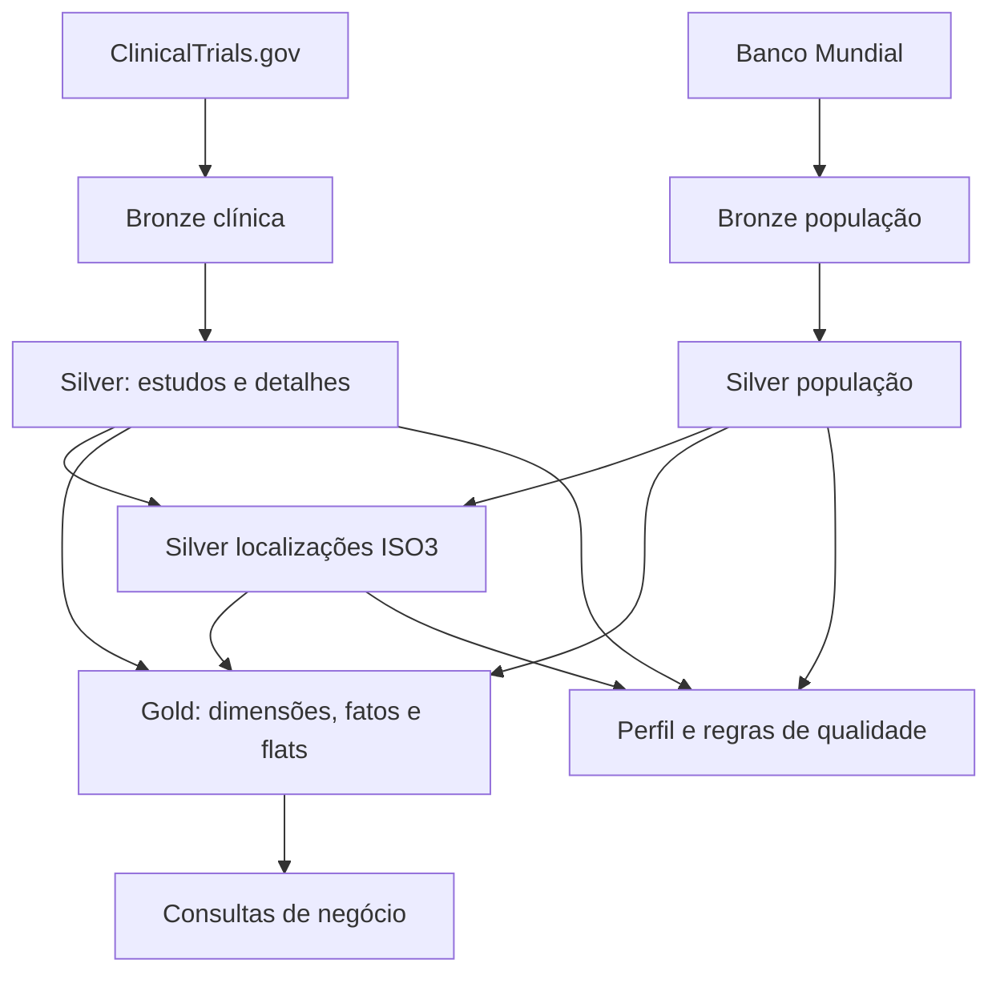

O diagrama é uma representação lógica das leituras e transformações identificadas.

### 3.2 O que representam fatos, dimensões e flats

**Dimensões** descrevem as entidades usadas para filtrar, agrupar e interpretar as medidas: estudo, patrocinador, intervenção, país e data. **Fatos** armazenam medidas no grão definido: participantes e duração por estudo; população por entidade geográfica e ano.

As **bridges** representam relações de muitos para muitos. Um estudo pode ocorrer em vários países e avaliar várias intervenções. No projeto, duas bridges usam o prefixo `gld_flat_`; A terceira flat, `gld_flat_country_year_metrics`, é uma tabela agregada e desnormalizada para consumo por país e ano de início.

O modelo possui cinco dimensões, duas fatos e três flats. As chaves SHA-256 são derivadas deterministicamente dos atributos normalizados; não são sequências numéricas. Não há implementação de histórico SCD, será revisto como melhoria ou debito técnico.

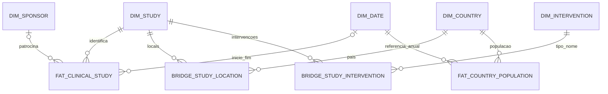

### 3.3 Descrição de cada tabela

#### brz_clinical_trials

**Classe:** Bronze. **Granularidade:** Um registro clínico por linha da coleta.

- Preserva o JSON do estudo e os metadados de ingestão. Permite reprocessar atributos sem repetir a chamada da API enquanto esse snapshot estiver disponível. Alimenta estudos, condições, intervenções e locais. A chave esperada é nct_id; duplicatas de origem não são removidas no coletor.

#### brz_population

**Classe:** Bronze. **Granularidade:** Uma observação geográfica por ano na coleta.

- Preserva a observação populacional em JSON com código, ano e origem. Alimenta slv_population. Pode incluir países, territórios e agregados regionais; não é exclusivamente uma lista de países.

#### slv_studies

**Classe:** Silver. **Granularidade:** Um estudo por nct_id.

- Estrutura título, tipo, situação, fases, datas, participantes e patrocinador. Conserva datas originais e natureza ACTUAL/ESTIMATED; converte datas parciais e calcula duração. É a base central da fato e da dimensão de estudos.

#### slv_conditions

**Classe:** Silver. **Granularidade:** Par distinto nct_id e condição.

- Explode o array de condições, normaliza espaços e remove nomes nulos e duplicatas. Permite investigar o escopo clínico e a presença de múltiplas doenças no mesmo estudo. 

#### slv_interventions

**Classe:** Silver. **Granularidade:** Linha distinta de estudo, tipo, nome e descrição.

- Explode intervenções, normaliza tipo/nome e mantém descrição. Como a deduplicação considera a linha inteira, descrições diferentes podem manter mais de uma linha para um mesmo estudo/tipo/nome. Alimenta dimensão e bridge de intervenções.

#### slv_locations

**Classe:** Silver. **Granularidade:** Linha distinta de localização dentro do estudo.

- Mantém estabelecimento, cidade, estado, país, latitude e longitude. Descarta países nulos. Um estudo pode ter muitos locais; contagens de linhas não equivalem a contagens de estudos ou hospitais físicos únicos.

#### slv_locations_iso3

**Classe:** Silver. **Granularidade:** Localização enriquecida com código geográfico.

- Faz left join por nome normalizado com referência da população e oito aliases manuais. Preserva locais não mapeados com country_iso3 nulo. Alimenta a dimensão geográfica e a bridge estudo–país.

#### slv_population

**Classe:** Silver. **Granularidade:** Uma entidade geográfica e ano.

- Extrai código, nome, ano e população do payload; tipa valores, exige código de tamanho três e população não nula, e deduplica código/ano. Serve como denominador das taxas. O filtro por tamanho não exclui agregados.

#### gld_dim_study

**Classe:** Dimensão. **Granularidade:** Um estudo por nct_id / study_key.

- Descreve estudo, título, tipo, situação, fase e natureza do enrollment. study_key = SHA-256(nct_id). Usa coalesce para transformar fase nula em NA, perdendo a distinção entre ausência e não aplicabilidade disponível na Silver.

#### gld_dim_sponsor

**Classe:** Dimensão. **Granularidade:** Uma chave derivada do nome e classe normalizados.

- Descreve o patrocinador principal. A chave usa lower(trim(nome)), classe normalizada e unknown para classe nula. Suporta rankings por patrocinador. Não representa todos os colaboradores nem montantes de financiamento.

#### gld_dim_country

**Classe:** Dimensão. **Granularidade:** Um código geográfico / country_key.

- Une códigos de locais mapeados e população. country_key = SHA-256(country_iso3). Mantém um nome via first não ordenado, portanto a escolha entre variantes não é determinística. Os 261 registros são entidades geográficas, não necessariamente 261 países.

#### gld_dim_intervention

**Classe:** Dimensão. **Granularidade:** Um par normalizado tipo e nome de intervenção.

- Descreve intervenções com chave SHA-256 de tipo e nome concatenados. Deduplica variantes de caixa/espaços externos, mas não resolve sinônimos, doses ou nomes comerciais. Permite agrupar tratamentos via bridge.

#### gld_dim_date

**Classe:** Dimensão. **Granularidade:** Uma data civil por date_key.

- Gera calendário diário entre menor e maior data clínica, com ano, trimestre, mês, dia e semana. date_key tem formato yyyyMMdd. Relaciona-se à fato clínica em dois papéis: início e conclusão. A fato populacional usa 1º de janeiro; 

#### gld_fat_clinical_study

**Classe:** Fato. **Granularidade:** Uma linha por estudo.

- Armazena enrollment_count, duration_days e collected_at, ligados às dimensões por study_key, sponsor_key, start_date_key e completion_date_key. Participantes são do estudo inteiro e podem ser estimados. Não correspondem a pessoas únicas entre estudos. Médias devem informar elegibilidade e nulos.

#### gld_fat_country_population

**Classe:** Fato. **Granularidade:** Uma entidade geográfica por ano.

- Armazena population, country_key e date_key no formato ano0101. O dia 1º de janeiro é uma convenção da chave anual, não uma afirmação sobre a data da medição. 

#### gld_flat_bridge_study_location

**Classe:** Flat / bridge. **Granularidade:** Um par study_key e country_key.

- Relaciona estudos a países mapeados e calcula facility_count por pares distintos de estabelecimento e cidade. Remove ISO3 nulo. O countDistinct de múltiplas colunas não conta pares com nulo; somar facility_count representa participações de locais nos estudos, não estabelecimentos únicos.

#### gld_flat_bridge_study_intervention

**Classe:** Flat / bridge. **Granularidade:** Um par study_key e intervention_key.

- Relaciona cada estudo às intervenções da dimensão. Deduplica o par de hashes. Viabiliza consultas por tipo/nome sem carregar descrições textuais na fato. Uma intervenção pode aparecer em muitos estudos e um estudo pode ter várias intervenções.

#### gld_flat_country_year_metrics

**Classe:** Flat agregada. **Granularidade:** Uma entidade geográfica e ano de início, inclusive ano nulo.

- Combina bridge geográfica, fato clínica, dimensão de países e fato populacional. Calcula study_count, soma facility_count, associa população do mesmo ano e calcula round(study_count / population × 1.000.000, 4). Inclui somente grupos com estudos; não produz uma grade completa de países/anos com zero. Sem população, a taxa é nula.

#### sys_data_quality_control

**Classe:** Controle. **Granularidade:** Uma tabela e coluna na avaliação armazenada.

- Persiste total, não nulos, nulos, percentual de nulos, distintos e extremos. Ajuda a entender cobertura e plausibilidade. A escrita overwrite conserva apenas o resultado corrente; não é um histórico de monitoramento.

#### sys_data_quality_results

**Classe:** Controle. **Granularidade:** Uma regra na avaliação armazenada.

- Persiste nome, tabela, severidade, quantidade de falhas, passed e timestamp. passed significa contagem igual a zero. A rotina registra resultados e não lança uma falha automática quando uma regra ERROR reprova.

### 3.4 Dicionário de dados completo

- Todos os nomes pertencem a `mvp_eng_dados.mvp_cancer`. Os tipos e transformações abaixo descrevem o código. Os caminhos clínicos estão dentro de `payload.protocolSection`. `json_data` é uma estrutura temporária do parsing.

#### 3.4.1 `brz_clinical_trials`
 
**Origem/linhagem:** API ClinicalTrials.gov.

| Coluna | Tipo | Descrição | Domínio / ressalva | Origem / transformação |
| --- | --- | --- | --- | --- |
| ingestion_id | STRING | Identificador da coleta | UUID textual; preenchido | Configuração da ingestão |
| nct_id | STRING | Identificador extraído do JSON | NCT + 8 dígitos esperado; schema de ingestão não aceita nulo | protocolSection.identificationModule.nctId |
| page_number | INT | Página da coleta | Inteiro >= 1 | Contador local de paginação |
| payload | STRING | JSON serializado do registro integral | JSON válido; não nulo | json.dumps(study, ensure_ascii=False) |
| source_url | STRING | URL da requisição | URL HTTPS, incluindo parâmetros e eventualmente pageToken | response.url |
| collected_at | TIMESTAMP | Instante lógico da coleta | Timestamp; confirmar fuso da exibição | Configuração da ingestão, preservada da Bronze |

#### 3.4.2 `brz_population`
 
**Origem/linhagem:** API Banco Mundial.

| Coluna | Tipo | Descrição | Domínio / ressalva | Origem / transformação |
| --- | --- | --- | --- | --- |
| ingestion_id | STRING | Identificador da coleta | UUID textual; preenchido | Configuração da ingestão |
| country_id | STRING | Identificador geográfico auxiliar | CORRIGIR: atualmente repete country_iso3 | record.countryiso3code, e não record.country.id |
| country_iso3 | STRING | Código geográfico de três caracteres | ISO3 esperado; códigos agregados ainda precisam de exclusão | Banco Mundial ou mapeamento por nome |
| year | INT | Ano de referência | 2000 a 2025 na carga de população | Banco Mundial, date, convertido para inteiro |
| payload | STRING | JSON serializado da observação populacional | JSON válido; não nulo | json.dumps(record, ensure_ascii=False) |
| source_url | STRING | URL da requisição populacional | URL HTTPS com indicador, período e tamanho da página | response.url |
| collected_at | TIMESTAMP | Instante lógico da coleta | Timestamp; confirmar fuso da exibição | Configuração da ingestão, preservada da Bronze |

#### 3.4.3 `slv_studies`

**Origem/linhagem:** brz_clinical_trials; seleção do registro mais recente e extração do JSON.

| Coluna | Tipo | Descrição | Domínio / ressalva | Origem / transformação |
| --- | --- | --- | --- | --- |
| nct_id | STRING | Identificador do registro clínico | NCT seguido de 8 dígitos; não nulo esperado | identificationModule.nctId; trim e upper na Silver |
| study_title | STRING | Título resumido do estudo | Texto não vazio esperado | identificationModule.briefTitle; normalização de espaços |
| study_type | STRING | Tipo de registro | INTERVENTIONAL, OBSERVATIONAL, EXPANDED_ACCESS | designModule.studyType; upper |
| overall_status | STRING | Situação cadastral | Enumeração oficial Status; regra local incompleta | statusModule.overallStatus; upper |
| phase | STRING | Fase ou combinação de fases | NA, EARLY_PHASE1, PHASE1 a PHASE4 e combinações separadas por \|; nulo na Silver | designModule.phases; ordenação e concatenação |
| start_date_original | STRING | Data de início como recebida | YYYY, YYYY-MM ou YYYY-MM-DD; pode ser nula | statusModule.startDateStruct.date |
| start_date_type | STRING | Natureza da data de início | ACTUAL, ESTIMATED ou nulo | statusModule.startDateStruct.type |
| completion_date_original | STRING | Data de conclusão como recebida | YYYY, YYYY-MM ou YYYY-MM-DD; pode ser nula | statusModule.completionDateStruct.date |
| completion_date_type | STRING | Natureza da data de conclusão | ACTUAL, ESTIMATED ou nulo | statusModule.completionDateStruct.type |
| enrollment_count | BIGINT | Participantes informados no cadastro | Inteiro >= 0 esperado; nulo permitido; sem teto validado | designModule.enrollmentInfo.count |
| enrollment_type | STRING | Natureza da quantidade de participantes | ACTUAL, ESTIMATED ou nulo | designModule.enrollmentInfo.type; upper |
| sponsor_name | STRING | Nome do patrocinador principal | Texto; não identifica necessariamente todos os financiadores | sponsorCollaboratorsModule.leadSponsor.name; espaços normalizados |
| sponsor_class | STRING | Classe do patrocinador principal | NIH, FED, OTHER_GOV, INDIV, INDUSTRY, NETWORK, AMBIG, OTHER, UNKNOWN conforme origem | sponsorCollaboratorsModule.leadSponsor.class; upper |
| ingestion_id | STRING | Identificador da coleta | UUID textual; preenchido | Configuração da ingestão |
| collected_at | TIMESTAMP | Instante lógico da coleta | Timestamp; confirmar fuso da exibição | Configuração da ingestão, preservada da Bronze |
| start_date | DATE | Data de início convertida | Data; precisão incompleta preenchida com mês/dia 01 | parse_partial_date(start_date_original) |
| completion_date | DATE | Data de conclusão convertida | Data; precisão incompleta preenchida com mês/dia 01 | parse_partial_date(completion_date_original) |
| duration_days | INT | Dias entre conclusão e início | >= 0 ou nulo; pode usar datas estimadas/imputadas | datediff(completion_date,start_date) quando fim >= início |

#### 3.4.4 `slv_conditions`

**Origem/linhagem:** brz_clinical_trials; conditionsModule.conditions[].

| Coluna | Tipo | Descrição | Domínio / ressalva | Origem / transformação |
| --- | --- | --- | --- | --- |
| nct_id | STRING | Identificador do registro clínico | NCT seguido de 8 dígitos; não nulo esperado | identificationModule.nctId; trim e upper na Silver |
| condition_name | STRING | Condição associada ao estudo | Texto não nulo; string vazia não é filtrada explicitamente | explode_outer e normalização de espaços; dropDuplicates |

#### 3.4.5 `slv_interventions`

**Origem/linhagem:** brz_clinical_trials; armsInterventionsModule.interventions[].

| Coluna | Tipo | Descrição | Domínio / ressalva | Origem / transformação |
| --- | --- | --- | --- | --- |
| nct_id | STRING | Identificador do registro clínico | NCT seguido de 8 dígitos; não nulo esperado | identificationModule.nctId; trim e upper na Silver |
| intervention_type | STRING | Categoria da intervenção | DRUG, DEVICE, BIOLOGICAL, PROCEDURE, RADIATION, BEHAVIORAL, GENETIC, DIETARY_SUPPLEMENT, DIAGNOSTIC_TEST, COMBINATION_PRODUCT, OTHER | armsInterventionsModule.interventions[].type; trim e upper |
| intervention_name | STRING | Nome cadastral da intervenção | Texto; nulos descartados, vazios avaliados depois | armsInterventionsModule.interventions[].name; espaços normalizados |
| description | STRING | Descrição cadastral da intervenção | Texto livre ou nulo | interventions[].description; trim |

#### 3.4.6 `slv_locations`

**Origem/linhagem:** brz_clinical_trials; explode das localizações; descarte de país nulo.

| Coluna | Tipo | Descrição | Domínio / ressalva | Origem / transformação |
| --- | --- | --- | --- | --- |
| nct_id | STRING | Identificador do registro clínico | NCT seguido de 8 dígitos; não nulo esperado | identificationModule.nctId; trim e upper na Silver |
| facility_name | STRING | Nome do estabelecimento | Texto ou nulo | contactsLocationsModule.locations[].facility; trim |
| city | STRING | Cidade | Texto ou nulo; sem normalização geográfica além de trim | locations[].city |
| state | STRING | Estado/província | Texto ou nulo; não exigir UF brasileira em dados mundiais | locations[].state |
| country_name | STRING | Nome da entidade geográfica | Texto; sem lista fechada no código | Fonte geográfica; trim na Silver |
| latitude | DOUBLE | Latitude do local | -90 a 90 ou nulo | locations[].geoPoint.lat |
| longitude | DOUBLE | Longitude do local | -180 a 180 ou nulo | locations[].geoPoint.lon |

#### 3.4.7 `slv_locations_iso3`

**Origem/linhagem:** slv_locations LEFT JOIN referência populacional e overrides por nome normalizado.

| Coluna | Tipo | Descrição | Domínio / ressalva | Origem / transformação |
| --- | --- | --- | --- | --- |
| nct_id | STRING | Identificador do registro clínico | NCT seguido de 8 dígitos; não nulo esperado | identificationModule.nctId; trim e upper na Silver |
| facility_name | STRING | Nome do estabelecimento | Texto ou nulo | contactsLocationsModule.locations[].facility; trim |
| city | STRING | Cidade | Texto ou nulo; sem normalização geográfica além de trim | locations[].city |
| state | STRING | Estado/província | Texto ou nulo; não exigir UF brasileira em dados mundiais | locations[].state |
| country_name | STRING | Nome da entidade geográfica | Texto; sem lista fechada no código | Fonte geográfica; trim na Silver |
| latitude | DOUBLE | Latitude do local | -90 a 90 ou nulo | locations[].geoPoint.lat |
| longitude | DOUBLE | Longitude do local | -180 a 180 ou nulo | locations[].geoPoint.lon |
| country_iso3 | STRING | Código geográfico de três caracteres | ISO3 esperado; códigos agregados ainda precisam de exclusão | Banco Mundial ou mapeamento por nome |

#### 3.4.8 `slv_population`
 
**Origem/linhagem:** brz_population; parse, filtros e deduplicação.

| Coluna | Tipo | Descrição | Domínio / ressalva | Origem / transformação |
| --- | --- | --- | --- | --- |
| country_iso3 | STRING | Código geográfico de três caracteres | ISO3 esperado; códigos agregados ainda precisam de exclusão | Banco Mundial ou mapeamento por nome |
| country_name | STRING | Nome da entidade geográfica | Texto; sem lista fechada no código | Fonte geográfica; trim na Silver |
| year | INT | Ano de referência | 2000 a 2025 na carga de população | Banco Mundial, date, convertido para inteiro |
| population | BIGINT | População da entidade no ano | >= 0 na regra atual; > 0 necessário para divisão | Banco Mundial, value; valores nulos filtrados na Silver |
| ingestion_id | STRING | Identificador da coleta | UUID textual; preenchido | Configuração da ingestão |
| collected_at | TIMESTAMP | Instante lógico da coleta | Timestamp; confirmar fuso da exibição | Configuração da ingestão, preservada da Bronze |

#### 3.4.9 `gld_dim_study`

**Origem/linhagem:** slv_studies.

| Coluna | Tipo | Descrição | Domínio / ressalva | Origem / transformação |
| --- | --- | --- | --- | --- |
| study_key | STRING | Chave técnica do estudo | Hash SHA-256, 64 caracteres hexadecimais | SHA-256 de nct_id |
| phase | STRING | Fase para consumo | Mesmos valores da Silver; nulos convertidos em NA | coalesce(slv_studies.phase, NA) |
| nct_id | STRING | Identificador do registro clínico | NCT seguido de 8 dígitos; não nulo esperado | identificationModule.nctId; trim e upper na Silver |
| study_title | STRING | Título resumido do estudo | Texto não vazio esperado | identificationModule.briefTitle; normalização de espaços |
| study_type | STRING | Tipo de registro | INTERVENTIONAL, OBSERVATIONAL, EXPANDED_ACCESS | designModule.studyType; upper |
| overall_status | STRING | Situação cadastral | Enumeração oficial Status; regra local incompleta | statusModule.overallStatus; upper |
| enrollment_type | STRING | Natureza da quantidade de participantes | ACTUAL, ESTIMATED ou nulo | designModule.enrollmentInfo.type; upper |

#### 3.4.10 `gld_dim_sponsor`
 
**Origem/linhagem:** slv_studies; patrocinador não nulo; deduplicação pela chave.

| Coluna | Tipo | Descrição | Domínio / ressalva | Origem / transformação |
| --- | --- | --- | --- | --- |
| sponsor_key | STRING | Chave técnica do patrocinador | Hash SHA-256; pode ser nula no fato | SHA-256 de nome e classe normalizados; classe nula vira unknown |
| sponsor_name | STRING | Nome do patrocinador principal | Texto; não identifica necessariamente todos os financiadores | sponsorCollaboratorsModule.leadSponsor.name; espaços normalizados |
| sponsor_class | STRING | Classe do patrocinador principal | NIH, FED, OTHER_GOV, INDIV, INDUSTRY, NETWORK, AMBIG, OTHER, UNKNOWN conforme origem | sponsorCollaboratorsModule.leadSponsor.class; upper |

#### 3.4.11 `gld_dim_country`
 
**Origem/linhagem:** União de slv_locations_iso3 e slv_population; agrupamento por código/hash.

| Coluna | Tipo | Descrição | Domínio / ressalva | Origem / transformação |
| --- | --- | --- | --- | --- |
| country_key | STRING | Chave técnica da entidade geográfica | Hash SHA-256, 64 caracteres hexadecimais | SHA-256 de country_iso3 |
| country_iso3 | STRING | Código geográfico de três caracteres | ISO3 esperado; códigos agregados ainda precisam de exclusão | Banco Mundial ou mapeamento por nome |
| country_name | STRING | Nome escolhido para a entidade | Texto; escolha não determinística se há nomes diferentes para o mesmo código | first(country_name, ignorenulls=True) após união |

#### 3.4.12 `gld_dim_intervention`

**Origem/linhagem:** slv_interventions; deduplicação pela chave.

| Coluna | Tipo | Descrição | Domínio / ressalva | Origem / transformação |
| --- | --- | --- | --- | --- |
| intervention_key | STRING | Chave técnica da intervenção | Hash SHA-256; tipo e nome normalizados | SHA-256 de lower(trim(tipo)) e lower(trim(nome)), separados por \| |
| intervention_type | STRING | Categoria da intervenção | DRUG, DEVICE, BIOLOGICAL, PROCEDURE, RADIATION, BEHAVIORAL, GENETIC, DIETARY_SUPPLEMENT, DIAGNOSTIC_TEST, COMBINATION_PRODUCT, OTHER | armsInterventionsModule.interventions[].type; trim e upper |
| intervention_name | STRING | Nome cadastral da intervenção | Texto; nulos descartados, vazios avaliados depois | armsInterventionsModule.interventions[].name; espaços normalizados |

#### 3.4.13 `gld_dim_date`

**Origem/linhagem:** Limites de slv_studies; sequence diária.

| Coluna | Tipo | Descrição | Domínio / ressalva | Origem / transformação |
| --- | --- | --- | --- | --- |
| date_key | INT | Chave da data | yyyyMMdd | date_format(full_date, yyyyMMdd) |
| full_date | DATE | Data civil | Entre os limites calculados | sequence(min_date,max_date,interval 1 day) |
| year | INT | Ano da data | Ano civil dentro do intervalo | year(full_date) |
| quarter | INT | Trimestre | 1 a 4 | quarter(full_date) |
| month | INT | Mês | 1 a 12 | month(full_date) |
| month_name | STRING | Nome do mês | Nome gerado por formatação MMMM | date_format(full_date, MMMM) |
| day | INT | Dia do mês | 1 a 31, conforme calendário | dayofmonth(full_date) |
| week_of_year | INT | Semana do ano | 1 a 53 | weekofyear(full_date) |

#### 3.4.14 `gld_fat_clinical_study`

**Origem/linhagem:** slv_studies.

| Coluna | Tipo | Descrição | Domínio / ressalva | Origem / transformação |
| --- | --- | --- | --- | --- |
| study_key | STRING | Chave técnica do estudo | Hash SHA-256, 64 caracteres hexadecimais | SHA-256 de nct_id |
| sponsor_key | STRING | Chave técnica do patrocinador | Hash SHA-256; pode ser nula no fato | SHA-256 de nome e classe normalizados; classe nula vira unknown |
| start_date_key | INT | Referência ao início | yyyyMMdd ou nulo | date_format(start_date) |
| completion_date_key | INT | Referência à conclusão | yyyyMMdd ou nulo | date_format(completion_date) |
| enrollment_count | BIGINT | Participantes informados no cadastro | Inteiro >= 0 esperado; nulo permitido; sem teto validado | designModule.enrollmentInfo.count |
| duration_days | INT | Dias entre conclusão e início | >= 0 ou nulo; pode usar datas estimadas/imputadas | datediff(completion_date,start_date) quando fim >= início |
| collected_at | TIMESTAMP | Instante lógico da coleta | Timestamp; confirmar fuso da exibição | Configuração da ingestão, preservada da Bronze |

#### 3.4.15 `gld_fat_country_population`

**Origem/linhagem:** slv_population.

| Coluna | Tipo | Descrição | Domínio / ressalva | Origem / transformação |
| --- | --- | --- | --- | --- |
| country_key | STRING | Chave técnica da entidade geográfica | Hash SHA-256, 64 caracteres hexadecimais | SHA-256 de country_iso3 |
| date_key | INT | Chave anual representada por 1º de janeiro | yyyy0101; ano 2000 a 2025 | concat(year,0101), convertido para INT |
| population | BIGINT | População da entidade no ano | >= 0 na regra atual; > 0 necessário para divisão | Banco Mundial, value; valores nulos filtrados na Silver |

#### 3.4.16 `gld_flat_bridge_study_location`

**Origem/linhagem:** slv_locations_iso3; exclusão de ISO3 nulo; agrupamento por estudo/país.

| Coluna | Tipo | Descrição | Domínio / ressalva | Origem / transformação |
| --- | --- | --- | --- | --- |
| study_key | STRING | Chave técnica do estudo | Hash SHA-256, 64 caracteres hexadecimais | SHA-256 de nct_id |
| country_key | STRING | Chave técnica da entidade geográfica | Hash SHA-256, 64 caracteres hexadecimais | SHA-256 de country_iso3 |
| facility_count | BIGINT | Pares distintos estabelecimento/cidade no estudo e país | Inteiro >= 0; não equivale a instalações únicas em toda a base | countDistinct(facility_name,city); pares com nulo não entram na contagem |

#### 3.4.17 `gld_flat_bridge_study_intervention`

**Origem/linhagem:** slv_interventions; hashes e dropDuplicates.

| Coluna | Tipo | Descrição | Domínio / ressalva | Origem / transformação |
| --- | --- | --- | --- | --- |
| study_key | STRING | Chave técnica do estudo | Hash SHA-256, 64 caracteres hexadecimais | SHA-256 de nct_id |
| intervention_key | STRING | Chave técnica da intervenção | Hash SHA-256; tipo e nome normalizados | SHA-256 de lower(trim(tipo)) e lower(trim(nome)), separados por \| |

#### 3.4.18 `gld_flat_country_year_metrics`

**Origem/linhagem:** Bridge de locais + fato clínica + dimensão de país; LEFT JOIN população por país/ano.

| Coluna | Tipo | Descrição | Domínio / ressalva | Origem / transformação |
| --- | --- | --- | --- | --- |
| country_key | STRING | Chave técnica da entidade geográfica | Hash SHA-256, 64 caracteres hexadecimais | SHA-256 de country_iso3 |
| country_iso3 | STRING | Código geográfico de três caracteres | ISO3 esperado; códigos agregados ainda precisam de exclusão | Banco Mundial ou mapeamento por nome |
| country_name | STRING | Nome da entidade geográfica | Texto; sem lista fechada no código | Fonte geográfica; trim na Silver |
| year | INT | Ano de início dos estudos | Ano de start_date; nulo possível; não é ano de registro | start_date_key / 10000 convertido para INT |
| study_count | BIGINT | Quantidade distinta de estudos no país/ano | Inteiro > 0 nas linhas presentes; não há grade com países de zero estudos | countDistinct(study_key) |
| facility_count | BIGINT | Soma de pares estabelecimento/cidade por estudo | >= 0; um mesmo estabelecimento pode contar em vários estudos | sum da facility_count da bridge |
| population | BIGINT | População da entidade no ano | >= 0 na regra atual; > 0 necessário para divisão | Banco Mundial, value; valores nulos filtrados na Silver |
| studies_per_million | DOUBLE | Estudos por milhão de habitantes | >= 0 quando denominador > 0; nulo sem população; proteção a zero pendente | round(study_count / population * 1000000,4) |

#### 3.4.19 `sys_data_quality_control`
 
**Origem/linhagem:** profile_table em config; seis tabelas Silver.

| Coluna | Tipo | Descrição | Domínio / ressalva | Origem / transformação |
| --- | --- | --- | --- | --- |
| table_name | STRING | Tabela avaliada | Uma das seis tabelas slv_ | Parâmetro de profile_table |
| column_name | STRING | Coluna avaliada | Nome no schema da tabela | df.schema.fields |
| data_type | STRING | Tipo PySpark como texto | Ex.: StringType(), LongType() | str(field.dataType) |
| total_rows | INT | Total de linhas da tabela | >= 0; tipo observado INT | df.count(), inserido por lit |
| non_null_count | BIGINT | Valores não nulos | 0 a total_rows | count(coluna) |
| null_count | BIGINT | Valores nulos | 0 a total_rows; caso vazio exige tratamento | sum de indicador isNull |
| null_percentage | DOUBLE | Percentual de nulos | 0 a 100 para tabela não vazia | round(null_count/total_rows*100,4) |
| distinct_count | BIGINT | Valores distintos não nulos | 0 a non_null_count | countDistinct |
| minimum_value | STRING | Mínimo convertido para texto | Numérico/data no tipo original; lexical para texto | min(coluna).cast(string) |
| maximum_value | STRING | Máximo convertido para texto | Numérico/data no tipo original; lexical para texto | max(coluna).cast(string) |

#### 3.4.20 `sys_data_quality_results`
  
**Origem/linhagem:** quality_rules e spark.sql; escrita overwrite.

| Coluna | Tipo | Descrição | Domínio / ressalva | Origem / transformação |
| --- | --- | --- | --- | --- |
| rule_name | STRING | Identificador da regra | Um dos 15 nomes implementados | quality_rules |
| table_name | STRING | Tabela principal da regra | Nome slv_; consultas podem usar mais de uma tabela | quality_rules |
| severity | STRING | Severidade configurada | ERROR ou WARNING | quality_rules |
| failure_count | BIGINT | Contagem de ocorrências da regra | >= 0; duplicidade conta grupos, não linhas excedentes | Resultado failures de cada SQL |
| passed | BOOLEAN | Indicador de aprovação | True quando failure_count=0 | Comparação no Python |
| execution_timestamp | TIMESTAMP | Instante de gravação da avaliação | Timestamp da escrita; fuso da sessão | current_timestamp() |

### 3.5 Governança

O catálogo textual documenta as 20 tabelas. Mostro abaixo a insert de comentários automatizados, mas também segue comentários para cada tabela usando como auxilio a Genie do Databricks. O notebook `estrutura_dos_dados`, foi executado com esse intuito.

**Evidência — E04: Modelagem e Catalogo**

<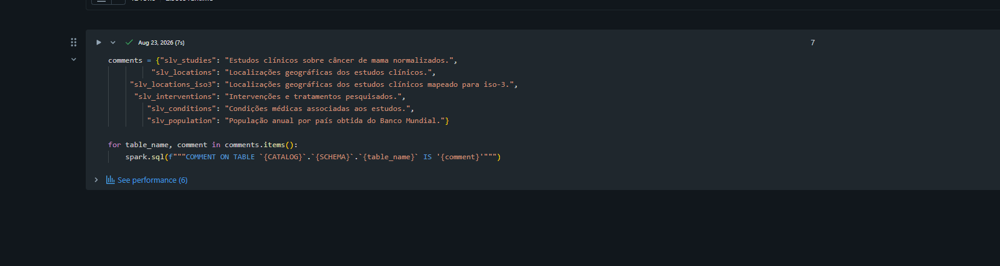 -->

**Evidência — E04: Modelagem e Catalogo**

<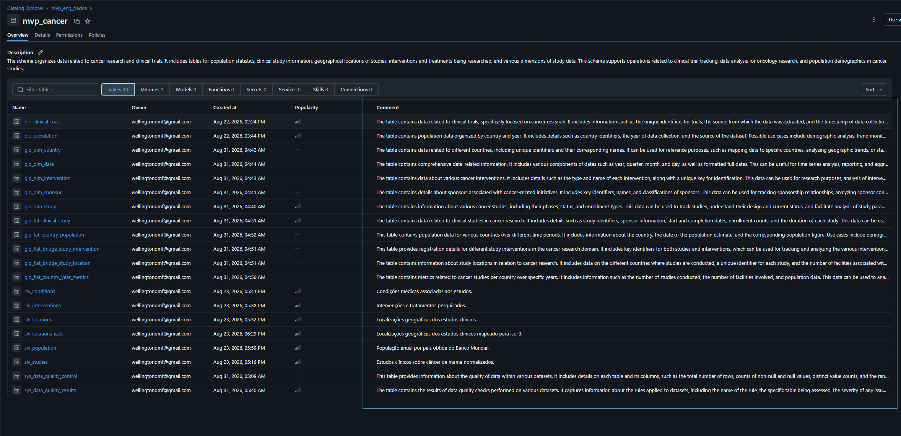 -->

<a id="pipeline"></a>
## 4. Pipeline de dados e análise dos notebooks

### 4.1 Descrição individual

| Arquivo |
| --- |
| config.dbc |
| 01_etl_brz_clinical_trials_table.dbc |
| 01_etl_brz_world_bank_open_data.dbc | 
| 02_etl_silver_studies.dbc |
| 02_etl_silver_conditions.dbc |
| 02_etl_silver_interventions.dbc | 
| 02_etl_silver_locations.dbc |
| 02_etl_silver_population.dbc |
| 02_etl_silver_locations_iso3.dbc |
| 03_etl_gold.dbc |
| 04_qualidade_dados.dbc | 
| 05_Analise_de_negocio.dbc |

#### 4.1.1 `config.dbc`

Centraliza imports, constantes, sessão HTTP, schema clínico e funções auxiliares. Como o `profile_table` que calcula métricas por coluna; `create_http_session` configura retry; `parse_partial_date` preenche mês/dia ausentes com 01; `save_gold` padroniza Delta overwrite para camada gold. Lê a Bronze, escolhe a linha mais recente por nct_id/collected_at e aplica from_json. A definição do schema precede o parsing na ordem real `position`. Com isso as configuraçoes pré definidas para cada notebook fica reutilizável.

#### 4.1.2 `01_etl_brz_clinical_trials_table.dbc`

Chama config, parametriza a busca clínica, pagina a API, serializa estudos, constrói schema e DataFrame, sobrescreve a Bronze e executa asserts de contagem. A coleta atual registra 17 páginas e 16.829 estudos.

#### 4.1.3 `01_etl_brz_world_bank_open_data.dbc`

Chama config, consulta o indicador populacional e armazena metadata e records. Monta 6.890 linhas e grava a Bronze. O SELECT final é truncado. 

#### 4.1.4 `02_etl_silver_studies.dbc`

Usa clinical_parsed para selecionar atributos do estudo, normalizar textos, concatenar fases ordenadas, tipar participantes e preservar origem. Converte datas parciais e calcula datediff somente quando conclusão não é anterior ao início. Persiste slv_studies. A coluna duration_days pode refletir datas estimadas e imputadas.

#### 4.1.5 `02_etl_silver_conditions.dbc`

Explode conditionsModule.conditions, normaliza espaços, filtra nulos e remove linhas duplicadas. Persiste slv_conditions. A saída contém 43.512 linhas no perfil e 16.828 estudos distintos.

#### 4.1.6 `02_etl_silver_interventions.dbc`

Explode armsInterventionsModule.interventions, normaliza tipo e nome e mantém descrição. Filtra nome nulo, deduplica e persiste slv_interventions. O perfil registra 33.605 linhas e 15.348 estudos distintos. A ausência de linha para outros estudos pode decorrer da origem ou dos filtros.

#### 4.1.7 `02_etl_silver_locations.dbc`

Explode contactsLocationsModule.locations, seleciona estabelecimento e atributos geográficos, filtra país nulo e deduplica. Persiste slv_locations. O perfil mostra 203.002 linhas e 15.435 estudos distintos.

#### 4.1.8 `02_etl_silver_population.dbc`

Lê brz_population, aplica schema específico ao payload, normaliza código e nome, converte ano e população e preserva metadados de ingestão. Filtra código de tamanho três e população não nula; deduplica código/ano. Persiste 6.760 registros com 260 entidades e 26 anos.

#### 4.1.9 `02_etl_silver_locations_iso3.dbc`

Lê slv_locations e slv_population; cria referência nome/código e acrescenta United States, South Korea, Korea, Republic of, Russia, Iran, Vietnam, Czechia e Taiwan. Normaliza nomes e faz left join. Persiste 203.002 linhas, das quais 2.511 sem ISO3. A união seguida de dropDuplicates não define prioridade explícita entre referência e override em conflitos.

#### 4.1.10 `03_etl_gold.dbc`

Lê estudos, intervenções, locais mapeados e população. Constrói e persiste cinco dimensões, fato clínica, fato populacional, duas bridges e flat país–ano. Exibe as dez contagens, unicidade da fato e relação fato–dimensão de estudo. O resultado atualizado mostra 16.829 estudos distintos e zero órfãos nessa relação. Essas verificações não abrangem todas as chaves da Gold.

#### 4.1.11 `04_qualidade_dados.dbc`

Lista as tabelas do projeto, chama config, perfila as seis Silver e grava sys_data_quality_control. Define 15 regras SQL, executa consultas, grava sys_data_quality_results e mostra status, fases e tipos de intervenção. Esta versão adiciona SELECTs das dez tabelas Gold. A célula inicial com apenas nomes qualificados está marcada como %sql e não contém uma instrução SQL válida; está sem execução nos metadados. Converter essa lista em Markdown antes de um Run all. O notebook não bloqueia automaticamente a publicação quando uma regra reprova.

#### 4.1.12 `05_Analise_de_negocios.dbc`

Usado para validar as perguntas a partir de consulta sql.

### 4.2 Job e ordem de execução

**Persistência:** foi criado e agendado um Job com uma task por notebook de execução. Tanto a execução manual quanto execução via cluster Job foram concluídas com sucesso. As dependências são organizadas por camada, Bronze → Silver → Gold.

Obs: O processo final da Camada Gold, foi mantido em um unico notebook para simular um framework de camada. (Apenas para diferenciar)

O encadeamento lógico deve garantir também que `slv_locations` e `slv_population` estejam atualizadas antes de `slv_locations_iso3`. 

| Estágio | Notebooks | Pré-requisito de dados |
| --- | --- | --- |
| Preparação | config e provisionamento dos objetos | Compute, bibliotecas, catálogo/schema e acesso às fontes |
| Bronze | As duas rotinas 01_etl_brz | Configuração; na implementação atual config também lê Bronze preexistente |
| Silver clínica | studies, conditions, interventions, locations | Bronze clínica concluída |
| Silver população | population | Bronze população concluída |
| Silver enriquecida | locations_iso3 | locations e population concluídas |
| Gold | 03_etl_gold | Silver concluída, incluindo ISO3 |
| Controle | 04_qualidade_dados | Silver para regras e Gold para os SELECTs finais; confirmar posição no grafo real |


### 4.3 Reprodutibilidade

`%run ./config` Importa os notebooks preservando a relação de caminhos, confirmar bibliotecas, funções e dados reutilizaveis para outros notebook e objetos de destino; executar as coletas, Silver na ordem lógica, Gold em sequecia e qualidade.Registra contagens, Run ID, horários e versões das tabelas. Como as fontes são reexecutadas, uma nova coleta pode produzir números diferentes dos apresentados.

> **Evidência — E05: Grafo do Job**  
> Obs: tasks e dependências entre camadas. 

<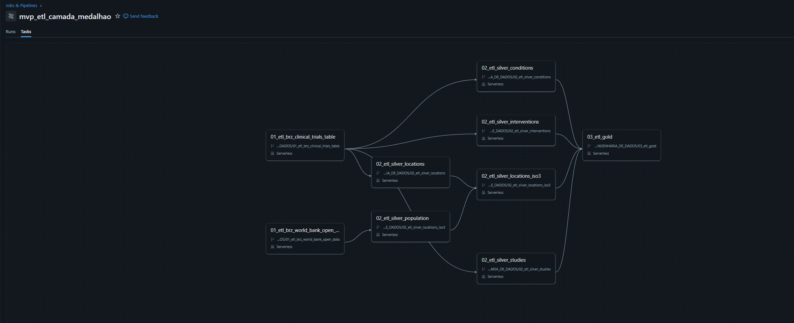 -->

> **Evidência — E06: Agendamento e compute**  
> Obs: frequência, fuso, agenda ativa e configuração de cluster ou compute.  

<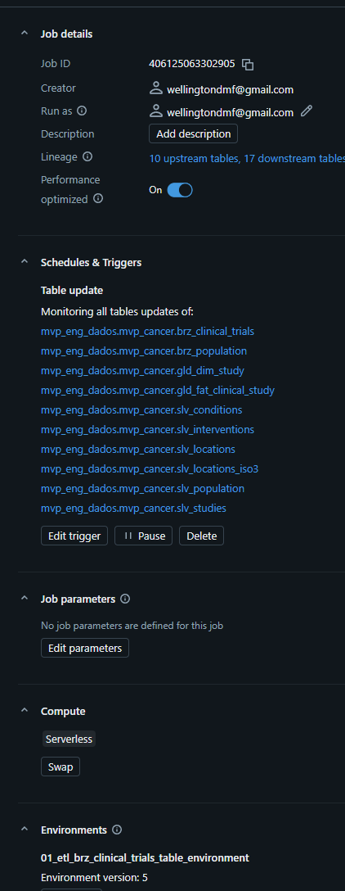 -->

> **Evidência — E07: Execução manual e via Job**  
> Obs: Run ID, horários e status de todas as tasks da rodada final, além das validações manuais.  

<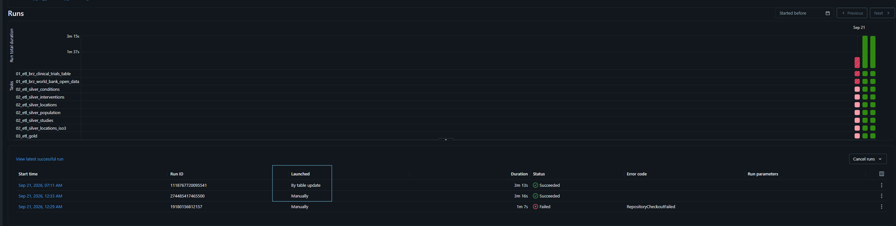 -->

### 4.4 Contagens Gold

| Tabela | Linhas |
| --- | --- |
| gld_dim_country | 261 |
| gld_dim_date | 47.362 |
| gld_dim_intervention | 16.196 |
| gld_dim_sponsor | 3.544 |
| gld_dim_study | 16.829 |
| gld_fat_clinical_study | 16.829 |
| gld_fat_country_population | 6.760 |
| gld_flat_bridge_study_intervention | 33.194 |
| gld_flat_bridge_study_location | 24.918 |
| gld_flat_country_year_metrics | 1.871 |

As saídas de contagem e as duas validações da Gold possuem metadados de 21/09/2026. A fato contém 16.829 linhas e 16.829 chaves distintas; o join com gld_dim_study apresenta zero Cartesiano.

> **Evidência — E08: Persistência e validação Gold**  
> Obs: as dez contagens, unicidade da fato e com chave primaira e extrageira validada na relação estudo.  

<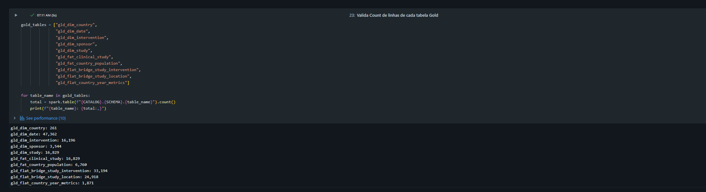 -->

<a id="qualidade"></a>
## 5. Qualidade de dados

### 5.1 Método e resultados

O perfilamento calcula total, não nulos, nulos, percentual de nulos, distintos e extremos para cada coluna Silver. Regras SQL avaliam formato, duplicidade, domínio, intervalo, coordenadas, população e integridade. Os controles são diagnósticos: gravar passed=false não faz o notebook lançar uma exceção.

| Regra | Tabela | Severidade | Ocorrências | Resultado |
| --- | --- | --- | --- | --- |
| UNMAPPED_COUNTRY | slv_locations_iso3 | WARNING | 2.511 | Sinalizada |
| INVALID_STATUS | slv_studies | ERROR | 32 | Sinalizada |
| NCT_ID_NULL | slv_studies | ERROR | 0 | Aprovada |
| NCT_ID_INVALID_FORMAT | slv_studies | ERROR | 0 | Aprovada |
| DUPLICATE_STUDY | slv_studies | ERROR | 0 | Aprovada |
| EMPTY_STUDY_TITLE | slv_studies | WARNING | 0 | Aprovada |
| NEGATIVE_ENROLLMENT | slv_studies | ERROR | 0 | Aprovada |
| INVALID_DATE_INTERVAL | slv_studies | ERROR | 0 | Aprovada |
| INVALID_LATITUDE | slv_locations_iso3 | ERROR | 0 | Aprovada |
| INVALID_LONGITUDE | slv_locations_iso3 | ERROR | 0 | Aprovada |
| EMPTY_INTERVENTION | slv_interventions | ERROR | 0 | Aprovada |
| INVALID_POPULATION | slv_population | ERROR | 0 | Aprovada |
| DUPLICATE_POPULATION | slv_population | ERROR | 0 | Aprovada |
| ORPHAN_LOCATION | slv_locations_iso3 | ERROR | 0 | Aprovada |
| ORPHAN_INTERVENTION | slv_interventions | ERROR | 0 | Aprovada |

**13 de 15 regras aprovadas.** O resultado detalhado de 21/09 registra 2.511 localizações sem ISO3 e 32 status fora da lista local. 

- Os 32 casos correspondem a NO_LONGER_AVAILABLE (13), APPROVED_FOR_MARKETING (10), AVAILABLE (8) e TEMPORARILY_NOT_AVAILABLE (1). A enumeração oficial da fonte reconhece essas situações; a regra local não as contempla.

- As 2.511 localizações sem ISO3 representam 1,2369% de 203.002 linhas; não são 2.511 países nem estudos. São mantidas na Silver e descartadas da bridge geográfica.

### 5.2 Perfil completo das colunas Silver

O quadro foi reconstruído diretamente das 45 linhas da saída atual. Extremos de strings sem formatação foram omitidos: ordem lexical não constitui domínio de negócio. As descrições e origens estão no catálogo.

| Tabela | Coluna | Linhas | Nulos | Nulos (%) | Distintos | Intervalo numérico/temporal |
| --- | --- | --- | --- | --- | --- | --- |
| slv_studies | start_date_type | 16.829 | 5.115 | 30,394 | 2 | Ver catálogo |
| slv_locations | state | 203.002 | 59.658 | 29,3879 | 2.313 | Ver catálogo |
| slv_locations_iso3 | state | 203.002 | 59.658 | 29,3879 | 2.313 | Ver catálogo |
| slv_studies | phase | 16.829 | 3.705 | 22,0156 | 8 | Ver catálogo |
| slv_interventions | description | 33.605 | 4.189 | 12,4654 | 24.120 | Ver catálogo |
| slv_studies | completion_date_type | 16.829 | 721 | 4,2843 | 2 | Ver catálogo |
| slv_studies | duration_days | 16.829 | 607 | 3,6069 | 3.907 | 0 a 35582 |
| slv_studies | completion_date_original | 16.829 | 596 | 3,5415 | 3.962 | Ver catálogo |
| slv_studies | completion_date | 16.829 | 596 | 3,5415 | 3.720 | 1998-05-01 a 2100-12-01 |
| slv_locations | facility_name | 203.002 | 5.903 | 2,9079 | 50.476 | Ver catálogo |
| slv_locations_iso3 | facility_name | 203.002 | 5.903 | 2,9079 | 50.476 | Ver catálogo |
| slv_studies | enrollment_type | 16.829 | 412 | 2,4482 | 2 | Ver catálogo |
| slv_locations | latitude | 203.002 | 3.301 | 1,6261 | 6.204 | -53.78773 a 69.6489 |
| slv_locations | longitude | 203.002 | 3.301 | 1,6261 | 6.226 | -159.3721 a 176.88333 |
| slv_locations_iso3 | latitude | 203.002 | 3.301 | 1,6261 | 6.204 | -53.78773 a 69.6489 |
| slv_locations_iso3 | longitude | 203.002 | 3.301 | 1,6261 | 6.226 | -159.3721 a 176.88333 |
| slv_studies | enrollment_count | 16.829 | 239 | 1,4202 | 1.591 | 0 a 15000000 |
| slv_locations_iso3 | country_iso3 | 203.002 | 2.511 | 1,2369 | 111 | Ver catálogo |
| slv_studies | start_date_original | 16.829 | 85 | 0,5051 | 4.445 | Ver catálogo |
| slv_studies | start_date | 16.829 | 85 | 0,5051 | 4.213 | 1971-04-01 a 2028-01-01 |
| slv_conditions | nct_id | 43.512 | 0 | 0,0 | 16.828 | Ver catálogo |
| slv_conditions | condition_name | 43.512 | 0 | 0,0 | 7.781 | Ver catálogo |
| slv_interventions | nct_id | 33.605 | 0 | 0,0 | 15.348 | Ver catálogo |
| slv_interventions | intervention_type | 33.605 | 0 | 0,0 | 11 | Ver catálogo |
| slv_interventions | intervention_name | 33.605 | 0 | 0,0 | 16.574 | Ver catálogo |
| slv_locations | nct_id | 203.002 | 0 | 0,0 | 15.435 | Ver catálogo |
| slv_locations | city | 203.002 | 0 | 0,0 | 7.311 | Ver catálogo |
| slv_locations | country_name | 203.002 | 0 | 0,0 | 123 | Ver catálogo |
| slv_locations_iso3 | nct_id | 203.002 | 0 | 0,0 | 15.435 | Ver catálogo |
| slv_locations_iso3 | city | 203.002 | 0 | 0,0 | 7.311 | Ver catálogo |
| slv_locations_iso3 | country_name | 203.002 | 0 | 0,0 | 123 | Ver catálogo |
| slv_population | country_iso3 | 6.760 | 0 | 0,0 | 260 | Ver catálogo |
| slv_population | country_name | 6.760 | 0 | 0,0 | 260 | Ver catálogo |
| slv_population | year | 6.760 | 0 | 0,0 | 26 | 2000 a 2025 |
| slv_population | population | 6.760 | 0 | 0,0 | 6.702 | 9492 a 8215424893 |
| slv_population | ingestion_id | 6.760 | 0 | 0,0 | 1 | Ver catálogo |
| slv_population | collected_at | 6.760 | 0 | 0,0 | 1 | 2026-09-21 10:04:32.845896 a 2026-09-21 10:04:32.845896 |
| slv_studies | nct_id | 16.829 | 0 | 0,0 | 16.829 | Ver catálogo |
| slv_studies | study_title | 16.829 | 0 | 0,0 | 16.799 | Ver catálogo |
| slv_studies | study_type | 16.829 | 0 | 0,0 | 3 | Ver catálogo |
| slv_studies | overall_status | 16.829 | 0 | 0,0 | 13 | Ver catálogo |
| slv_studies | sponsor_name | 16.829 | 0 | 0,0 | 3.544 | Ver catálogo |
| slv_studies | sponsor_class | 16.829 | 0 | 0,0 | 8 | Ver catálogo |
| slv_studies | ingestion_id | 16.829 | 0 | 0,0 | 1 | Ver catálogo |
| slv_studies | collected_at | 16.829 | 0 | 0,0 | 1 | 2026-09-21 10:11:41.069693 a 2026-09-21 10:11:41.069693 |

### 5.3 Interpretação e limitações

Há 3.705 estudos com fase nula, 239 com participantes nulos e 607 com duração nula. A maior quantidade de participantes é 15.000; a duração máxima é 35.582 dias, e a conclusão máxima convertida é 2100-12-01. Esses extremos exigem inspeção do cadastro antes de qualquer exclusão. Datas com precisão apenas anual ou mensal recebem dia/mês 01 para conversão; isso introduz precisão artificial na duração.

O perfil é posterior aos filtros. Ele não quantifica individualmente as linhas eliminadas na Bronze → Silver. Valores zero de população passam na regra atual e exigem proteção antes de uma divisão. Strings vazias não são nulos.

Os resultados completos da flat país–ano têm 291 linhas sem população e 28 linhas com ano nulo.

### 5.4 Rastreabilidade temporal das exportações

O perfil populacional registra collected_at = `2026-09-21 10:04:32.845896`. O perfil clínico registra `2026-09-21 10:11:41.069693`, embora algumas células de leitura manual tenham timestamps anteriores.

> **Evidência — E09: Perfil Silver**  
> Obs: Função criada para qualificar e quantificar métricas como Null e erregularidades.  
<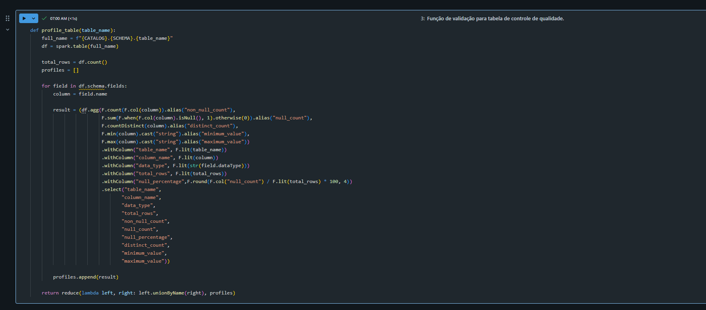 -->

Obs: nulos, distintos e extremos com contexto de execução.  


**Evidência — E09: Perfil Silver** Faz a chamada das tabelas silvers em loop para qualificá-las. Gravando por fim, em uma tabela delta controle de qualidade.

<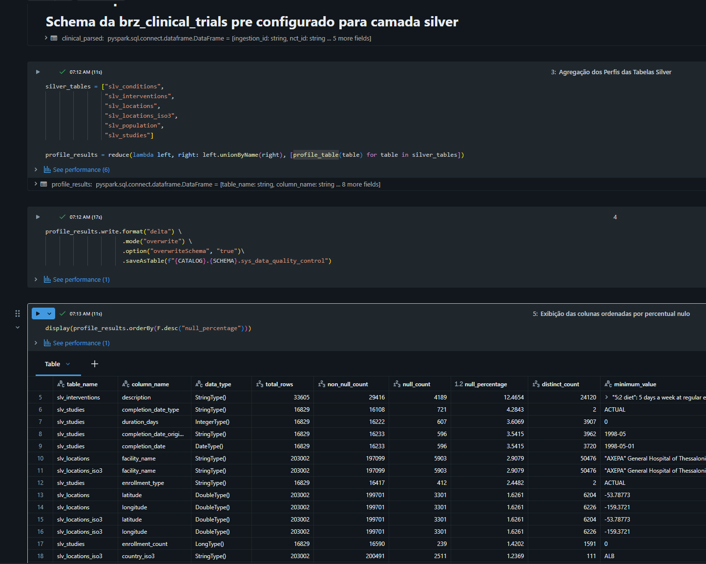 -->

> **Evidência — E10: Regras de qualidade**  
> Obs: 15 regras e resumo atualizado feita em lista de dicionários.

<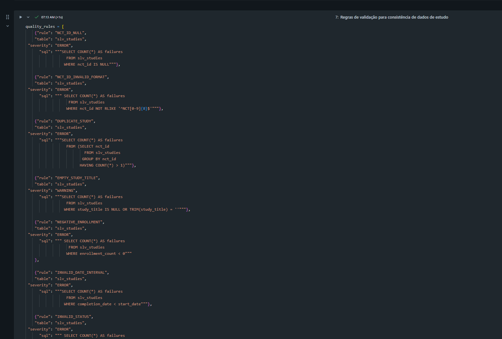 -->


> **Evidência — E11: Análise das ocorrências de qualidade**  
> Obs: países sem ISO3, domínio corrigido de status e inspeção de outliers. O processo de qualidade executa a lista de dicionarios e inclui a validação de cada regra em um dataframe, que posteriormente será salvo em uma tabela delta.

<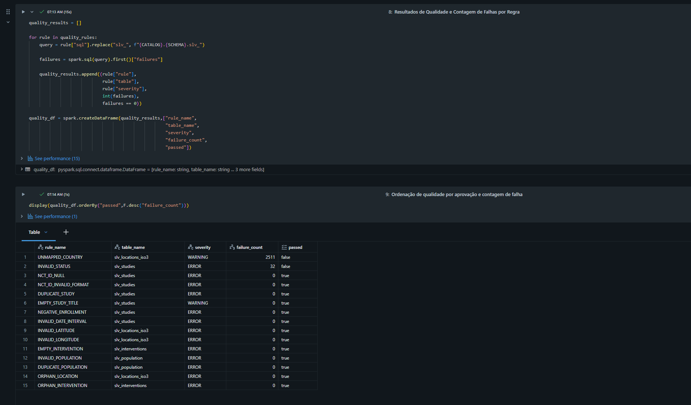 -->


<a id="analise"></a>
## 6. Análise dos resultados

### 6.1 Alcance das respostas

As consultas permitem analisar fases e status das perguntas proposta neste MVP. O resultado por tipo de intervenção permanece histórico completo direto da origem. A flat país–ano foi exportada integralmente (1.871 linhas, sem overflow), permitindo agregações geográficas.

| Pergunta | Situação | Motivo / alcance |
| --- | --- | --- |
| 1 — Registro por ano | Respondida | A quantidade de registro por ano aumenta a cada ano. Precisa de melhoria na tabela para camada gold |
| 2 — Ranking de países | Respondida | Entender quais paises consentramm o maior numero de estudo |
| 3 — Fases | Respondida| Sabendo quais são as fases mais frenquentes, podemos entender até onde os estudos alcançam |
| 4 — Tipos de intervenção | Respondida | Quais são os tipos de intervençoes mais comuns |
| 5 — Tratamentos / medicamentos | Não conclusivo | Tentar chegar em um denominador comumm para melhor tratamentos, mas sem resultado conclusivo |
| 6 — Situação | Não conclusivo | Status COMPLETED Significa conclusão do estudo, não eficácia ou sucesso terapêutico |
| 7 — Participantes por fase | Sem resposta final | Entender as fases com mais participante. Porem a muitas fases sem classificação |
| 8 — Patrocinadores | Respondida | Analisar quais setores investem mais em estudos, e logicamente são industrias |
| 9 — Fase, participantes e duração | Sem resposta final | Falta análise estratificada e tratamento dos extremos |
| 10 — Brasil | Respondida | Entender a participação do Brasil em meio a outros paises. |

### 6.1 Quantidade de registro de estudos feito por ano — Perguntas 1

**Analise sobre a pergunta:**A ideia desta pergunta foi encontrar se a quantidade de registro de estudos por ano, se mantem ao longo dos anos ou não. Para usar esse parametro futuramente, e entender se mais ou menos estudos ajudam a melhorar a qualidade da solução na luta contra o cancer.

```SQL
WITH ultima_versao AS (SELECT nct_id,
                              payload,
                              ROW_NUMBER() OVER (PARTITION BY nct_id ORDER BY collected_at DESC, page_number DESC) AS rn
                         FROM mvp_eng_dados.mvp_cancer.brz_clinical_trials),

         registros AS (SELECT nct_id,
                              TRY_CAST(get_json_object(payload,'$.protocolSection.statusModule.studyFirstPostDateStruct.date') AS DATE) AS data_primeira_publicacao
                         FROM ultima_versao
                        WHERE rn = 1)
                        
SELECT YEAR(data_primeira_publicacao) AS ano_registro,
       COUNT(DISTINCT nct_id) AS quantidade_estudos
  FROM registros
 GROUP BY YEAR(data_primeira_publicacao)
 ORDER BY ano_registro NULLS LAST;
```
> **Evidência — Q01: Quantidade de estudos por ano**  
> Obs: Conta a quantidade de registro por data da primeira puplicação do estudo.  
<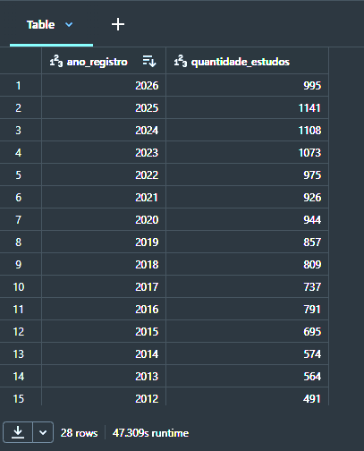 -->

---
### 6.2 Países com mais estudos  — Perguntas 2

**Analise sobre a pergunta:** Soma de study_count por país em todos os grupos da flat exportada sem data filtro apenas um valor total, incluindo o grupo de ano nulo. Pela granularidade do modelo, cada estudo tem um único ano de início e um par estudo–país na bridge; portanto a soma entre anos representa a contagem por país, condicionada à unicidade prevista no código. Não é soma mundial de estudos exclusivos

```sql
WITH estudos_por_pais AS (SELECT c.country_iso3,
                                 c.country_name,
                                 COUNT(DISTINCT b.study_key) AS quantidade_estudos
                            FROM mvp_eng_dados.mvp_cancer.gld_flat_bridge_study_location b
                            JOIN mvp_eng_dados.mvp_cancer.gld_dim_country c
                                ON b.country_key = c.country_key
                            GROUP BY c.country_iso3, c.country_name)

SELECT DENSE_RANK() OVER (ORDER BY quantidade_estudos DESC) AS posicao,
       country_iso3 AS codigo_iso3,
       country_name AS pais,
       quantidade_estudos
  FROM estudos_por_pais
 ORDER BY posicao, pais;
```
> **Evidência — Q02: Ranking dos Paises**  
> Obs: consulta de países com contagem distinta e cobertura do mapeamento.

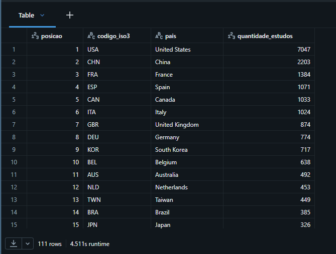 -->


Os Estados Unidos concentram 7.047 estudos com geografia mapeada, seguidos de China (2.203) e França (1.384). O ranking descreve presença de locais dos estudos nesses países, não nacionalidade do patrocinador nem pacientes únicos.

---

### 6.3 Fases clínicas — Pergunta 3
**Analise sobre a pergunta:** O grupo NA reúne 8.635 estudos e mistura valores NA explícitos com 3.705 fases nulas. A diferença de 4.930 é uma conciliação entre saídas, condicionada à mesma versão da base. Entre fases nomeadas isoladas, PHASE2 é a mais frequente, com 3.555. As categorias combinadas foram preservadas,e não devem ser distribuídas entre fases sem definir uma regra.

```
WITH base AS (SELECT nct_id,
                     COALESCE(NULLIF(TRIM(phase), ''), 'NA') AS fase
                FROM mvp_eng_dados.mvp_cancer.slv_studies)

SELECT fase,
       COUNT(DISTINCT nct_id) AS quantidade_estudos,
       ROUND(100.0 * COUNT(DISTINCT nct_id) / SUM(COUNT(DISTINCT nct_id)) OVER (), 2) AS percentual
  FROM base
 GROUP BY fase
 ORDER BY quantidade_estudos DESC;
```

> **Evidência — Q03: Fases** 
> Obs: Consulta separando fase nula de NA e identificando o tipo de estudo.

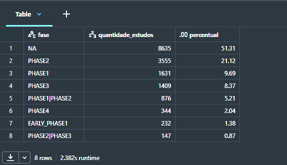 -->

---
### 6.4 Tipos de intervenção — Pergunta 4

**Analise sobre a pergunta:** DRUG lidera essa saída histórica, com 7.699 estudos. Um estudo pode aparecer em vários tipos, e a soma das categorias não equivale ao total de estudos. Para a base atual, o perfil atual registra 15.348 estudos distintos em slv_interventions, mas não fornece sua distribuição completa por tipo.

```
SELECT intervention_type AS tipo_intervencao,
       COUNT(DISTINCT nct_id) AS quantidade_estudos
   FROM mvp_eng_dados.mvp_cancer.slv_interventions
  GROUP BY intervention_type
  ORDER BY quantidade_estudos DESC;
```

> **Evidência — Q04: Tipos de intervenção**  
> Obs: Consulta agregada reexecutada para a mesma rodada da entrega.  
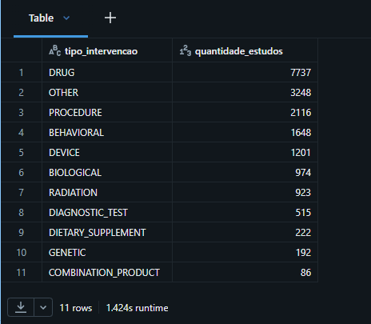 -->

### 6.5 Tratamentos e medicamentos — Pergunta 5

**Analise sobre a pergunta:** O medicamento mais utilizado segundo a analise e a base é o Paclitaxel. Send um medicamento quimioterápico usado no tratamento de vários tipos de câncer, é possivel que talvez seja um dos mais eficazes. Mas ainda falta bases mais detalhadas.

```
SELECT d.intervention_type AS tipo_intervencao,
       d.intervention_name AS intervencao,
       COUNT(DISTINCT b.study_key) AS quantidade_estudos
FROM mvp_eng_dados.mvp_cancer.gld_flat_bridge_study_intervention b
JOIN mvp_eng_dados.mvp_cancer.gld_dim_intervention d
    ON b.intervention_key = d.intervention_key
GROUP BY
    d.intervention_type,
    d.intervention_name
ORDER BY quantidade_estudos DESC, intervencao
```
> **Evidência — Q05: Tratamentos e medicamentos**  
> Obs: A Consulta agrupa a as inverveções por quantiade de estudos e tipo de medicamento ou tratamento utilizado.

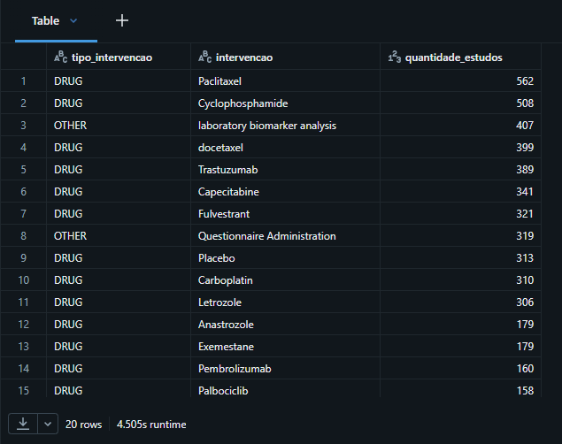 -->

---
### 6.6 Situação — Pergunta 6

**Analise sobre a pergunta:** COMPLETED representa 45,76% (7.701 estudos); RECRUITING reúne 2.448 (14,55%). UNKNOWN representa 14,80% (2.491), limitando a interpretação da atividade operacional. COMPLETED significa conclusão do estudo, não eficácia ou sucesso terapêutico. A soma dos percentuais pode diferir de 100% por arredondamento.

```
SELECT overall_status AS situacao,
       COUNT(DISTINCT nct_id) AS quantidade_estudos,
       ROUND(100.0 * COUNT(DISTINCT nct_id) / SUM(COUNT(DISTINCT nct_id)) OVER (), 2) AS percentual
  FROM mvp_eng_dados.mvp_cancer.slv_studies
 GROUP BY overall_status
 ORDER BY quantidade_estudos DESC;
```

> **Evidência — Q06: Situação**  
> Obs: A consulta mostra como os estudos se distribuem por situação.

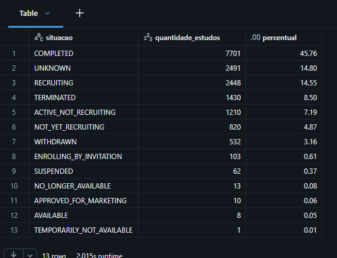 -->

---
### 6.7 Participantes por fases — pergunta 7

**Analise sobre a pergunta:** A média dos Participantes por fases ignora valores nulos. Por isso, estudos_com_participantes informa o denominador efetivo.

```
SELECT
    COALESCE(NULLIF(TRIM(phase), ''), 'NA') AS fase,
    study_type AS tipo_estudo,
    COALESCE(enrollment_type, 'NA') AS tipo_contagem,
    COUNT(*) AS quantidade_estudos,
    COUNT(enrollment_count) AS estudos_com_participantes,
    ROUND(AVG(enrollment_count), 2) AS media_participantes,
    percentile_approx(enrollment_count, 0.5) AS mediana_participantes
FROM mvp_eng_dados.mvp_cancer.slv_studies
WHERE COALESCE(enrollment_type, 'NA') <> 'NA'
GROUP BY COALESCE(NULLIF(TRIM(phase), ''), 'NA'),
         study_type,
         COALESCE(enrollment_type, 'NA')
ORDER BY fase, tipo_estudo, tipo_contagem;
```

> **Evidência — Q07: Participantes por fases**  
> Obs: Separa tipo de estudo e natureza da quantidade de participantes, evitando misturar valores ACTUAL e ESTIMATED.

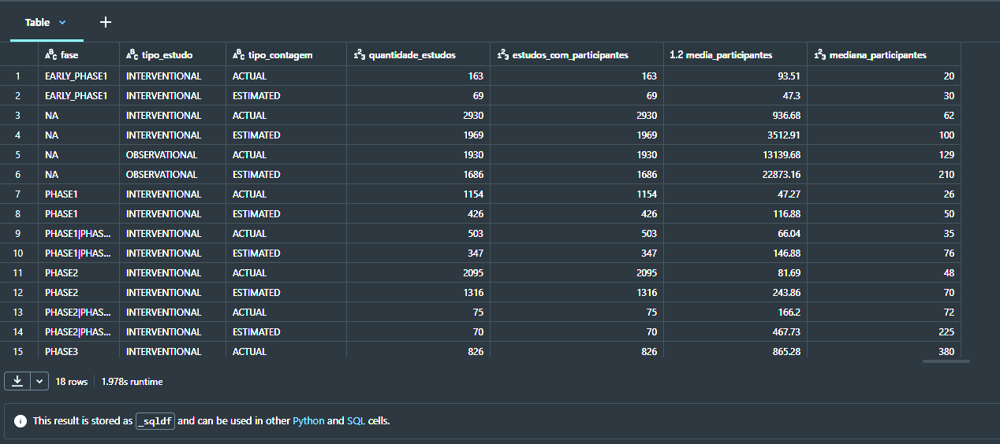 -->

---

### 6.8 Patrocinadores — pergunta 8

**Analise sobre a pergunta:** A classe dos patrocinadores aparentimente é predominante industrial, sendo dificil analisar outros setores incluino governamentais. Esse fato não parece ser incomum devido ao ser o maiores interessados em si. 

```
SELECT d.sponsor_name AS patrocinador,
       d.sponsor_class AS categoria_patrocinador,
       COUNT(DISTINCT f.study_key) AS quantidade_estudos
  FROM mvp_eng_dados.mvp_cancer.gld_fat_clinical_study f
  JOIN mvp_eng_dados.mvp_cancer.gld_dim_sponsor d
    ON f.sponsor_key = d.sponsor_key
 GROUP BY d.sponsor_key,
          d.sponsor_name,
          d.sponsor_class
 ORDER BY quantidade_estudos DESC, 
          patrocinador
```

> **Evidência — Q08: Patrocinadores**  
> Obs: Representa o patrocinador principal, sem medir valores financeiros ou todos os colaboradores.

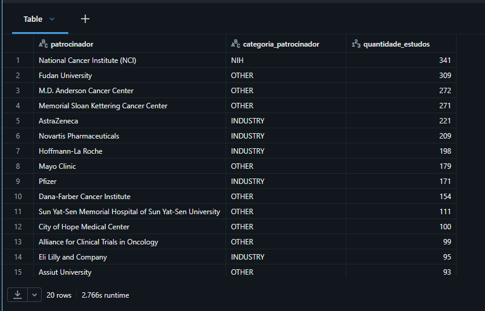 -->

---

### 6.9 Fase, participantes e duração — pergunta 9

**Analise sobre a pergunta:** Correlação próxima de 1 indica associação positiva; próxima de −1, negativa; próxima de 0, pouca associação linear. Grupos constantes podem produzir correlação indefinida. O mínimo de três registros apenas evita grupos muito pequenos; não garante robustez estatística. A consulta é exploratória e não demonstra causalidade.

```
WITH estudos_elegiveis AS ( SELECT COALESCE(NULLIF(TRIM(phase), ''), 'SEM_INFORMACAO') AS fase,
                                   enrollment_count,
                                   duration_days
                              FROM mvp_eng_dados.mvp_cancer.slv_studies
                             WHERE study_type = 'INTERVENTIONAL'
                               AND overall_status = 'COMPLETED'
                               AND enrollment_type = 'ACTUAL'
                               AND start_date_type = 'ACTUAL'
                               AND completion_date_type = 'ACTUAL'
                               AND LENGTH(start_date_original) = 10
                               AND LENGTH(completion_date_original) = 10
                               AND enrollment_count IS NOT NULL
                               AND duration_days IS NOT NULL)

SELECT fase,
       COUNT(*) AS estudos_elegiveis,
       ROUND(AVG(enrollment_count), 2) AS media_participantes,
       percentile_approx(enrollment_count, 0.5) AS mediana_participantes,
       ROUND(AVG(duration_days), 2) AS media_duracao_dias,
       percentile_approx(duration_days, 0.5) AS mediana_duracao_dias,
       ROUND(CORR(enrollment_count, duration_days),4) AS correlacao_participantes_duracao
  FROM estudos_elegiveis
 GROUP BY fase
HAVING COUNT(*) >= 3
 ORDER BY fase;
```

> **Evidência — Q09: Fase, participantes e duração**  
> Obs: A consulta compara os grupos de fase e calcula a correlação de Pearson entre participantes e duração dentro de cada grupo. Essa é a medida retornada por CORR no Databricks.

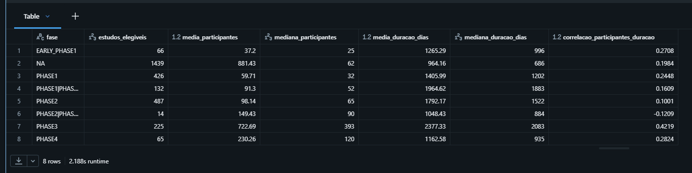 -->
---

### 6.10 Brasil — Pergunta 10

**Analise sobre a pergunta:** o Brasil aparece com 385 estudos na soma dos grupos da flat, em 14º lugar por contagem entre os códigos representados na tabela. Essa é uma comparação descritiva da cobertura mapeada. Para o ano de início de 2025, a flat contém 26 estudos associados ao Brasil e população de 212.812.405, produzindo 0,1222 estudo por milhão. O valor de facility_count é 164 e representa a soma das participações de pares estabelecimento/cidade nos estudos desse grupo. Não representa 164 hospitais únicos nem número de participantes.

A taxa usa população total e ano de início. Não mede incidência de câncer, oferta de tratamento nem probabilidade individual de acesso. Países sem denominador no mesmo ano não devem ser comparados usando taxa zero.

```
WITH parametros AS (SELECT 2025 AS ano_referencia),

base AS (SELECT m.year,
                m.country_iso3,
                m.country_name,
                m.study_count,
                m.population,
                CASE WHEN m.population > 0 THEN 1000000.0 * m.study_count / m.population END AS estudos_por_milhao
           FROM mvp_eng_dados.mvp_cancer.gld_flat_country_year_metrics m
     CROSS JOIN parametros p
          WHERE m.year = p.ano_referencia)

SELECT year AS ano_inicio,
    country_iso3 AS codigo_iso3,
    country_name AS pais,
    CASE WHEN country_iso3 = 'BRA' THEN 'BRASIL' ELSE 'OUTROS PAISES' END AS identificacao,
    study_count AS quantidade_estudos,
    population AS populacao,
    ROUND(estudos_por_milhao, 4) AS estudos_por_milhao,
    DENSE_RANK() OVER (ORDER BY study_count DESC) AS ranking_quantidade,
    CASE WHEN estudos_por_milhao IS NOT NULL THEN DENSE_RANK() OVER (ORDER BY estudos_por_milhao DESC NULLS LAST) END AS ranking_por_milhao
FROM base
ORDER BY ranking_quantidade, pais;
```

> **Evidência — Q10: Brasil e comparação internacional**  
> Obs: ranking absoluto e taxas para um ano comum com denominadores válidos.  

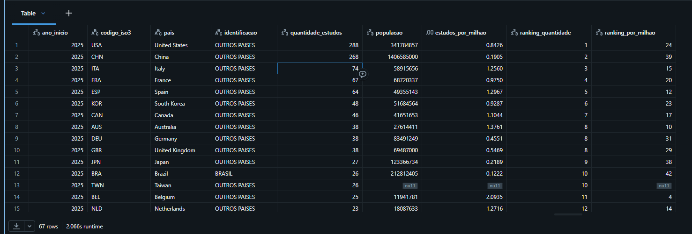 -->

---

<a id="autoavaliacao"></a>
## 7. Autoavaliação

### 7.1 Alcance dos objetivos

Considero que alcancei o objetivo técnico principal do MVP: construir um pipeline de dados em nuvem utilizando a plataforma de dados da Databricks, em conjunto com o GitHub para apoiar a análise de pesquisas clínicas sobre câncer. Integrando dados do ClinicalTrials.gov e do Banco Mundial, organizando o processamento nas camadas Bronze, Silver e Gold e implementado a persistência em tabelas Delta. Também configurado a execução por Job, com dependências entre as etapas.

A modelagem dimensional, composta por fatos, dimensões, tabelas flats, permitiu analisar diferentes aspectos dos estudos. Obtive resultados sobre distribuição geográfica, fases clínicas, intervenções, patrocinadores e participação do Brasil. Entretanto, reconheçendo que o objetivo analítico foi atendido parcialmente em algummas questões, pois ainda existem respostas e interpretações que precisam ser consolidadas. A frequência de um tratamento nos registros, por exemplo, não permite concluir sobre sua eficácia.

### 7.2 Aprendizados técnicos observáveis

Os principais desafios técnicos envolveram a transformação dos JSONs aninhados, o tratamento de datas incompletas e valores nulos, a padronização dos países e a representação de relacionamentos de muitos para muitos. Para contornar esse desafios, utilizei schemas explícitos, normalização de textos, deduplicação, conversão de datas e tabelas normalizadas exclusivas para joins. Algumas limitações, como localizações sem correspondência ISO3 e perda de precisão ao completar datas parciais ainda precisão ser melhoradas.

O projeto reforçou a importância de distinguir execução bem-sucedida de qualidade dos dados. O perfilamento e as regras de validação ajudaram a identificar inconsistências e limitações que afetam as análises. Também compreendi a necessidade de definir a granularidade das tabelas e evitar duplicação de medidas ou plano cartesiano nas consultas.

### 7.3 Evoluções propostas

Como trabalhos futuros, pretendo preservar o histórico das cargas e das avaliações de qualidade, ampliar as validações de integridade, melhorar o mapeamento geográfico e desenvolver um dashboard. Essas evoluções permitirão acompanhar mudanças nos estudos e ampliar o valor analítico do projeto em meu portfólio.

---
<a id="evidencias"></a>
## 8. Evidências, pontos de revisão.

### 8.5 Índice dos espaços de evidência
| Código | Conteúdo | Caminho sugerido |
| --- | --- | --- |
| E01 | Ambiente e armazenamento | `MVP_ENGENHARIA_DE_DADOS/IMAGENS/E01_Ambiente e armazenamento.png` |
| E02 | Conciliação clínica | `MVP_ENGENHARIA_DE_DADOS/IMAGENS/E02_Conciliacao_clinica.png` |
| E03 | Coleta populacional | `MVP_ENGENHARIA_DE_DADOS/IMAGENS/E03_Coleta_populacional.png` |
| E04 | Modelagem e catálogo | `MVP_ENGENHARIA_DE_DADOS/IMAGENS/E04_Modelagem_e_catalogo_1.png` |
| E05 | Grafo do Job | `MVP_ENGENHARIA_DE_DADOS/IMAGENS/E05_Grafo_do_Job.png` |
| E06 | Agendamento e compute | `MVP_ENGENHARIA_DE_DADOS/IMAGENS/E06_Agendamento_e_compute.png` |
| E07 | Execução manual e via Job | `MVP_ENGENHARIA_DE_DADOS/IMAGENS/E07_Execucao_manual_Job.png` |
| E08 | Persistência e validação Gold | `MVP_ENGENHARIA_DE_DADOS/IMAGENS/E08_Persistência_validação_Gold.png` |
| E09 | Perfil Silver | `MVP_ENGENHARIA_DE_DADOS/IMAGENS/E09_Perfil_Silver.png` |
| E10 | Regras de qualidade | `MVP_ENGENHARIA_DE_DADOS/IMAGENS/E10_Regras_de_qualidade.png` |
| E11 | Tratamento das exceções | `MVP_ENGENHARIA_DE_DADOS/IMAGENS/E11_Análise_das_ocorrencias_de_qualidade.png` |
| Q01 | Registros por ano | `MVP_ENGENHARIA_DE_DADOS/IMAGENS/Q01_Quantidade_estudos_ano.png` |
| Q02 | Ranking geográfico  | `MVP_ENGENHARIA_DE_DADOS/IMAGENS/Q02_Ranking_dos_paises.png` |
| Q03 | Fases | `MVP_ENGENHARIA_DE_DADOS/IMAGENS/Q03_Fases.png` |
| Q04 | Tipos de intervenção | `MVP_ENGENHARIA_DE_DADOS/IMAGENS/Q04_Tipos_de_intervencao.png` |
| Q05 | Tratamentos e medicamentos | `MVP_ENGENHARIA_DE_DADOS/IMAGENS/Q05_Tratamentos_medicamentos.png` |
| Q06 | Situação dos estudos | `MVP_ENGENHARIA_DE_DADOS/IMAGENS/Q06_Situacao.png` |
| Q07 | Participantes por fase | `MVP_ENGENHARIA_DE_DADOS/IMAGENS/Q07_Participantes_por_fases.png` |
| Q08 | Patrocinadores | `MVP_ENGENHARIA_DE_DADOS/IMAGENS/Q08_Patrocinadores.png` |
| Q09 | Fase, participantes e duração | `MVP_ENGENHARIA_DE_DADOS/IMAGENS/Q09_Fase_participantes_duracao.png` |
| Q10 | Brasil e comparação internacional | `MVP_ENGENHARIA_DE_DADOS/IMAGENS/Q10_Brasil_comparacao_internacional.png` |

## 9. Referências e rastreabilidade

### 9.1 Fontes

- [Repositório do MVP](https://github.com/wellingtondmf/pos_puc_2026/tree/main/MVP_ENGENHARIA_DE_DADOS)
- [ClinicalTrials.gov — API](https://clinicaltrials.gov/data-api/api).
- [ClinicalTrials.gov — estrutura dos estudos e enumerações](https://clinicaltrials.gov/data-api/about-api/study-data-structure).
- [Banco Mundial — Population, total](https://data.worldbank.org/indicator/SP.POP.TOTL).
- [Banco Mundial — termos de uso dos datasets](https://www.worldbank.org/ext/en/legal/terms-conditions/datasets).

